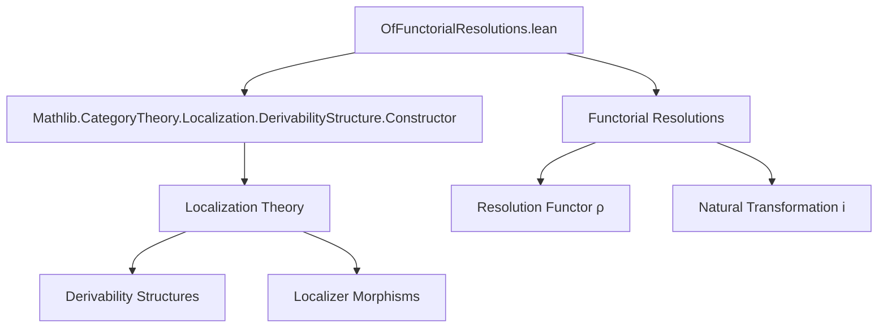

### Technical Brief: `OfFunctorialResolutions.lean`

---

#### **1. Key Definitions & Theorems**

| Name | Type / Signature | Purpose |
|------|------------------|---------|
| `hasRightResolutions_arrow_of_functorial_resolutions` | `Φ.arrow.HasRightResolutions` | Constructs a *functorial* right resolution for any arrow in `C₂`, using the resolution functor `ρ` and the natural transformation `i`. |
| `localizerMorphismInv` | `LocalizerMorphism W₂ W₁` | Constructs a *reverse* localizer morphism using the resolution functor `ρ`, assuming `W₂` has the two-out-of-three property. |
| `ι` (iota) | `𝟭 C₁ ⟶ Φ.functor ⋙ ρ` | Natural transformation induced by `i : 𝟭 C₂ ⟶ ρ ⋙ Φ.functor`, via full faithfulness of `Φ.functor`. |
| `Φ_functor_map_ι_app` | `Φ.functor.map ((ι i).app X₁) = i.app (Φ.functor.obj X₁)` | Commutativity of `Φ.functor` with the induced natural transformation `ι`. |
| `W₁_ι_app` | `W₁ ((ι i).app X₁)` | Shows that the components of `ι` lie in `W₁`, using `hW₁` and `hi`. |
| `isLocalizedEquivalence_of_functorial_right_resolutions` | `Φ.IsLocalizedEquivalence` | Proves `Φ` is a localized equivalence, using the unit/counit-like data from `ι` and `localizerMorphismInv`. |
| `isConnected_rightResolution_of_functorial_resolutions` | `IsConnected (Φ.RightResolution X₂)` | Shows that the category of right resolutions of any object `X₂` is connected, using zigzags built from `ι` and `ρ`. |
| `isRightDerivabilityStructure_of_functorial_resolutions` | `Φ.IsRightDerivabilityStructure` | Main theorem: under assumptions (fully faithful `Φ.functor`, `W₁ = W₂⁻¹[W₂]`, `W₂` multiplicative + two-out-of-three), `Φ` is a *right derivability structure*. |

---

#### **2. Naming Conventions**

- **Prefixes**:
  - `is_`: Predicate definitions (e.g., `isLocalizedEquivalence`, `isRightDerivabilityStructure`)
  - `has_`: Existence of structure (e.g., `hasRightResolutions_arrow_of_functorial_resolutions`)
  - `functorial_`: Refers to *functorial* constructions (e.g., `functorialRightResolutions`, `functorial_right_resolutions`)
- **Suffixes**:
  - `_of_`: Derivation from assumptions (e.g., `of_functorial_resolutions`, `of_unit_of_unit`)
  - `_app`: Component at an object (e.g., `ι_app`, `Φ_functor_map_ι_app`)
- **Other**:
  - `inverseImage`: Used in `hW₁ : W₁ = W₂.inverseImage Φ.functor`
  - `preimage`, `whiskerLeft`, `whiskeringRight`: Category-theoretic operations in naming (`preimage`, `whiskerLeft`)

---

#### **3. Tactic Stack**

Frequent tactics used in proofs:

| Tactic | Role |
|--------|------|
| `rw [hW₁]` | Rewriting the hypothesis `hW₁` to replace `W₁` with `W₂.inverseImage Φ.functor` |
| `simp only [...]` | Simplification with explicit lemmas (e.g., `MorphismProperty.inverseImage_iff`) |
| `exact` / `apply` | Direct proof step using previously established lemmas |
| `calc` + `Zigzag.of_hom` / `Zigzag.of_inv` | Constructing connectedness via zigzags in resolution categories |
| `infer_instance` | Automatically infers class instances (e.g., `W₁.IsMultiplicative`) |
| `dsimp`, `simp` | Simplification of naturality squares and whiskering |
| `congr` / `congr_arg` / `congr_fun` | Equality reasoning for natural transformations |
| `have`, `let` | Intermediate lemma introduction |

---

#### **4. Proof Logic**

The logical flow follows a *structured derivation*:

1. **Assumptions**:
   - `Φ : LocalizerMorphism W₁ W₂`
   - Fully faithful `Φ.functor`
   - Resolution functor `ρ : C₂ ⥤ C₁`
   - Natural transformation `i : 𝟭 ⇒ ρ ⋙ Φ.functor` with `W₂(i.app X₂)`
   - `W₁ = W₂.inverseImage Φ.functor`
   - `W₂` multiplicative + two-out-of-three

2. **Step 1**: Construct *functorial* right resolutions for arrows (`hasRightResolutions_arrow_of_functorial_resolutions`)

3. **Step 2**: Build reverse localizer morphism `ρ : C₂ → C₁` (`localizerMorphismInv`)

4. **Step 3**: Use full faithfulness to define unit `ι : 𝟭 ⇒ Φ.functor ⋙ ρ`

5. **Step 4**: Prove `Φ` is a localized equivalence (`isLocalizedEquivalence_of_functorial_right_resolutions`)

6. **Step 5**: Show resolution categories are connected (`isConnected_rightResolution_of_functorial_resolutions`)

7. **Step 6**: Conclude `Φ` is a *right derivability structure* (`isRightDerivabilityStructure_of_functorial_resolutions`)

---

#### **5. Imports**

- `Mathlib.CategoryTheory.Localization.DerivabilityStructure.Constructor`  
  → Provides the `IsRightDerivabilityStructure` constructor and related lemmas.

This import indicates the file is part of the *localization theory* in category theory, specifically building *derivability structures* from functorial resolutions.

---

#### **6. Mermaid Diagrams**

##### **Dependency Graph (Top-Level)**



##### **Overview of File Structure**

```mermaid
graph LR
  subgraph Assumptions
    A1[Φ : LocalizerMorphism W₁ W₂]
    A2[ρ : C₂ ⥤ C₁]
    A3[i : 𝟭 ⇒ ρ ⋙ Φ.functor]
    A4[hi : W₂(i.app X₂)]
    A5[hW₁ : W₁ = W₂⁻¹[W₂]]
    A6[W₂ multiplicative + 2/3]
  end

  subgraph Intermediate Results
    R1[hasRightResolutions_arrow]
    R2[localizerMorphismInv]
    R3[ι : 𝟭 ⇒ Φ.functor ⋙ ρ]
    R4[Φ_functor_map_ι_app]
    R5[W₁_ι_app]
    R6[isLocalizedEquivalence]
    R7[isConnected_rightResolution]
  end

  subgraph Main Result
    M[isRightDerivabilityStructure]
  end

  A1 --> R1
  A2 & A3 & A4 & A5 --> R2
  A1 & A2 & A3 --> R3
  R3 --> R4
  A4 & A5 --> R5
  R2 & R3 & R5 & A4 --> R6
  R1 & R6 & R7 --> M
```

---

#### **7. Theory Context**

This file contributes to the **formalization of derived categories and localization** in homological algebra. It shows how *functorial resolutions* (e.g., injective, projective, or more abstract resolutions) can be used to construct *derivability structures*, which are the categorical framework for defining derived functors.

The result is a *constructor* for right derivability structures, dual to standard constructions for left derivability (e.g., using projective resolutions). It fits into the broader `Mathlib` project’s effort to formalize *Grothendieck’s six operations*, *derived equivalences*, and *homotopical algebra* in a fully categorical setting.

--- 

Let me know if you'd like a formalized dependency graph of `Mathlib` modules or a proof sketch in natural language.
