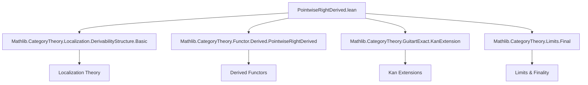
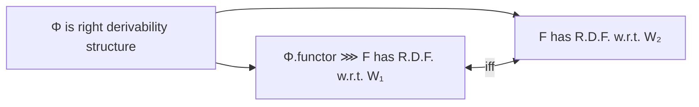

### Technical Brief: `PointwiseRightDerived.lean`

---

#### **1. Key Definitions & Theorems**

| Name | Type / Signature | Purpose |
|------|------------------|---------|
| `rightDerivedFunctorComparison` | `F₁ ⟶ Φ.localizedFunctor L₁ L₂ ⋙ F₂` | Canonical morphism comparing the derived functor of `Φ.functor ⋙ F` with that of `F` via the localizer morphism `Φ`. |
| `rightDerivedFunctorComparison_fac` | `α₁ ≫ whiskerLeft _ (...) = ...` | Factorization property of `rightDerivedFunctorComparison`, expressing how `α₁` factors through it. |
| `rightDerivedFunctorComparison_fac_app` | `α₁.app X ≫ (...) = α₂.app (...) ≫ F₂.map (...)` | Pointwise (component-wise) version of the factorization, useful for concrete verification. |
| `hasPointwiseRightDerivedFunctorAt_iff_of_isRightDerivabilityStructure` | `(Φ.functor ⋙ F).HasPointwiseRightDerivedFunctorAt W₁ X ↔ F.HasPointwiseRightDerivedFunctorAt W₂ (Φ.functor.obj X)` | Core equivalence: existence of pointwise right derived functor at an object `X ∈ C₁` for `Φ.functor ⋙ F` iff for `F` at `Φ.functor.obj X`. |
| `hasPointwiseRightDerivedFunctor_iff_of_isRightDerivabilityStructure` | `F.HasPointwiseRightDerivedFunctor W₂ ↔ (Φ.functor ⋙ F).HasPointwiseRightDerivedFunctor W₁` | Global version of the above equivalence (for all objects). |
| `IsIso (Φ.rightDerivedFunctorComparison ...)` | Instance proof | Shows the comparison morphism is an isomorphism under the assumption that both derived functors exist. |
| `isIso_iff_of_isRightDerivabilityStructure` | `IsIso (α₁.app X) ↔ IsIso (α₂.app (Φ.functor.obj X))` | Characterizes when the unit components of the derived functors are isomorphisms — a key condition for *absolute* derived functors. |

---

#### **2. Naming Conventions**

- **Prefixes**:
  - `rightDerivedFunctorComparison`: compound noun, descriptive of purpose.
  - `hasPointwiseRightDerivedFunctorAt`: predicate naming for existence at a point.
  - `isIso_α_iff_of_isRightDerivabilityStructure`: deprecated alias, follows pattern `isIso_[term]_iff_of_[condition]`.

- **Suffixes**:
  - `_iff_`: indicates logical equivalence.
  - `_fac`: factorization property.
  - `_app`: application at an object (pointwise).
  - `_of_`: dependency on a structure or hypothesis (e.g., `of_isRightDerivabilityStructure`).

- **Pattern**:  
  `has_[property]_[at|iff]_[of_]` and `_[term]_[of_]` for constructions depending on structures.

---

#### **3. Tactic Stack**

Frequent tactics used in proofs:

| Tactic | Usage |
|--------|-------|
| `dsimp` | Simplify definitions (e.g., unfolding `rightDerivedFunctorComparison`). |
| `rw` | Rewrite using lemmas or equivalences (especially `Functor.rightDerived_fac`, `hasPointwiseRightDerivedFunctorAt_iff`, etc.). |
| `simpa` | Simplify and discharge goal using `simps`-style reasoning. |
| `congr_app` | Apply congruence to function extensionality (for component-wise reasoning). |
| `rw [← isRightDerivedFunctor_iff_isIso_rightDerivedDesc]` | Switch between derived functor and isomorphism criteria. |
| `exact ...isLeftKanExtension` | Use known categorical properties (e.g., left Kan extensions). |
| ` Classical.arbitrary _` | Constructive choice for resolution objects (in `hasPointwiseRightDerivedFunctor_iff_of_isRightDerivabilityStructure`). |

---

#### **4. Proof Logic**

The logical flow in key proofs follows this pattern:

1. **Reduction via equivalences**:
   - Use `hasPointwiseRightDerivedFunctorAt_iff` to reduce to left Kan extension conditions.
2. **Use of commutative squares & iso components**:
   - Leverage `Φ.catCommSq` and its iso to relate localizations.
3. **Kan extension calculus**:
   - Apply `Functor.hasPointwiseLeftKanExtensionAt_iff_of_iso` and `TwoSquare.hasPointwiseLeftKanExtensionAt_iff`.
4. **Isomorphism criteria**:
   - Use `isRightDerivedFunctor_iff_isIso_rightDerivedDesc` and `isIso_comp_right_iff` to reduce to checking invertibility of components.
5. **Indirect reasoning**:
   - In the global equivalence proof, use pointwise existence + resolution objects to lift to global existence.

---

#### **5. Imports**

| Module | Role |
|--------|------|
| `Mathlib.CategoryTheory.Localization.DerivabilityStructure.Basic` | Defines `LocalizerMorphism`, `IsRightDerivabilityStructure`, `catCommSq`, etc. |
| `Mathlib.CategoryTheory.Functor.Derived.PointwiseRightDerived` | Defines `HasPointwiseRightDerivedFunctorAt`, `IsRightDerivedFunctor`, `rightDerivedDesc`, etc. |
| `Mathlib.CategoryTheory.GuitartExact.KanExtension` | Provides tools for two-sided Kan extensions and left Kan extensions along spans. |
| `Mathlib.CategoryTheory.Limits.Final` | Used for finality arguments (e.g., in Kan extension characterizations). |

---

#### **8. Mermaid Diagrams**

##### **Dependency Graph (Module-Level)**



##### **Overview of Theoretical Flow**

```mermaid
flowchart LR
  subgraph Setup
    C1[C₁] -->|W₁| L1["L₁ : C₁ ⥤ D₁ (localization)"]
    C2[C₂] -->|W₂| L2["L₂ : C₂ ⥤ D₂ (localization)"]
    Φ["Φ : LocalizerMorphism W₁ W₂"]
    Φ -->|isRightDerivabilityStructure| Φcond[Derivability Condition]
  end

  subgraph Functors
    F["F : C₂ ⥤ H"]
    F₁["F₁ : D₁ ⥤ H"]
    F₂["F₂ : D₂ ⥤ H"]
    α₁["α₁ : Φ.functor ⋙ F ⇒ L₁ ⋙ F₁"]
    α₂["α₂ : F ⇒ L₂ ⥤ F₂"]
  end

  subgraph Equivalences
    E1["Pointwise R.D.F. at X for Φ.functor ⋙ F"]
    E2["Pointwise R.D.F. at Φ(X) for F"]
    E1 <-->|iff| E2
  end

  subgraph Comparison
    Comp["rightDerivedFunctorComparison : F₁ ⇒ Φ.localizedFunctor L₁ L₂ ⋙ F₂"]
    CompIso["IsIso(Comp)"]
    CompIso <--|under assumptions| E1 & E2
  end

  Φ -->|structure| Comp
  Φcond -->|enables| E1 <--> E2
```

##### **Key Logical Equivalence (Core Lemma)**



---

This file formalizes a foundational result in derived category theory: the *transfer* of existence of pointwise right derived functors along a *right derivability structure*, following Kahn–Maltsiniotis. It is a key step toward constructing derived functors in homotopical algebra without assuming model structures.
