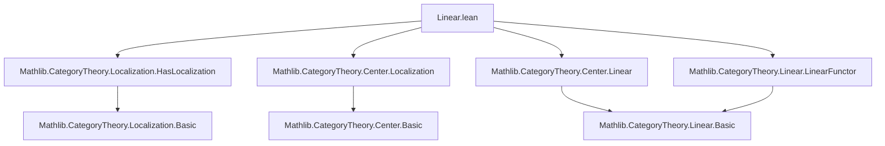
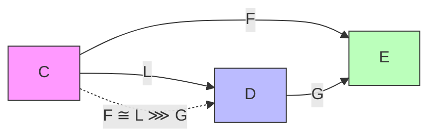

### Technical Brief: `Linear.lean` — Localization of Linear Categories

---

#### **1. Key Definitions & Theorems**

| Name | Type / Signature | Purpose |
|------|------------------|---------|
| `linear` | `noncomputable def linear : Linear R D` | Constructs an $R$-linear structure on $D$, assuming $L : C \to D$ is an additive localization and $C$ is $R$-linear. Uses `Linear.ofRingMorphism` via the composite ring homomorphism `CatCenter.localizationRingHom ∘ Linear.toCatCenter`. |
| `functor_linear` | `lemma functor_linear : Functor.Linear R L` | Shows that the localization functor $L$ is $R$-linear under the induced $R$-linearity on $D$. Proof uses `simp` and naturality of $L$. |
| `Linear R W.Localization` | `noncomputable instance` | Induces $R$-linearity on the localized category $W^{-1}C$, assuming $W^{-1}C$ is preadditive and $Q : C \to W^{-1}C$ is additive. |
| `Functor.Linear R W.Q` | `noncomputable instance` | Shows the localization functor $Q : C \to W^{-1}C$ is $R$-linear. |
| `functor_linear_iff` | `lemma functor_linear_iff : F.Linear R ↔ G.Linear R` | Equivalence of $R$-linearity between a functor $F : C \to E$ and its lift $G : D \to E$ along a localization $L : C \to D$, assuming $F \cong L \circ G$. Relies on essential surjectivity of $L$ and lifting isomorphism. |

---

#### **2. Naming Conventions**

- **Prefixes**:
  - `linear_`: for constructing or characterizing $R$-linearity (`linear`, `functor_linear`, `functor_linear_iff`).
  - `is_`: in `L.IsLocalization W`, indicating a property of $L$.
  - `Additive`: in `[L.Additive]`, `[W.Q.Additive]`, indicating additive nature of functors.
- **Suffixes**:
  - `_iff`: for biconditional lemmas (`functor_linear_iff`).
  - `_hom`: in `localizationRingHom`, standard for ring homomorphisms induced by universal properties.
- **Category-theoretic notation**:
  - `obj`, `map`, `comp`, `smul`, `•` for module action.
  - `Q`, `Q'` for localization functors $C \to W^{-1}C$.
  - `Lifting`, `iso`, `essSurj` for lifting data and essential surjectivity.

---

#### **3. Tactic Stack**

| Tactic | Usage Frequency | Role |
|--------|-----------------|------|
| `simp` | High | Simplifies hom-sets, naturality, and scalar multiplication using `Preadditive`, `Linear`, and `Functor` instances. |
| `rw` | High | Rewrites using definitions like `Linear.smul_comp`, `Linear.comp_smul`, and lifting isomorphisms. |
| `constructor` | Medium | Used in `functor_linear` to prove linearity of a functor (two conditions: preservation of addition and scalar multiplication). |
| `dsimp` | Medium | Simplifies definitional equalities after rewriting. |
| `have` / `set` | Medium | Introduces intermediate equalities (e.g., `e := L.objObjPreimageIso X`). |
| `change` | Low | Adjusts goal to match definition of $R$-linearity for $L$. |

No heavy automation (e.g., `aesop`, `ring`, `linarith`) is used—proofs are mostly structural and rely on explicit rewriting.

---

#### **4. Proof Logic**

- **Main construction (`linear`)**:
  - Uses the universal property of localization at the level of centers: `CatCenter.localizationRingHom`.
  - Composes with `Linear.toCatCenter R C` to get a ring map $R \to \mathrm{End}(1_D)$.
  - Applies `Linear.ofRingMorphism` to obtain the $R$-linear structure.

- **`functor_linear`**:
  - Reduces to verifying $L(r \cdot f) = r \cdot L(f)$.
  - Rewrites using definition of scalar action in $D$ (via `linear`), then applies `L.map_comp` and `simp`.

- **`functor_linear_iff`**:
  - Uses:
    - Essential surjectivity of $L$: every object in $D$ is a retract of $L(X)$.
    - Lifting isomorphism $F \cong L \circ G$.
    - Naturality and $R$-linearity of $L$, $F$, $G$.
  - Direction `$\Rightarrow$`: assumes $F$ linear, shows $G$ linear by transporting scalar action via the isomorphism.
  - Direction `$\Leftarrow$`: assumes $G$ linear, shows $F = L \circ G$ is linear (trivial via composition).

---

#### **5. Imports**

| Import | Purpose |
|--------|---------|
| `Mathlib.CategoryTheory.Localization.HasLocalization` | Defines localization of categories at a multiplicative system; `IsLocalization`, `Localization`, `Q`. |
| `Mathlib.CategoryTheory.Center.Localization` | Constructs ring homomorphism $R \to Z(D)$ induced by localization; `localizationRingHom`. |
| `Mathlib.CategoryTheory.Center.Linear` | Connects $R$-linearity with ring maps $R \to Z(C)$; `toCatCenter`, `ofRingMorphism`. |
| `Mathlib.CategoryTheory.Linear.LinearFunctor` | Defines linear functors and their properties; `Linear`, `linear_iff`, `linear_of_iso`. |

---

#### **6. Mermaid Diagrams**

##### **Dependency Graph (Module-Level)**



##### **Theoretical Overview (Localizing Linear Structure)**

```mermaid
graph LR
  C["Preadditive C<br>Linear R C"] -->|L: additive localization| D["Preadditive D"]
  D -->|induced| R["Linear R D"]
  L -.->|functor_linear| R
  R -->|via localizationRingHom| ZD["Z(D)"]
  R -->|via toCatCenter| ZC["Z(C)"]
  ZC -->|ring map| R
  ZD <--|localizationRingHom| ZC
```

##### **Lifting Diagram (for `functor_linear_iff`)**



---

#### **7. Summary**

This file establishes that $R$-linearity descends along additive localization functors between preadditive categories. It constructs the unique $R$-linear structure on the target category $D$ making the localization functor $L$ $R$-linear, and proves that $R$-linearity of functors through $L$ is equivalent to $R$-linearity of their lifts. The construction is categorical and relies on the interplay between the center of a category and scalar multiplication.
