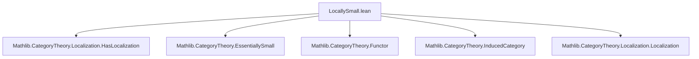
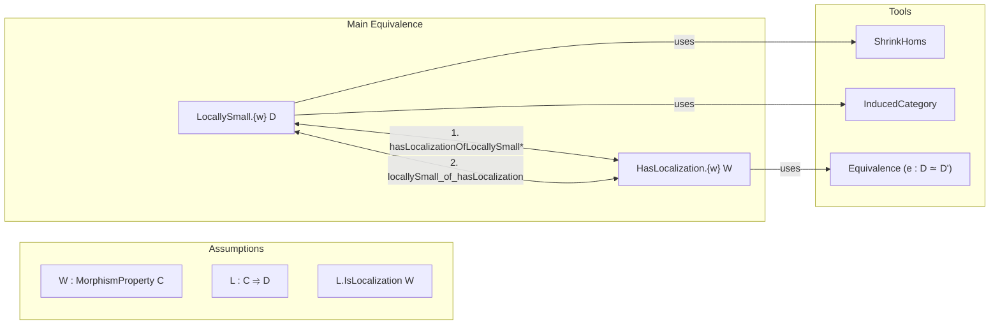
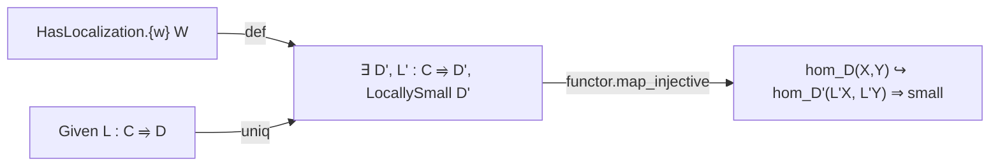

**Technical Brief: `LocallySmall.lean`**

---

### 1. **Key Definitions & Theorems**

| Name | Type | Purpose |
|------|------|---------|
| `hasLocalizationOfLocallySmall` | `{D : Type u₁} [Category D] [LocallySmall.{w} D] → (L : C ⥤ D) → [L.IsLocalization W] → HasLocalization.{w} W` | Constructs a `HasLocalization.{w} W` instance when the localization target `D` is locally `w`-small and `C`, `D` share the same object universe. Uses `ShrinkHoms` to adjust morphism universes. |
| `hasLocalizationOfLocallySmall'` | `{D : Type u₂} [Category D] [LocallySmall.{w} D] → (L : C ⥤ D) → [L.IsLocalization W] → HasLocalization.{w} W` | Same purpose as above, but handles the case where `C` and `D` live in *different* object universes. Uses `InducedCategory` and equivalence of categories to reduce to the equal-universe case. |
| `locallySmall_of_hasLocalization` | `(L : C ⥤ D) → [L.IsLocalization W] → [HasLocalization.{w} W] → LocallySmall.{w} D` | Shows that if `HasLocalization.{w} W` exists, then *any* localization target `D` is locally `w`-small. Relies on uniqueness of localization up to equivalence and injectivity of the localization functor on homs. |

---

### 2. **Naming Conventions**

- **Prefixes**:
  - `hasLocalizationOfLocallySmall*`: Indicates construction of a `HasLocalization` instance *from* local smallness of the target.
  - `locallySmall_of_hasLocalization`: Indicates implication in the *reverse* direction — existence of localization implies local smallness.

- **Suffixes**:
  - `'` (prime): Used for variants with relaxed universe constraints (`hasLocalizationOfLocallySmall'` vs `hasLocalizationOfLocallySmall`).

- **Core terms**:
  - `ShrinkHoms`: A utility to adjust morphism universes of a category.
  - `InducedCategory`: Used to pull back structure along a functor.
  - `IsLocalization`, `EssSurj`, `IsEquivalence`: Standard localization-theoretic properties.

---

### 3. **Tactic Stack**

- `aesop`: Likely used for routine category-theoretic reasoning (e.g., verifying naturality, functor laws).
- `simp_rw`: Used to rewrite using definitional equalities (e.g., in `associator`, `isoWhiskerLeft`, `unitIso`).
- `exact`: For direct proof completion (e.g., in `hasLocalizationOfLocallySmall'`, `exact hasLocalizationOfLocallySmall.{w} W L'`).
- `intro`, `apply`, `refine`: Implicit in `noncomputable def`/`irreducible_def` definitions, especially in the `by`-block for `hasLocalizationOfLocallySmall'`.
- `have`, `let`: Used to introduce intermediate constructions (e.g., `L'`, `e`, `e'`).

No heavy automation like `ring`, `linarith`, or `interval_cases` appears — this is high-level category theory.

---

### 4. **Proof Logic**

- **Forward direction** (`hasLocalizationOfLocallySmall*`):
  - Given `L : C ⥤ D` localization and `D` locally `w`-small:
    - If `C` and `D` have same object universe: directly define `HasLocalization` via `ShrinkHoms D`.
    - If not: embed `D` into `InducedCategory _ L.obj`, show it’s locally small, use equivalence to reduce to equal-universe case, then apply `hasLocalizationOfLocallySmall`.

- **Reverse direction** (`locallySmall_of_hasLocalization`):
  - Assume `HasLocalization.{w} W` exists (i.e., there is some `D'` with localization `L' : C ⥤ D'` and `D'` locally `w`-small).
  - For arbitrary localization `L : C ⥤ D`, use uniqueness of localization up to essential image equivalence:
    - Show `L` factors through `L'` and vice versa.
    - Use `Localization.uniq` to deduce that `L` is fully faithful on `W`-local morphisms and injective on hom-sets.
    - Conclude `D` is locally `w`-small via `small_of_injective`.

- **Key logical flow**:
  - *Equivalence* of conditions:  
    $$
    \exists D, L : C \leftrightarrows D \text{ localization},\ D \text{ locally } w\text{-small}
    \iff
    \text{for all such } L,\ D \text{ locally } w\text{-small}
    \iff
    \text{HasLocalization.{w} W}
    $$

---

### 5. **Imports**

- `Mathlib.CategoryTheory.Localization.HasLocalization`: Core definitions of `HasLocalization`, `IsLocalization`, and uniqueness.
- `Mathlib.CategoryTheory.EssentiallySmall`: Used implicitly via `EssSurj`, `EssImage`, etc., especially in `hasLocalizationOfLocallySmall'`.
- `Mathlib.CategoryTheory.Functor`: For `Functor`, `comp`, `natTrans`, etc.
- `Mathlib.CategoryTheory.InducedCategory`: For `InducedCategory`, `inducedFunctor`.
- `Mathlib.CategoryTheory.Localization.Localization`: Implicitly used via `Localization.uniq`, `Localization.essSurj`.

---

### 6. **Mermaid Diagrams**

#### Dependency Graph (Module-Level)

#### Theoretical Overview (Local Smallness ↔ Localization)

#### Proof Structure (Reverse Direction)

---

### Summary

This file establishes a *universally quantified* characterization of local smallness for localizations:  
> A class of morphisms `W` admits a localization in universe `w` **iff** *every* localization of `W` lands in a locally `w`-small category.

It bridges *existence* (`HasLocalization`) and *property* (`LocallySmall`) via two complementary constructions and a uniqueness lemma. The proofs rely on standard localization theory (essential surjectivity, full faithfulness up to `W`-localization) and careful universe management using `ShrinkHoms` and `InducedCategory`.
