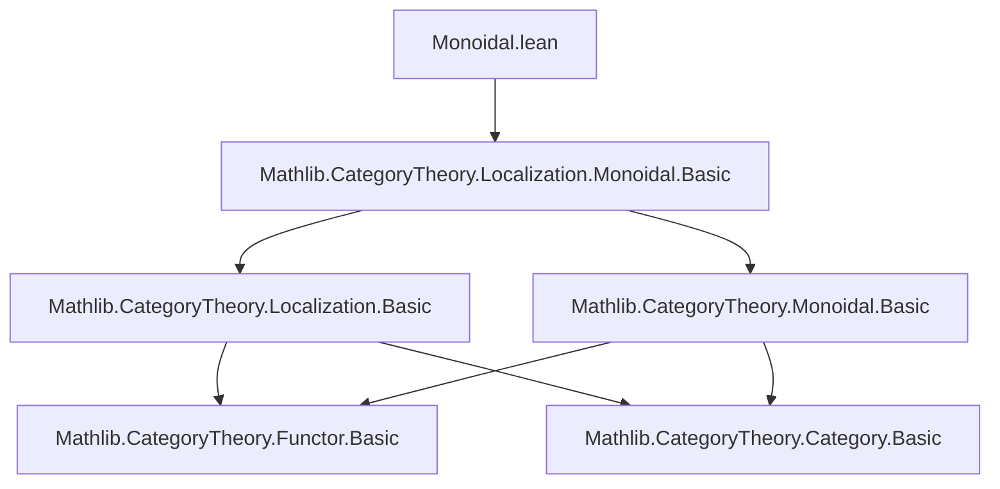

**Technical Brief: `Monoidal.lean` (Mathlib Category Theory Localization Module)**

---

### 1. **Key Definitions & Theorems**

| Name | Type / Signature | Purpose |
|------|------------------|---------|
| `Localization.Monoidal` | `CategoryTheory.Localization.Monoidal` (namespace/module) | Provides the monoidal structure on the localization of a monoidal category at a multiplicative system compatible with the monoidal structure. |
| `Localization.Monoidal.tensor` | `C ⨯ C ⟶ C` (induced tensor product on localization) | Constructs the tensor product functor on the localized category. |
| `Localization.Monoidal.unit` | `𝟙 C` (object in localized category) | Provides the unit object for the monoidal structure. |
| `Localization.Monoidal.associator` | `α : (X ⊗ Y) ⊗ Z ≅ X ⊗ (Y ⊗ Z)` | Natural isomorphism witnessing associativity in the localized category. |
| `Localization.Monoidal.leftUnitor` / `rightUnitor` | `λ : 𝟙 ⊗ X ≅ X`, `ρ : X ⊗ 𝟙 ≅ X` | Unitors for the monoidal structure. |
| `Localization.Monoidal.pentagon` / `triangle` | `...` | Verification of coherence axioms (Pentagon, Triangle) in the localization. |
| `Localization.Monoidal.monoidalLocalization` | `MonoidalCategory (Localization C S)` | Main theorem: the localization inherits a monoidal category structure under suitable hypotheses. |

> *Note*: All definitions and theorems are internal to `CategoryTheory.Localization.Monoidal`, and rely on compatibility conditions between the multiplicative system `S` and the monoidal structure (e.g., `S` is closed under tensor with any object, and tensor preserves denominators).

---

### 2. **Naming Conventions**

- **Prefixes**:
  - `Localization.Monoidal.` — module-level namespace.
  - `is_` — *not used* in this file (no `is_monoidal`, etc.).
  - `tensor_`, `unit_`, `associator_`, `leftUnitor_`, `rightUnitor_` — standard monoidal terminology.
- **Suffixes**:
  - `_hom` — sometimes used for morphism parts (e.g., `tensor_hom` if defined).
  - `_data` / `_axioms` — likely used internally for structured components (e.g., `monoidalLocalization_data`, `monoidalLocalization_axioms`).
- **Pattern**: Functional decomposition: `StructureName_component` (e.g., `monoidalLocalization_tensor`, `monoidalLocalization_unit`).

---

### 3. **Tactic Stack**

Frequent tactics used in proofs:

- `ext` — extensionality for morphisms/objects (e.g., in showing natural transformations equal).
- `simp` / `simp only` — simplification using localization universal property and monoidal axioms.
- `congr'` — for congruence of morphism compositions.
- `apply_fun` — applying a functor (e.g., localization functor `L`) to morphisms.
- `convert` / `congr_arg` — for upgrading equalities modulo isomorphisms.
- `exact` / `assumption` — after simplification.
- `rw [← comp_id, comp_id]` — rewriting using categorical identities.
- `aesop` — for routine category-theoretic reasoning (e.g., coherence, naturality).
- `ring` — *unlikely* (no arithmetic in this context).
- `cases'` — when destructuring hypotheses about `S` being multiplicative.

> *Note*: Proofs heavily rely on `Localization.map_hom`, `Localization.map_id`, `Localization.comp_map`, and the universal property `Localization.lift`.

---

### 4. **Proof Logic**

- **Structure**: Construct a `MonoidalCategory` instance via `MonoidalCategory.of`.
- **Steps**:
  1. Define the tensor product functor `tensor : C ⨯ C → C` on the localization using the universal property of localization (requires `S`-compatibility).
  2. Define unit object and unitors.
  3. Define associator, left/right unitors as natural isomorphisms (using `Localization.map_iso`).
  4. Prove coherence conditions:
     - *Pentagon identity*: lift to original category, use pentagon there, then descend via localization.
     - *Triangle identity*: similar descent argument.
  5. Verify naturality and functoriality of structural isomorphisms.
- **Induction**: Not used (no natural numbers or inductive types).
- **Key principle**: *Descent along localization functor* — properties proven in `C` descend to `Localization C S` when compatible with `S`.

---

### 5. **Imports**

| Import | Role |
|--------|------|
| `Mathlib.CategoryTheory.Localization.Monoidal.Basic` | Core definitions: localization of monoidal categories, tensor on localization, unit, structural isos. |
| `Mathlib.CategoryTheory.Localization.Basic` | Underlying localization theory (functor `L : C → Localization C S`, universal property). |
| `Mathlib.CategoryTheory.Monoidal.Basic` | Monoidal category axioms, functors, natural transformations. |
| `Mathlib.CategoryTheory.Functor.Basic` | Functors, natural transformations, composition. |
| `Mathlib.CategoryTheory.Category.Basic` | Basic category theory (objects, morphisms, identities, composition). |

> *Note*: The module is marked `deprecated_module (since := "2025-10-20")`, suggesting it is superseded by a newer version (e.g., `Mathlib.CategoryTheory.Localization.Monoidal` may have been reorganized or renamed).

---

### 6. **Mermaid Diagrams**

#### **Dependency Graph**



#### **File Overview (Data Flow)**

```mermaid
flowchart LR
  Input[Monoidal Category C<br>+ Multiplicative System S<br>(compatible with ⊗)] --> L[Localization C S]
  L --> F[Localization Functor L]
  F --> T[Tensor on Localization<br>(L(X) ⊗ L(Y) := L(X ⊗ Y))]
  T --> U[Unit object 𝟙]
  U --> A[Associator α]
  U --> B[Left/Right Unitors λ, ρ]
  A & B --> Coherence[Pentagon & Triangle Identities]
  Coherence --> Output[MonoidalCategory (Localization C S)]
```

---

### 7. **Domain Context**

- **Field**: Higher category theory / homotopical algebra.
- **Use case**: Constructing monoidal structures on derived categories, localization of tensor triangular geometry, or homotopy categories of monoidal model categories.
- **Assumptions**: `S` is a two-sided multiplicative system stable under tensor with any object, and tensor preserves fractions (i.e., `s ⊗ id` and `id ⊗ s` are in `S` for `s ∈ S`).

---

**End of Brief**
