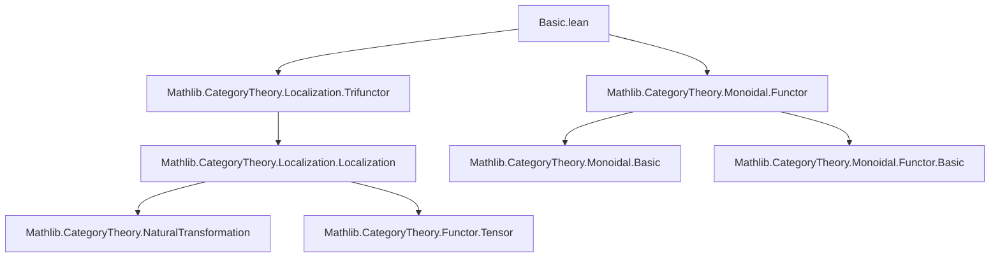
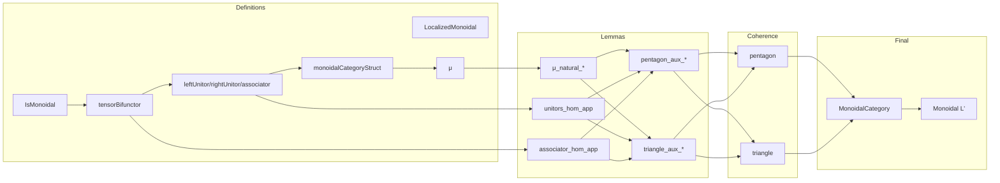

### Technical Brief: Localization of Monoidal Categories in Lean 4

---

#### **1. Key Definitions & Theorems**

| Name | Type / Signature | Purpose |
|------|------------------|---------|
| `IsMonoidal` | `class IsMonoidal : Prop extends W.IsMultiplicative` | Defines when a morphism property `W` is compatible with the monoidal structure: multiplicative + stable under left/right whiskering. |
| `LocalizedMonoidal` | `def LocalizedMonoidal (L : C ⥤ D) (W : MorphismProperty C) [W.IsMonoidal] [L.IsLocalization W] {unit : D} (_ : L.obj (𝟙_ C) ≅ unit) := D` | Type synonym for `D`, used to equip the localization category with a monoidal structure. |
| `tensorBifunctor` | `noncomputable def tensorBifunctor : D ⥤ D ⥤ D` | Lifts the tensor product of `C` to the localized category via `Localization.lift₂`. |
| `leftUnitor`, `rightUnitor`, `associator` | `noncomputable def leftUnitor : (tensorBifunctor).obj unit ≅ 𝟭 _` `noncomputable def rightUnitor : (tensorBifunctor).flip.obj unit ≅ 𝟭 _` `noncomputable def associator : bifunctorComp₁₂ tensorBifunctor ≅ bifunctorComp₂₃ tensorBifunctor` | Structural isomorphisms for the localized monoidal structure, constructed using `Localization.liftNatIso`. |
| `monoidalCategoryStruct` | `noncomputable instance : MonoidalCategoryStruct (LocalizedMonoidal L W ε)` | Defines the basic data of a monoidal category on `LocalizedMonoidal`. |
| `μ` | `noncomputable def μ (X Y : C) : (L').obj X ⊗ (L').obj Y ≅ (L').obj (X ⊗ Y)` | Compatibility isomorphism for the monoidal functor `L'`. |
| `μ_natural_left`, `μ_natural_right`, etc. | `lemma μ_natural_left {f : X₁ ⟶ X₂} (Y : C) : ...` | Naturality of `μ` in both arguments. |
| `leftUnitor_hom_app`, `rightUnitor_hom_app`, `associator_hom_app` | `lemma leftUnitor_hom_app (Y : C) : ...` | Explicit descriptions of unitors and associator on objects in the image of `L'`. |
| `pentagon`, `triangle` | `lemma pentagon (Y₁ Y₂ Y₃ Y₄ : D) : Pentagon ...` `lemma triangle (X Y : D) : ...` | Verification of coherence laws (Pentagon & Triangle) for the localized monoidal structure. |
| `instance : MonoidalCategory (LocalizedMonoidal L W ε)` | `instance` | Final result: the localized category inherits a monoidal structure. |
| `instance : (toMonoidalCategory L W ε).Monoidal` | `instance` | `L'` becomes a *monoidal* functor. |
| `associator_hom`, `associator_inv` | `lemma associator_hom (X Y Z : C) : ...` `lemma associator_inv (X Y Z : C) : ...` | Explicit formulas for associator on `L'`-images, in terms of `μ` and `δ`. |

---

#### **2. Naming Conventions**

- **Prefixes**:
  - `isInvertedBy₂`, `isInvertedBy`: used for properties of functors inverting `W`.
  - `whiskerLeft`, `whiskerRight`: standard monoidal whiskering.
  - `tensorBifunctor`, `tensorHom`, `tensorObj`: tensor-related constructions.
  - `μ`, `λ`, `ρ`, `α`: standard monoidal unitors and associator.
  - `ε`, `ε'`: unit isomorphism (from `L.obj (𝟙) ≅ unit`).
  - `lift`, `liftNatIso`, `lift₂`: localization lifting constructions.

- **Suffixes**:
  - `_hom`, `_inv`: for components of isomorphisms.
  - `_app`: for components of natural transformations/isomorphisms.
  - `_naturality`: naturality lemmas.
  - `_aux`: auxiliary lemmas used in main coherence proofs.

- **Notation**:
  - `L'` is shorthand for `toMonoidalCategory L W ε`.
  - `ε'` is shorthand for `ε` viewed as an iso in the localized category.

---

#### **3. Tactic Stack**

| Tactic | Usage Frequency | Purpose |
|--------|-----------------|---------|
| `simp` | Very High | Simplification using `monoidalCategoryStruct`, naturality, whiskering, `μ`, `ε`, etc. |
| `rw` | High | Rewriting using lemmas like `associator_hom_app`, `μ_natural_left`, `pentagon_aux₁`, etc. |
| `dsimp` | Medium | Definitional simplification, especially when unfolding `monoidalCategoryStruct`. |
| `congr` | Medium | Used in `pentagon` proof to reduce to equalities on preimages. |
| `apply`, `exact`, `intro` | Medium | Basic proof structure. |
| `convert` | Medium | Used in `triangle` proof to match up complex expressions. |
| `rfl` | Low | Reflexivity when definitions match. |
| `aesop` | Not present | Not used in this file. |
| `ring` | Not present | Not needed (no arithmetic). |

---

#### **4. Proof Logic**

The proof strategy follows a **localization-first, then coherence** pattern:

1. **Setup**:
   - Assume `W` is monoidal (`W.IsMonoidal`) and `L` is a localization (`L.IsLocalization W`).
   - Fix `unit : D` and `ε : L.obj (𝟙) ≅ unit`.

2. **Construct monoidal structure**:
   - Define `tensorBifunctor` via `Localization.lift₂`, using `isInvertedBy₂`.
   - Define unitors and associator via `liftNatIso`, using `ε` and the original unitors/associator of `C`.
   - Assemble into `MonoidalCategoryStruct`.

3. **Verify coherence**:
   - Prove naturality of `μ`, unitors, associator.
   - Prove `pentagon` and `triangle` by:
     - Using `EssSurj` of `L'` to reduce to objects in the image of `L'`.
     - Lifting morphisms and isomorphisms from `C`.
     - Reducing to coherence in `C` using lemmas like `associator_hom_app`, `leftUnitor_hom_app`, `μ_natural_*`, etc.
     - Applying auxiliary lemmas (`pentagon_aux₁`, `triangle_aux₂`, etc.) to handle `ε` and `μ`.

4. **Finalize**:
   - Prove `MonoidalCategory` instance by checking all axioms.
   - Prove `L'` is monoidal via `Functor.CoreMonoidal.toMonoidal`.

---

#### **5. Imports**

| Module | Purpose |
|--------|---------|
| `Mathlib.CategoryTheory.Localization.Trifunctor` | Provides `lift₂`, `liftNatIso`, `associator`, and localization machinery for bifunctors/natural transformations. |
| `Mathlib.CategoryTheory.Monoidal.Functor` | Defines monoidal functors, lax/oplax structures (`μ`, `δ`, `εIso`, etc.), and coherence conditions. |

---

#### **6. Mermaid Diagrams**

##### **Dependency Graph (Top-Level)**

##### **Overview of File Structure**

---

#### **7. Theory Context**

This file is part of the **localization theory of monoidal categories**, aiming to construct a monoidal structure on the localization `C[W⁻¹]` when the class of morphisms `W` is compatible with the monoidal structure. It generalizes the classical result that localization of a monoidal category at a multiplicative system stable under tensoring yields a monoidal localization.

- **Preceded by**: `Mathlib.CategoryTheory.Localization.Localization` (basic localization), `Mathlib.CategoryTheory.Monoidal.*` (monoidal category basics).
- **Followed by**: `Braided.lean` (symmetric/braided case), `Symmetric.lean`, and likely `Tannaka.lean` or `Tensored.lean` for enriched applications.

- **Key novelty**: Handling of the unit object via a *choice* of isomorphism `ε : L.obj (𝟙) ≅ unit`, allowing flexibility in defining the unit in the localized category.

--- 

Let me know if you'd like a formalized summary in Lean syntax or a dependency graph for the entire `Mathlib.CategoryTheory.Localization.Monoidal` directory.
