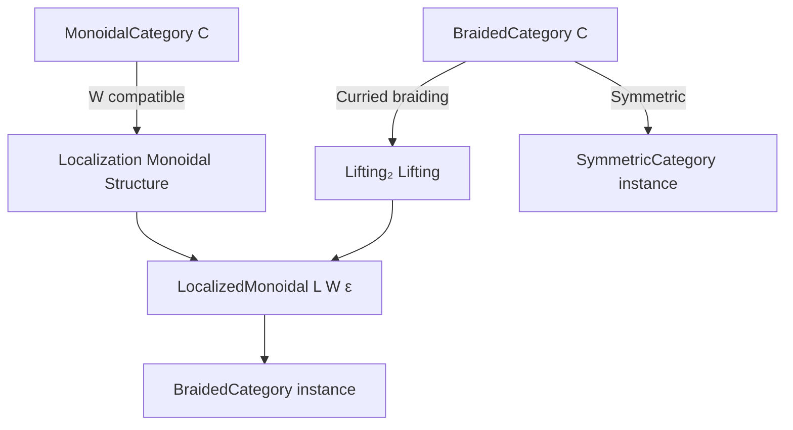
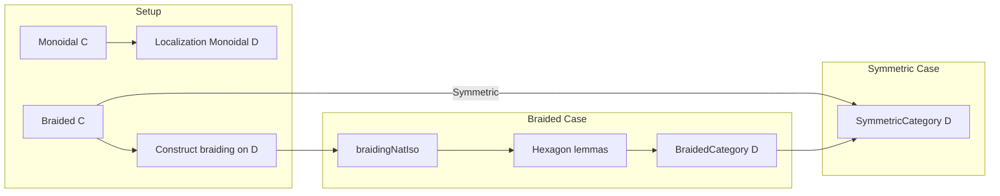

### Technical Brief: Localization of Braided/Symmetric Monoidal Categories

---

#### **1. Key Definitions & Theorems**

| Name | Type / Signature | Purpose |
|------|------------------|---------|
| `braidingNatIso` | `tensorBifunctor L W ε ≅ (tensorBifunctor L W ε).flip` | Constructs the braiding natural isomorphism on the localized monoidal category `LocalizedMonoidal L W ε`, lifting the braiding from `C`. |
| `braidingNatIso_hom_app` | `((braidingNatIso L W ε).hom.app ((L').obj X)).app ((L').obj Y) = ...` | Explicit formula for the hom-component of the braiding on objects in the localization. |
| `map_hexagon_forward` | Hexagon identity for the braiding in `LocalizedMonoidal L W ε` | Verifies one hexagon axiom required for a braided structure. |
| `map_hexagon_reverse` | Reverse hexagon identity | Verifies the second hexagon axiom. |
| `instance BraidedCategory (LocalizedMonoidal L W ε)` | `BraidedCategory` instance | Promotes the localized monoidal category to a braided one using `braidingNatIso` and the hexagon lemmas. |
| `β_hom_app` | Equality of braiding morphism in localized category | Relates the localized braiding to the original braiding via the localization functor. |
| `instance SymmetricCategory (LocalizedMonoidal L W ε)` | `SymmetricCategory` instance | Promotes the localized monoidal category to a symmetric one when `C` is symmetric. |

---

#### **2. Naming Conventions**

- **Prefixes**:
  - `braidingNatIso_`: for definitions/lemmas about the braiding natural isomorphism.
  - `map_`: for lemmas showing that localization preserves categorical structure (e.g., `map_hexagon_*`).
  - `naturality_μ_*`: for naturality of monoidal structure maps (e.g., `naturality_μ_left`, `naturality_μ_right`).
- **Suffixes**:
  - `_hom_app`: for hom-components of natural transformations applied to objects.
  - `_forward` / `_reverse`: for the two hexagon identities.
  - `_left` / `_right`: for left/right naturality conditions.

---

#### **3. Tactic Stack**

Frequently used tactics in proofs:
- `simp` (with many `only` modifiers and `at` targets)
- `rw` (especially with `braidingNatIso_hom_app`, `naturality_μ_*`)
- `slice_rhs`, `slice_lhs` (for targeted simplification of subexpressions)
- `apply natTrans₃_ext` (to prove equality of natural transformations in localized categories)
- `simpa using` (to discharge goals using lemmas)
- `rfl`, `symm`, `assoc`

---

#### **4. Proof Logic**

The logical flow follows a standard pattern for promoting structure through localization:

1. **Construct candidate braiding**:
   - Use `lift₂NatIso` to lift the curried braiding from `C` to the localized category.
2. **Verify naturality & coherence**:
   - Prove hexagon identities (`map_hexagon_forward`, `map_hexagon_reverse`) by:
     - Expanding definitions (`braidingNatIso_hom_app`)
     - Using monoidal functor laws (`μ_natural_left`, `δ_μ_*`)
     - Applying naturality of `μ` and `δ` (`naturality_μ_*`)
3. **Instantiate braided structure**:
   - Use `.ofBifunctor` with the two hexagon lemmas.
4. **Symmetric case**:
   - Use `natTrans₂_ext` and symmetry of `C` to show the braiding is self-inverse.

Induction is not used; instead, the proofs rely on:
- Explicit computation in the localization,
- Monoidal functor coherence laws,
- Naturality and hexagon identities in the source category.

---

#### **5. Imports**

| Import | Role |
|--------|------|
| `Mathlib.CategoryTheory.Localization.Monoidal.Basic` | Constructs monoidal structure on localization. |
| `Mathlib.CategoryTheory.Monoidal.Braided.Multifunctor` | Provides tools for braided multifunctors, used in lifting braiding. |

---

#### **6. Mermaid Diagrams**

##### **Dependency Graph (High-Level)**

##### **Overview of File Structure**

---

#### **7. Summary**

This file extends the monoidal localization construction to the braided and symmetric settings. It shows that if a monoidal localization `L : C → D` inverts a monoidal class `W`, and `C` is braided (resp. symmetric), then `D` inherits a braided (resp. symmetric) structure such that `L` becomes a braided (resp. symmetric) monoidal functor. The key technical step is lifting the braiding via `lift₂NatIso`, and verifying coherence via explicit naturality and hexagon identities.
