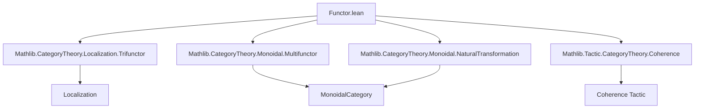
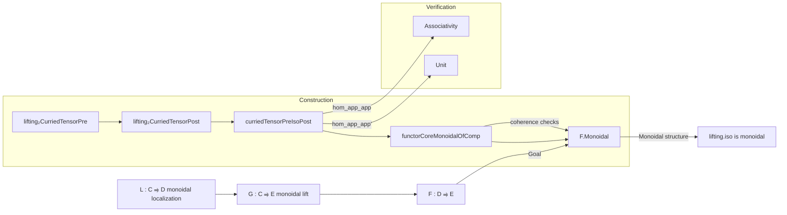

### Technical Brief: `Functor.lean` — Universal Property of Monoidal Localizations

---

#### **1. Key Definitions & Theorems**

| Name | Type / Signature | Purpose |
|------|------------------|---------|
| `lifting₂CurriedTensorPre` | `Lifting₂ L L W W (curriedTensorPre G) (curriedTensorPre F)` | Constructs a 2-sided lifting for the curried tensor precomposition bifunctor, using the given lifting isomorphism. |
| `lifting₂CurriedTensorPost` | `Lifting₂ L L W W (curriedTensorPost G) (curriedTensorPost F)` | Constructs a 2-sided lifting for the curried tensor postcomposition bifunctor, via composition with `curriedTensorPreIsoPost`. |
| `curriedTensorPreIsoPost` | `curriedTensorPre F ≅ curriedTensorPost F` | Natural isomorphism of bifunctors induced by the monoidal structure of the lift `G`. Core to constructing the monoidal structure on `F`. |
| `curriedTensorPreIsoPost_hom_app_app` | `((curriedTensorPreIsoPost...).hom.app (L.obj X₁)).app (L.obj X₂) = ...` | Explicit description of the hom-component of the iso on objects in the image of `L`. |
| `curriedTensorPreIsoPost_hom_app_app'` | Generalizes the above to arbitrary objects `Y₁, Y₂ : D` via isos `e₁, e₂`. | Enables extension of naturality arguments beyond the essential image of `L`. |
| `functorCoreMonoidalOfComp` | `F.CoreMonoidal` | Constructs a *core monoidal structure* on `F`, using the lifting isomorphism and `curriedTensorPreIsoPost`. |
| `functorMonoidalOfComp` | `F.Monoidal` | Promotes the core monoidal structure to a full monoidal structure. |
| `functorMonoidalOfComp_ε` | `ε F = ε G ≫ e.inv.app _ ≫ F.map (η L)` | Describes the unit constraint of `F` in terms of `G`, the lifting iso, and the unit of the localization. |
| `functorMonoidalOfComp_μ` | `μ F (L.obj X₁) (L.obj X₂) = ...` | Describes the tensor constraint of `F` on objects in the image of `L`. |
| `lifting_isMonoidal` | `(Lifting.iso L W G F).hom.IsMonoidal` | Shows the lifting isomorphism is *monoidal* when `F` is equipped with `functorMonoidalOfComp`. |

---

#### **2. Naming Conventions**

- **Prefixes**:
  - `lifting₂_`: For 2-sided lifting instances (e.g., `lifting₂CurriedTensorPre`).
  - `curriedTensorPre/Post`: For bifunctors derived from tensoring before/after applying a functor.
  - `functorMonoidalOfComp`: Indicates construction of monoidal structure *via composition/lifting*.
  - `isMonoidal`: Predicate for monoidal natural transformations.

- **Suffixes**:
  - `_app_app`: For component-wise evaluation on two arguments (bifunctor level).
  - `_assoc`: For associativity-related rewrites (used in `simp` blocks).
  - `_iso`: For isomorphisms (e.g., `εIso`, `μIso`, `curriedTensorPreIsoPost`).

- **Notable abbreviations**:
  - `e := Lifting.iso L W G F`: Standard notation for the lifting isomorphism.
  - `δ`, `μ`, `η`: Standard monoidal structure components (`δ` = oplax structure of `L`, `μ` = lax structure of `G`, `η` = unit of localization).

---

#### **3. Tactic Stack**

| Tactic | Frequency | Role |
|--------|-----------|------|
| `simp` / `simp only` | Very High | Simplification using `@[simps]`, `@[reassoc]`, and custom lemmas. |
| `monoidal_simps` | High | Custom simp set for monoidal category calculus (e.g., whiskering, tensor naturality). |
| `rw` / `dsimp` | High | Rewriting with definitions and simplifying definitional equalities. |
| `refine` | Medium | Constructing proofs by filling in holes (e.g., `refine natTrans_ext ...`). |
| `have` / `set` | Medium | Introducing intermediate equations or definitions. |
| `cancel_mono` | Low | Cancellation of monomorphisms in diagram chasing. |
| `iso_inv_hom_id`, `tensorHom_id`, etc. | Low | Specific monoidal category identities for normalization. |

---

#### **4. Proof Logic**

The proof follows a **structured lifting strategy**:

1. **Lifting bifunctor isos**:
   - Use `lift₂NatIso` to lift the known isomorphism `curriedTensorPre G ≅ curriedTensorPost G` (from `G` being monoidal) along the localization `L`.
   - This yields `curriedTensorPre F ≅ curriedTensorPost F`.

2. **Explicit naturality & coherence**:
   - Prove explicit formulas for the iso on objects of the form `L.obj X` (`hom_app_app`).
   - Extend to arbitrary objects via isomorphisms `Y ≅ L.obj X` (`hom_app_app'`), using naturality and monoidal identities.

3. **Construct core monoidal structure**:
   - Use `Functor.CoreMonoidal.ofBifunctor`, providing:
     - Unit constraint: `εIso G ≪≫ e.symm ≫ F.map (η L)`
     - Tensor constraint: `curriedTensorPreIsoPost`
   - Verify the three coherence diagrams (unit, associativity, symmetry) using:
     - `natTrans₃_ext`, `natTrans_ext`
     - `monoidal_simps` + `simp` with generated lemmas.

4. **Promote to monoidal structure**:
   - Use `.toMonoidal` to upgrade `CoreMonoidal` to `Monoidal`.

5. **Monoidality of the lifting iso**:
   - Show the lifting isomorphism is monoidal by checking unit and tensor constraints using `functorMonoidalOfComp_ε` and `functorMonoidalOfComp_μ`.

---

#### **5. Imports & Dependencies**

| Module | Role |
|--------|------|
| `Mathlib.CategoryTheory.Localization.Trifunctor` | Provides `lift₂NatIso`, trifunctorial lifting machinery. |
| `Mathlib.CategoryTheory.Monoidal.Multifunctor` | Defines `curriedTensorPre`, `curriedTensorPost`, and multifunctor lifting. |
| `Mathlib.CategoryTheory.Monoidal.NaturalTransformation` | Tools for monoidal natural transformations. |
| `Mathlib.Tactic.CategoryTheory.Coherence` | Provides `monoidal_simps`, coherence automation. |

---

#### **8. Mermaid Diagrams**

##### **Dependency Graph (Top-Level)**

##### **Overview of File Logic Flow**

##### **Theoretical Context**

This file formalizes the **universal property of monoidal localizations**:

> If $L : \mathcal{C} \to \mathcal{D}$ is a monoidal localization (inverting a multiplicative system $W$), and $F : \mathcal{D} \to \mathcal{E}$ lifts to a monoidal functor $G : \mathcal{C} \to \mathcal{E}$ along $L$, then $F$ itself inherits a unique monoidal structure making the lift a *monoidal natural isomorphism*.

This is the monoidal analogue of the universal property of (1-categorical) localizations, but requires careful coherence data (via `curriedTensorPreIsoPost`) to ensure the monoidal structure is well-defined *after* localization.

--- 

Let me know if you'd like a formalized statement of the theorem in pseudocode or a higher-level categorical summary.
