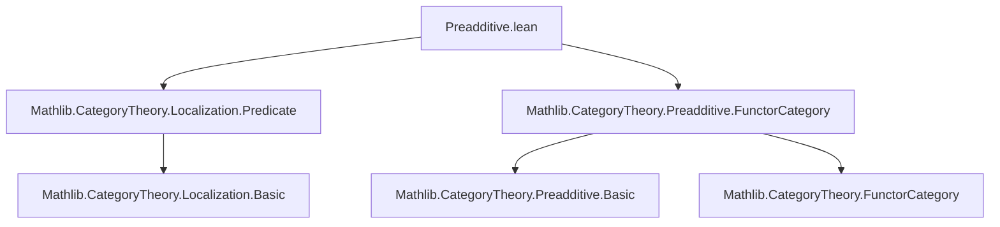

**Technical Brief: `Preadditive.lean` (Localization of Natural Transformations)**

---

### 1. KEY DEFINITIONS & THEOREMS

| Name | Type / Signature | Purpose |
|------|------------------|---------|
| `liftNatTrans` | `Lifting L W F₁ F₁' → Lifting L W F₂ F₂' → (F₁ ⟶ F₂) → (F₁' ⟶ F₂')` | Lifts a natural transformation $\tau : F_1 \Rightarrow F_2$ along a localization $L : C \to D$ to a natural transformation $F_1' \Rightarrow F_2'$, assuming $L$ is a localization w.r.t. $W$ and lifting data exists. |
| `liftNatTrans_zero` | `liftNatTrans L W F₁ F₂ F₁' F₂' 0 = 0` | States that `liftNatTrans` preserves the zero morphism (i.e., is *additive at zero*). |
| `liftNatTrans_add` | `liftNatTrans L W F₁ F₂ F₁' F₂' (τ + τ') = liftNatTrans … τ + liftNatTrans … τ'` | States that `liftNatTrans` preserves addition of natural transformations — i.e., it is *$\mathbb{Z}$-linear* (hence additive). |

> **Note**: `liftNatTrans` is not explicitly defined in this snippet, but its behavior is characterized by these two lemmas. It is assumed to be the canonical lift induced by the universal property of localization in the 2-categorical sense.

---

### 2. NAMING CONVENTIONS

- **Prefixes**:
  - `liftNatTrans_`: for lemmas about the lift of natural transformations.
  - `isLocalization`: typeclass for localization (used in assumptions).
- **Suffixes**:
  - `_zero`, `_add`: indicate preservation of zero and addition, respectively — standard in additive/preadditive contexts.
- **Variable naming**:
  - `F₁`, `F₂`, `F₁'`, `F₂'`: pairs of functors related by lifting.
  - `τ`, `τ'`: natural transformations between $F_1, F_2$.
  - `L`, `W`: localization functor and multiplicative system (morphism property).

---

### 3. TACTIC STACK

- `natTrans_ext`: extensionality principle for natural transformations — used to reduce equalities to componentwise equalities.
- `simp`: simplification using definitional equalities and known lemmas (e.g., `zero_comp`, `add_comp`, lifting properties).
- Implicit use of `rfl` or `congr_arg` via `simp` (not explicit in code, but implied by `by simp`).

No heavy automation (e.g., `aesop`, `linarith`) is used — proofs are direct and rely on structural properties.

---

### 4. PROOF LOGIC

- **Strategy**:  
  1. Use `natTrans_ext` to reduce equality of natural transformations to equality at each object $X : C$.  
  2. Apply `simp` to simplify using:
     - `HasZeroMorphisms` axioms (for `liftNatTrans_zero`),  
     - `Preadditive E` (i.e., hom-sets are abelian groups, composition is bilinear),  
     - the defining property of `liftNatTrans` (which commutes with composition and respects the localization equivalence relation).  
- **Induction / Cases**: Not used — proofs are *pointwise* and rely on definitional behavior of lift.

---

### 5. IMPORTS & DEPENDENCIES

| Module | Role |
|--------|------|
| `Mathlib.CategoryTheory.Localization.Predicate` | Provides `IsLocalization`, `Lifting`, and the universal property framework. |
| `Mathlib.CategoryTheory.Preadditive.FunctorCategory` | Supplies `Preadditive (C ⥤ E)` and related structure (e.g., pointwise addition of natural transformations). |
| `Limits` (via `open Limits`) | Provides zero morphisms, biproducts, and related constructions (used implicitly via `HasZeroMorphisms`). |

> **Scope**: This file sits in the *2-categorical* development of localization in preadditive categories — specifically, ensuring that the localization functor on functor categories is *additive* (i.e., preserves the abelian group structure on hom-sets).

---

### 6. MERMAID DIAGRAMS

#### Dependency Graph (Module-Level)



#### Overview of Theoretical Flow

```mermaid
flowchart LR
  C -- L : localization --> D
  F₁ & F₂ -- functors C ⥤ E --> F₁', F₂' -- lift along L --> D ⥤ E
  τ : F₁ ⇒ F₂ -- liftNatTrans --> τ' : F₁' ⇒ F₂'
  style τ fill:#ffe4e1,stroke:#333
  style τ' fill:#e6e6fa,stroke:#333
  classDef additive fill:#f0fff0,stroke:#006400;
  class τ,τ' additive;
  note2["Preserves 0 and +"]:::additive
  τ -- liftNatTrans_zero --> 0
  τ + τ' -- liftNatTrans_add --> τ' + τ''
```

#### Proof Structure (for `liftNatTrans_add`)

```mermaid
flowchart LR
  Goal[liftNatTrans(τ + τ') = liftNatTrans(τ) + liftNatTrans(τ')] --> natTrans_ext
  natTrans_ext --> simp[componentwise]
  simp --> HasZeroMorphisms & Preadditive & Lifting
  Lifting --> universal_property_of_localization
```

---

### 7. CONTEXTUAL ROLE

This file is part of a larger effort to develop *derived functors* and *localization of abelian categories* in Lean. It ensures that the localization functor $L_* : [C, E] \to [D, E]$ (on functor categories) is **additive**, a prerequisite for constructing derived functors in the preadditive setting (e.g., right derived functors of additive functors).

The lemmas `liftNatTrans_zero` and `liftNatTrans_add` together imply that `liftNatTrans` is a group homomorphism on hom-sets — i.e., the lift is a *morphism in the category of preadditive categories* (`PreadditiveCat`).

--- 

Let me know if you'd like the formalization of `liftNatTrans` itself or extensions (e.g., naturality in $F_1, F_2$).
