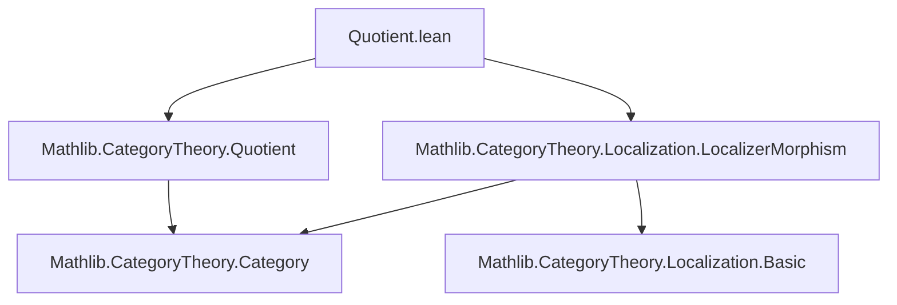
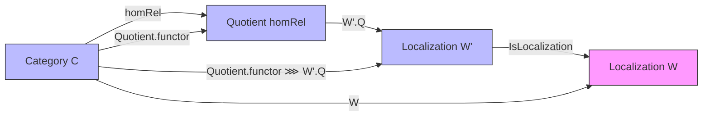

**Technical Brief: `Quotient.lean` — Localization of Quotient Categories**

---

### 1. **Key Definitions & Theorems**

| Name | Type / Signature | Purpose |
|------|------------------|---------|
| `FactorsThroughLocalization` | `def FactorsThroughLocalization (W : MorphismProperty C) : Prop` | Expresses that `homRel f g` implies `f` and `g` become equal in the localization w.r.t. `W`. Formally: `homRel f g → AreEqualizedByLocalization W f g`. |
| `strictUniversalPropertyFixedTarget` | `def strictUniversalPropertyFixedTarget (L' : Quotient homRel ⥤ D) (univ : StrictUniversalPropertyFixedTarget L' W' E) : StrictUniversalPropertyFixedTarget (Quotient.functor homRel ⋙ L') W E` | Lifts a strict universal property from a functor `L'` on the quotient to the composite with the quotient functor. |
| `strictUniversalPropertyFixedTarget'` | `noncomputable def strictUniversalPropertyFixedTarget' : StrictUniversalPropertyFixedTarget (Quotient.functor homRel ⋙ W'.Q) W E` | Special case of the above for `L' = W'.Q`, using the universal property of `W'.Q`. |
| `isLocalizedEquivalence` | `lemma isLocalizedEquivalence : (LocalizerMorphism.ofEq hW).IsLocalizedEquivalence` | Main theorem: under compatibility (`hW : W = W'.inverseImage (Quotient.functor homRel)`) and factorization (`h : homRel.FactorsThroughLocalization W`), the localizer morphism induced by the quotient functor is a *localized equivalence*, i.e., induces an equivalence on localized categories. |

---

### 2. **Naming Conventions**

- **Prefixes**:
  - `FactorsThroughLocalization`: predicate on `homRel` and `W`.
  - `strictUniversalPropertyFixedTarget`: indicates a construction based on a strict universal property.
  - `ofEq`: used in `LocalizerMorphism.ofEq hW`, indicating construction from an equality of morphism classes.
- **Suffixes**:
  - `'` (prime): used for derived or specialized versions (`strictUniversalPropertyFixedTarget'`).
  - `Q`: suffix for canonical functors into localized categories (e.g., `W'.Q : D ⥤ Localization W'`).
- **Functional composition**: `⋙` (Unicode `U+2299`), standard in Mathlib for categorical composition.

---

### 3. **Tactic Stack**

- `rwa`: rewrite + assumption (e.g., `rwa [hW] at hf`)
- `intro`: standard for introducing hypotheses/variables
- `rw`: rewriting equalities (especially `hW`)
- `simp_rw`: simplification + rewriting (e.g., `simp [hW] using hf`)
- `exact`: for direct proof steps
- `by rw [Functor.assoc, univ.fac, Quotient.lift_spec]`: algebraic simplification in functor calculus
- `intro K L ⟨f⟩ hf`: destructuring dependent pairs and using `quotient.lift` structure
- `Functor.IsLocalization.mk'`: constructor for showing a functor is a localization

No heavy automation (e.g., `aesop`, `linarith`) — proofs are mostly structural and rely on categorical universal properties.

---

### 4. **Proof Logic**

The proof proceeds in three main stages:

1. **Factorization ⇒ strict universal property**  
   Using `h : homRel.FactorsThroughLocalization W`, one shows that the composite `Quotient.functor homRel ⋙ W'.Q` inverts exactly the morphisms in `W`, by lifting the universal property of `W'.Q` (which inverts `W'`) through the quotient.

2. **Apply `strictUniversalPropertyFixedTarget'`**  
   This yields that `Quotient.functor homRel ⋙ W'.Q` satisfies the strict universal property of localization at `W`.

3. **Conclude `IsLocalizedEquivalence`**  
   Using `LocalizerMorphism.IsLocalizedEquivalence.of_isLocalization_of_isLocalization`, the fact that both `Quotient.functor homRel ⋙ W'.Q` and `W'.Q` are localizations (at `W` and `W'`, respectively) implies the induced localizer morphism is a localized equivalence.

The key logical flow is:
> **Compatibility (`hW`) + Factorization (`h`) ⇒ Composite functor is localization ⇒ Induced localizer morphism is equivalence.**

Induction or case analysis is not used — the argument is categorical and relies on universal properties.

---

### 5. **Imports**

- `Mathlib.CategoryTheory.Localization.LocalizerMorphism`: defines `LocalizerMorphism`, `IsLocalizedEquivalence`, `ofEq`.
- `Mathlib.CategoryTheory.Quotient`: defines `HomRel`, `Quotient`, `Quotient.functor`, `Quotient.lift`, and related constructions.

These imports anchor the file in the *localization theory of categories*, specifically the interplay between quotient categories and localization.

---

### 6. **Mermaid Diagrams**

#### Dependency Graph (Module-Level)

#### Overview of Theoretical Flow

- **Arrows** represent functors.
- **Dashed/colored** highlights emphasize the *target* localization (`Localization W`) and the *intermediate* localization (`Localization W'`).
- The lemma `isLocalizedEquivalence` asserts that the composite `Quotient.functor ⋙ W'.Q` induces an equivalence between `Localization W` and `Localization W'`.

---

### 7. **Summary**

This file formalizes a foundational result in categorical localization: *when a relation on morphisms factors through a localization, the quotient category localizes equivalently*. It bridges quotient categories and localization via the language of *localizer morphisms*, and is a key step toward developing derived categories or homotopy categories in homological algebra.

Let me know if you'd like a formalized statement in Lean syntax or a higher-level explanation of `AreEqualizedByLocalization`.
