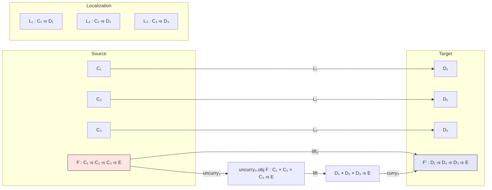

Here is the structured technical brief extracted from `Trifunctor.lean`:

---

### **1. Key Definitions & Theorems**

| Name | Type / Signature | Purpose |
|------|------------------|---------|
| `IsInvertedBy₃` | `MorphismProperty C₁ → MorphismProperty C₂ → MorphismProperty C₃ → (C₁ ⥤ C₂ ⥤ C₃ ⥤ E) → Prop` | States that a trifunctor `F` inverts the product of three morphism properties via currying. |
| `Lifting₃` | `class` | Encapsulates the data of an isomorphism between a trifunctor `F` and the localization-induced trifunctor `F'`, i.e., `F ≅ (((L₁ ⊠ L₂) ⊠ L₃) ⋙ F')`. |
| `lift₃` | `D₁ ⥤ D₂ ⥤ D₃ ⥤ E` | Induced localized trifunctor from `F : C₁ ⥤ C₂ ⥤ C₃ ⥤ E` that inverts `W₁, W₂, W₃`, using universal property of localization. |
| `lift₃NatTrans` | `F₁' ⟶ F₂'` | Natural transformation between localized trifunctors induced by a natural transformation `τ : F₁ ⟶ F₂`. |
| `lift₃NatIso` | `F₁' ≅ F₂'` | Natural isomorphism between localized trifunctors induced by `e : F₁ ≅ F₂`. |
| `Lifting₃.bifunctorComp₁₂` | `Lifting₃ …` | Shows compatibility of localization with the `bifunctorComp₁₂` construction (left-associated trifunctor). |
| `Lifting₃.bifunctorComp₂₃` | `Lifting₃ …` | Shows compatibility of localization with the `bifunctorComp₂₃` construction (right-associated trifunctor). |
| `associator` | `bifunctorComp₁₂ F₁₂' G' ≅ bifunctorComp₂₃ F' G₂₃'` | The **main theorem**: the associator isomorphism for trifunctors lifts through localization. |
| `associator_hom_app_app_app` | `∀ X₁ X₂ X₃, …` | Explicit description of the action of `associator.hom` on objects under localization. |

---

### **2. Naming Conventions**

- **Prefixes**:
  - `is_`: e.g., `IsInvertedBy₃` — property definitions.
  - `lift₃`: e.g., `lift₃`, `lift₃NatTrans`, `lift₃NatIso` — localization lifts for trifunctors.
  - `bifunctorComp₁₂`, `bifunctorComp₂₃`: constructions of trifunctors via composition of bifunctors.
- **Suffixes**:
  - `_₃`: indicates trifunctor-level analogues (e.g., `Lifting₃`, `IsInvertedBy₃`).
  - `_app_app_app`: triple application on objects (for trifunctors).
- **Notation**:
  - `⊠` (prod of functors), `⋙` (composition), `curry₃`, `uncurry₃`, `currying₃`, `whiskeringLeft₃`, `whiskeringRight`.

---

### **3. Tactic Stack**

Frequent tactics used in proofs:
- `dsimp`, `simp only`, `simp` — for simplification using definitional equalities and lemmas.
- `rw` — rewriting using isomorphism equations.
- `cat_disch` — category-theoretic automation (likely a custom tactic for diagram chasing).
- `exact`, `apply`, `intro`, `cases` — standard proof scripting.
- `currying₃_unitIso_hom_app_app_app_app`, `currying₃_unitIso_inv_app_app_app_app` — specialized simplification lemmas for currying isomorphisms.

---

### **4. Proof Logic**

- **Structure**:
  - **Step 1**: Define when a trifunctor inverts three morphism properties (`IsInvertedBy₃`).
  - **Step 2**: Introduce `Lifting₃` class to encode the existence of a localized lift up to iso.
  - **Step 3**: Use `uncurry₃` to reduce trifunctor lifting to bifunctor lifting (via `Lifting`).
  - **Step 4**: Construct `lift₃` using the universal property of localization applied to `uncurry₃.obj F`.
  - **Step 5**: Prove naturality: `lift₃NatTrans`, `lift₃NatIso`, with extensionality lemma `natTrans₃_ext`.
  - **Step 6**: Show compatibility of localization with two canonical trifunctor constructions (`bifunctorComp₁₂`, `bifunctorComp₂₃`) via `Lifting₃.bifunctorComp₁₂` and `Lifting₃.bifunctorComp₂₃`.
  - **Step 7**: Use these to construct the **localized associator** `associator`, and verify its action via `associator_hom_app_app_app`.

- **Key technique**: Reduction to known bifunctor localization results via currying/uncurrying, and use of unit/counit isomorphisms of the currying equivalence (`currying₃.unitIso`).

---

### **5. Imports**

- `Mathlib.CategoryTheory.Localization.Bifunctor` — foundational bifunctor localization.
- `Mathlib.CategoryTheory.Functor.CurryingThree` — theory of 3-ary currying/uncurrying.
- `Mathlib.CategoryTheory.Products.Associator` — associator isomorphisms for product categories.

---

### **6. Mermaid Diagrams**

#### **Dependency Graph (Module Level)**


#### **Theoretical Overview (Trifunctor Localization)**



#### **Associator Construction Flow**

```mermaid
graph TD
  iso["iso : bifunctorComp₁₂ F₁₂ G ≅ bifunctorComp₂₃ F G₂₃"]
  iso --> postcompose["(Functor.postcompose₃.obj L).mapIso iso"]
  Lifting₁["Lifting₃.bifunctorComp₁₂"] --> iso₁["iso₁ : L₁,L₂,L₃ ⊩ bifunctorComp₁₂ F₁₂' G'"]
  Lifting₂["Lifting₃.bifunctorComp₂₃"] --> iso₂["iso₂ : L₁,L₂,L₃ ⊩ bifunctorComp₂₃ F' G₂₃'"]
  iso₁ & iso₂ & postcompose --> lift₃NatIso["lift₃NatIso … iso"]
  lift₃NatIso --> associator["associator : bifunctorComp₁₂ F₁₂' G' ≅ bifunctorComp₂₃ F' G₂₃'"]
```

---

Let me know if you'd like a formalized summary in Lean syntax or a diagram for the naturality squares.
