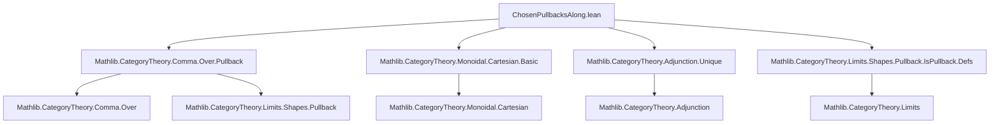
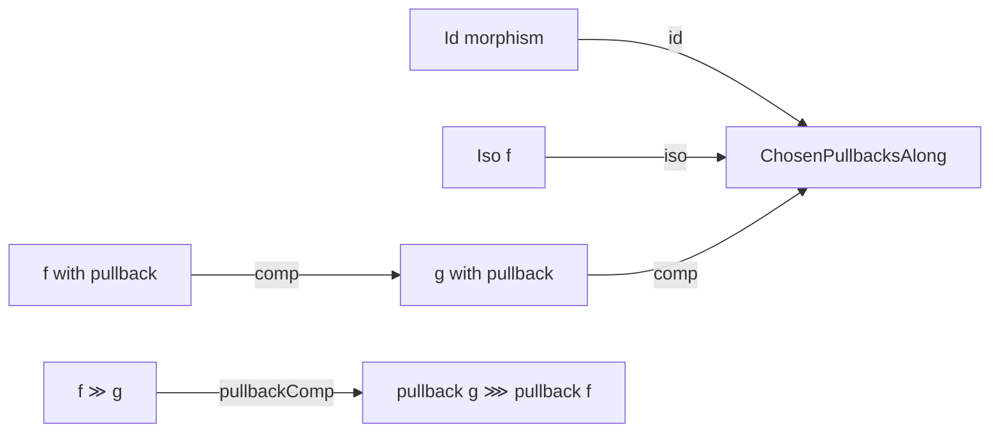

### Technical Brief: `ChosenPullbacksAlong.lean`

---

#### **1. Key Definitions & Theorems**

| Name | Type / Signature | Purpose |
|------|------------------|---------|
| `ChosenPullbacksAlong f` | `class` for `f : Y ⟶ X` | Provides a *functorial* choice of pullbacks along `f`: a right adjoint `pullback : Over X ⥤ Over Y` to `Over.map f`. |
| `ChosenPullbacks` | `abbrev` | A category has *chosen pullbacks* if every morphism has a `ChosenPullbacksAlong`. |
| `ofHasPullbacksAlong` | `def` | Converts a noncomputable `HasPullbacksAlong f` into `ChosenPullbacksAlong f`. |
| `id X` | `def` | Identity morphism `𝟙 X` has chosen pullbacks (via identity functor). |
| `pullbackId X` | `def` | Natural isomorphism `pullback (𝟙 X) ≅ 𝟭 (Over X)`. |
| `iso f` | `def` | Any isomorphism `f : Y ≅ X` has chosen pullbacks (via precomposition with `f.inv`). |
| `comp f g` | `def` | Composition of morphisms with chosen pullbacks inherits chosen pullbacks (via composition of functors). |
| `pullbackComp f g` | `def` | Natural isomorphism `pullback (f ≫ g) ≅ pullback g ⋙ pullback f`. |
| `cartesianMonoidalCategoryToUnit f` | `def` | Morphisms to terminal object `1` have chosen pullbacks in cartesian monoidal categories. |
| `cartesianMonoidalCategoryFst X Y` | `def` | First projection `fst : X ⊗ Y ⟶ X` has chosen pullbacks. |
| `cartesianMonoidalCategorySnd X Y` | `def` | Second projection `snd : X ⊗ Y ⟶ Y` has chosen pullbacks. |
| `pullbackObj f g` | `abbrev` | Underlying object of the chosen pullback of `f` along `g`. |
| `fst f g`, `snd f g` | `abbrev` | Projections from the pullback object to `Y` and `Z`. |
| `lift a b h` | `def` | Universal morphism into the pullback object from a cone `a : W ⟶ Y`, `b : W ⟶ Z` with `a ≫ f = b ≫ g`. |
| `pullbackMap ...` | `def` | Functoriality of pullback objects under morphisms between cospan diagrams. |
| `pullbackCone f g` | `def` | Canonical pullback cone from chosen pullback data. |
| `isLimitPullbackCone f g` | `def` | Proof that the canonical cone is a limit cone. |
| `isPullback f g` | `def` | The canonical square is a pullback (i.e., satisfies the universal property). |
| `chosenPullbacksAlongFst f g` | `def` | If `g` has chosen pullbacks, then `fst f g` does too. |
| `pullbackIsoOverPullback g` | `noncomputable def` | Natural isomorphism between computable `ChosenPullbacksAlong.pullback g` and noncomputable `Over.pullback g`. |

---

#### **2. Naming Conventions**

- **Prefixes**:
  - `pullback...`: refers to the pullback object, projections, or functors.
  - `fst`, `snd`: standard projections from pullback object.
  - `lift...`: universal morphism into pullback.
  - `mapPullbackAdj...`: adjunction data (unit/counit) between `Over.map f` and `pullback f`.
  - `unit_`, `counit_`: components of unit/counit of adjunction.
  - `iso...`, `id`, `comp`: closure properties of the class.

- **Suffixes**:
  - `'` (e.g., `fst'`, `snd'`): morphisms *in* `Over X`, i.e., over `X`.
  - `Obj`: underlying object of a construction (e.g., `pullbackObj`).
  - `Cone`: cone-level data (e.g., `pullbackCone`).
  - `Limit`: limit cone data (e.g., `isLimitPullbackCone`).

- **Adjectives**:
  - `ChosenPullbacksAlong`: class name.
  - `ChosenPullbacks`: global property.
  - `hasPullbackAlong`, `hasPullbacks`: instance constructors.

---

#### **3. Tactic Stack**

- **Core tactics**:
  - `rw`, `simp`, `refl`, `exact`, `intro`, `cases`
  - `cat_disch`: custom tactic for discharging commutativity conditions in categories.
  - `reassoc`: used in `@[reassoc]` attributes to simplify whiskering/composition.
  - `congr_arg`, `funext`, `ext`: for extensionality and equality proofs.
  - `have`, `set_option`: for local definitions and settings (e.g., `backward.privateInPublic true`).
  - `simpa using`: to simplify using a hypothesis.

- **Category-theoretic automation**:
  - `Over.forget X).map_injective`: injectivity of forgetful functor on morphisms.
  - `Adjunction.*` lemmas: `homEquiv`, `unit_rightAdjointUniq_hom`, `rightAdjointUniq_hom_counit`, etc.
  - `Over.w`, `Over.comp_left_assoc`: lemmas about morphisms in comma categories.

---

#### **4. Proof Logic**

- **Inductive structure**:
  - Most proofs are *constructive* and *data-driven*, leveraging the adjunction `Over.map f ⊣ pullback f`.
  - Universal properties are proven via `homEquiv`, `unit`, and `counit`.
  - Uniqueness of lifts follows from injectivity of `Over.forget` and faithfulness of hom-sets.

- **Typical proof flow**:
  1. Define candidate morphism using `lift` (via `homEquiv`).
  2. Prove commutativity of triangles using `lift_fst`, `lift_snd`.
  3. Prove uniqueness using `hom_ext` (based on projections).
  4. For naturality/functoriality, use `pullbackMap` and verify projections via `pullbackMap_fst`, `pullbackMap_snd`.
  5. For isomorphisms between functors, use `Adjunction.rightAdjointUniq`.

- **Key lemmas used**:
  - `Adjunction.homEquiv_counit`: relates `homEquiv` to counit.
  - `Over.w`: characterizes morphisms in `Over X`.
  - `pullbackIsoOverPullback`: bridges computable and noncomputable pullbacks.

---

#### **5. Imports**

| Module | Purpose |
|--------|---------|
| `Mathlib.CategoryTheory.Comma.Over.Pullback` | Pullbacks in over-categories, `Over.pullback`, `Over.mapPullbackAdj`. |
| `Mathlib.CategoryTheory.Monoidal.Cartesian.Basic` | Cartesian monoidal structure, `fst`, `snd`, `𝟙_`, etc. |
| `Mathlib.CategoryTheory.Adjunction.Unique` | Uniqueness of right adjoints (`rightAdjointUniq`). |
| `Mathlib.CategoryTheory.Limits.Shapes.Pullback.IsPullback.Defs` | Definitions of `IsPullback`, `PullbackCone`, `IsLimit`. |

---

#### **6. Mermaid Diagrams**

##### **Dependency Graph (Module-Level)**

##### **Conceptual Overview (Theory Flow)**

##### **Closure Properties**

---

#### **7. Summary**

This file formalizes a *computable*, *functorial* version of pullbacks along a morphism, using adjunctions in over-categories. It provides:

- A typeclass `ChosenPullbacksAlong` for *data* (not just existence).
- Closure under identity, isomorphisms, and composition.
- Construction of actual pullback squares (`isPullback`) from the data.
- Applications in cartesian monoidal categories (terminal object, product projections).
- Equivalence with classical pullbacks (`pullbackIsoOverPullback`), ensuring compatibility with existing theory.

The formalization emphasizes *computability* (via `lift` defined from adjunction data) and *naturality* (via `pullbackMap`), making it suitable for further development in categorical logic, type theory, and homotopy theory.
