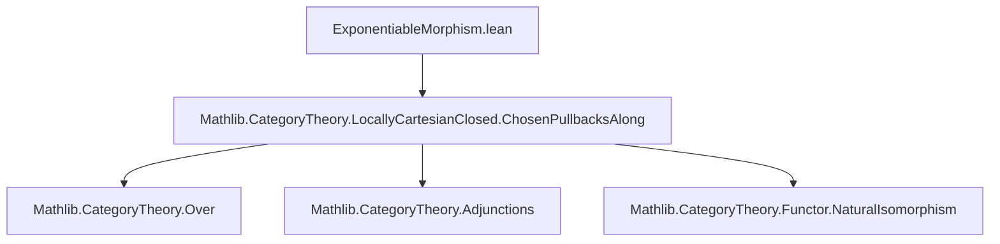
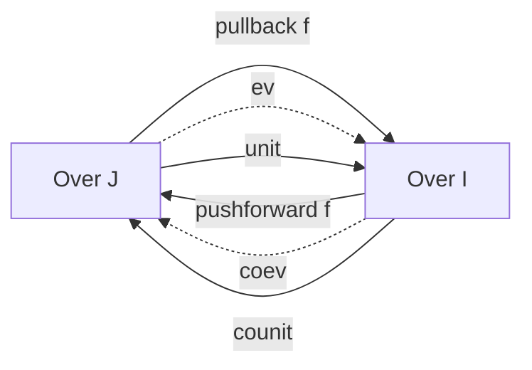

### Technical Brief: `ExponentiableMorphism.lean`

---

#### **1. Key Definitions & Theorems**

| Name | Type / Signature | Purpose |
|------|------------------|---------|
| `ExponentiableMorphism` | `class {I J : C} (f : I ⟶ J) [ChosenPullbacksAlong f] where ...` | Defines a morphism $f$ as *exponentiable* if its pullback functor `pullback f : Over J ⥤ Over I` has a right adjoint (`pushforward f`). |
| `pushforward` | `pushforward : Over I ⥤ Over J` | The right adjoint to `pullback f`, called the *pushforward* along $f$. |
| `pullbackPushforwardAdj` | `pullback f ⊣ pushforward` | The adjunction witnessing exponentiability. |
| `ev` | `ev : pushforward f ⋙ pullback f ⟶ 𝟭 _` | Counit of the adjunction (`ev f = (pullbackPushforwardAdj f).counit`). |
| `coev` | `coev : 𝟭 _ ⟶ pullback f ⋙ pushforward f` | Unit of the adjunction (`coev f = (pullbackPushforwardAdj f).unit`). |
| `pushforwardCurry` | `(pullback f).obj A ⟶ X → A ⟶ (pushforward f).obj X` | Currying isomorphism induced by the adjunction. |
| `pushforwardUncurry` | `A ⟶ (pushforward f).obj X → (pullback f).obj A ⟶ X` | Uncurrying inverse to `pushforwardCurry`. |
| `id` | `I : C → ExponentiableMorphism (𝟙 I)` | Identity morphisms are exponentiable. |
| `comp` | `(f : I ⟶ J) → (g : J ⟶ K) → ExponentiableMorphism (f ≫ g)` | Composition of exponentiable morphisms is exponentiable. |
| `pushforwardId` | `pushforward (𝟙 I) ≅ 𝟭 (Over I)` | Natural isomorphism between pushforward of identity and identity functor. |
| `pushforwardComp` | `pushforward (f ≫ g) ≅ pushforward f ⋙ pushforward g` | Natural isomorphism between pushforward of composition and composition of pushforwards. |

---

#### **2. Naming Conventions**

- **Prefixes**:
  - `pushforward_`: related to the right adjoint (e.g., `pushforwardCurry`, `pushforwardComp`).
  - `ev_`: related to the counit (e.g., `ev_def`, `ev_naturality`, `ev_coev`).
  - `coev_`: related to the unit (e.g., `coev_def`, `coev_naturality`, `coev_ev`).
  - `pullback_`: related to the pullback functor (e.g., `pullbackId`, `pullbackComp`).
- **Suffixes**:
  - `_hom`: morphism part of a natural isomorphism (e.g., `pushforwardId_hom`, `pushforwardComp_hom`).
  - `_adj`: adjunction data (e.g., `pullbackPushforwardAdj`).
  - `_def`: definition lemmas (e.g., `ev_def`, `coev_def`).
- **Adjectives**:
  - `isExponentiable`: predicate version (a `MorphismProperty`).
  - `ChosenPullbacksAlong`: typeclass for functorial pullbacks along a morphism.

---

#### **3. Tactic Stack**

Frequently used tactics in proofs:
- `dsimp`, `rw`, `simp` (especially with `reassoc` and `simp` attributes)
- `infer_instance` (for typeclass resolution)
- `ofNatIsoLeft` (to transport adjunctions along natural isomorphisms)
- `Adjunction.*` lemmas (e.g., `unit_rightAdjointUniq_hom`, `rightAdjointUniq_hom_counit`)
- `rfl` (for definitional equalities)

No heavy automation like `aesop` or `ring` is used — proofs are mostly structural and rely on adjunction calculus.

---

#### **4. Proof Logic**

- **Structure**: Proofs follow standard categorical reasoning:
  - Use of adjunction properties (unit/counit, triangle identities, hom-isomorphism).
  - Transport of adjunctions along natural isomorphisms via `ofNatIsoLeft`.
  - Use of `rightAdjointUniq` to identify right adjoints up to unique isomorphism.
- **Induction**: Not used — all arguments are categorical/functorial.
- **Case analysis**: Minimal; mostly handled by typeclass inference and definitional equality.
- **Key pattern**:
  - Define candidate right adjoint (`pushforward`).
  - Construct adjunction using `ofNatIsoLeft` and known adjunctions (e.g., `pullbackId`, `pullbackComp`).
  - Prove naturality and triangle identities via `simp` and adjunction lemmas.

---

#### **5. Imports & Dependencies**

- **Core imports**:
  ```lean
  import Mathlib.CategoryTheory.LocallyCartesianClosed.ChosenPullbacksAlong
  ```
- **Open namespaces**:
  - `Category`, `MonoidalCategory`, `Functor`, `Adjunction`
  - `ChosenPullbacksAlong`
- **Dependencies**:
  - `CategoryTheory.Over`
  - `CategoryTheory.Adjunctions`
  - `CategoryTheory.NaturalIsomorphism`
  - `CategoryTheory.LocallyCartesianClosed.ChosenPullbacksAlong`

---

#### **6. Mermaid Diagrams**

##### **Dependency Graph (Module-Level)**



##### **Conceptual Overview (Theory Flow)**

```mermaid
flowchart LR
  A[ChosenPullbacksAlong f] --> B[Pullback Functor pullback f : Over J ⥤ Over I]
  B --> C[ExponentiableMorphism f]
  C --> D[Pushforward Functor pushforward f : Over I ⥤ Over J]
  D --> E[Adjunction pullback f ⊣ pushforward f]
  E --> F[ev = counit, coev = unit]
  F --> G[Currying/Uncurrying isomorphisms]
  C --> H[id : ExponentiableMorphism (𝟙 I)]
  C --> I[comp : ExponentiableMorphism (f ≫ g)]
  H --> J[pushforward (𝟙 I) ≅ 𝟭]
  I --> K[pushforward (f ≫ g) ≅ pushforward f ⋙ pushforward g]
```

##### **Adjunction Triangle (Local Structure)**



---

#### **7. Summary**

This module formalizes *exponentiable morphisms* in a category $C$ with functorial pullbacks. The key idea is that exponentiability of $f : I \to J$ means the pullback functor $f^* : \mathrm{Over}(J) \to \mathrm{Over}(I)$ has a right adjoint $f_* : \mathrm{Over}(I) \to \mathrm{Over}(J)$, called the *pushforward*. The formalization includes:

- The definition of `ExponentiableMorphism` as a class.
- Construction of the unit (`coev`) and counit (`ev`) of the adjunction.
- Currying/uncurrying isomorphisms.
- Proof that identities and compositions of exponentiable morphisms are exponentiable.
- Natural isomorphisms identifying pushforwards of identities and compositions with compositions of pushforwards.

The theory is foundational for locally cartesian closed categories and dependent type theory semantics (e.g., in the internal logic of toposes). The TODO item about pullbacks of exponentiable morphisms suggests future work in stability under base change.

--- 

Let me know if you'd like a formalized summary in Lean syntax or a proof sketch of `comp`.
