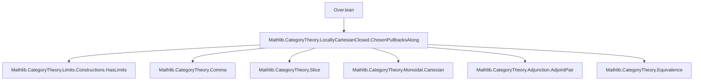
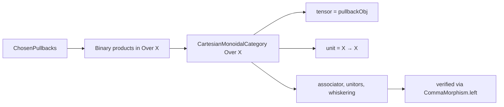

### Technical Brief: `Over.lean` — Cartesian Monoidal Structure on Slices via Chosen Pullbacks

---

#### **1. Key Definitions & Theorems**

| Name | Type / Signature | Purpose |
|------|------------------|---------|
| `binaryFan` | `[ChosenPullbacksAlong Z.hom] → BinaryFan Y Z` | Constructs a binary fan from chosen pullbacks along `Z.hom`. |
| `binaryFanIsBinaryProduct` | `[ChosenPullbacksAlong Z.hom] → IsLimit (binaryFan Y Z)` | Shows the binary fan is a product in `Over X`. |
| `cartesianMonoidalCategoryOver` | `[ChosenPullbacks C] (X : C) → CartesianMonoidalCategory (Over X)` | Provides a *computable* cartesian monoidal structure on `Over X` using chosen pullbacks. |
| `toOver` | `[CartesianMonoidalCategory C] (X : C) → C ⥤ Over X` | Maps `A ↦ A ⊗ X → X`, the computable analogue of `Over.star`. |
| `toOverUnit` | `C ⥤ Over (𝟙_ C)` | Sends `X ↦ X → 1`, the unit projection. |
| `equivToOverUnit` | `Over (𝟙_ C) ≌ C` | Equivalence between slice over terminal object and base category. |
| `toOverUnitPullback` | `toOverUnit C ⋙ pullback (toUnit X) ≅ toOver X` | Natural iso between post-composition with pullback along unit and `toOver X`. |
| `forgetAdjToOver` | `Over.forget X ⊣ toOver X` | `toOver X` is right adjoint to forgetful functor. |
| `toOverIsoToOverUnit` | `toOver (𝟙_ C) ≅ toOverUnit C` | Iso between `toOver` at terminal and `toOverUnit`. |
| `toOverPullbackIsoToOver` | `toOver X ⋙ pullback f ≅ toOver Y` for `f : Y → X` | Natural iso expressing compatibility of `toOver` with pullback. |
| `toOverIteratedSliceForwardIsoPullback` | `toOver (Over.mk f) ⋙ iteratedSliceForward ≅ pullback f` | Relates pullback along `f` to `toOver` on iterated slice + equivalence. |

---

#### **2. Naming Conventions**

- **Prefixes**:
  - `is_`: e.g., `isBinaryProduct`, `IsTerminal.ofUniqueHom`
  - `to_`: e.g., `toOver`, `toOverUnit`, `toUnit`
  - `forget_`: e.g., `forgetAdjToOver`, `forget`
  - `pullback_`: e.g., `pullback`, `pullbackMap`, `pullbackObj`
  - `binaryFan_`: e.g., `binaryFan`, `binaryFanIsBinaryProduct`
  - `tensor_`, `fst`, `snd`: for monoidal structure components.

- **Suffixes**:
  - `_left`, `_hom`: for projections in comma category morphisms.
  - `_iso_`: for natural isomorphisms (`toOverPullbackIsoToOver`, `toOverIteratedSliceForwardIsoPullback`).
  - `_ext`, `_simp`: for extensionality and simplification lemmas.

- **Monoidal notation**:
  - `⊗ₘ`, `α_`, `λ_`, `ρ_`, ` whiskerLeft`, `whiskerRight`, `lift`, `toUnit`, `fst`, `snd`.

---

#### **3. Tactic Stack**

- **Core proof tactics**:
  - `cat_disch`: used repeatedly to discharge diagrammatic commutativity.
  - `ext`: for extensionality in comma category morphisms.
  - `simp` / `dsimp`: heavily used, especially with `@[simp]`, `@[reassoc]`, `@[simps!]`.
  - `congr_arg CommaMorphism.left`: to reduce equalities of morphisms in comma categories to equalities of left components.
  - `rw [Adjunction.homEquiv_counit]`, `simp [toOver]`: for adjunction manipulations.
  - `eqTo_iso`, `NatIso.ofComponents`: for constructing natural isomorphisms.

- **Category-theoretic automation**:
  - `cart_disch`, `cat_disch`: custom tactics for diagram chasing in comma/slice categories.
  - `Over.OverMorphism.ext`: extensionality principle for morphisms in `Over X`.

---

#### **4. Proof Logic**

- **Inductive structure**:
  - Most proofs proceed by:
    1. **Unfolding definitions** (e.g., `tensorObj_left`, `tensorUnit_left`, `lift_left`).
    2. **Reducing to base category** via `CommaMorphism.left`.
    3. **Applying universal properties** (e.g., `binaryFanIsBinaryProduct` uses `BinaryFan.IsLimit.mk`).
    4. **Using adjunctions** (e.g., `forgetAdjToOver` constructs unit/counit explicitly).
    5. **Verifying naturality** via `NatIso.ofComponents` + `simp`.

- **Pattern**:
  - For isomorphisms: construct component-wise iso (often `Iso.refl _`) and prove naturality via `simp`.
  - For adjunctions: define unit/counit explicitly, verify triangle identities via `simp` and `cat_disch`.
  - For monoidal structure: verify axioms via `ofChosenFiniteProducts`, using `binaryFanIsBinaryProduct` for binary products and terminal object.

---

#### **5. Imports & Dependencies**

- **Primary imports**:
  ```lean
  Mathlib.CategoryTheory.LocallyCartesianClosed.ChosenPullbacksAlong
  ```
- **Implicit dependencies**:
  - `Mathlib.CategoryTheory.Limits.Constructions.HasLimits`
  - `Mathlib.CategoryTheory.CartesianClosed`
  - `Mathlib.CategoryTheory.Monoidal.Cartesian`
  - `Mathlib.CategoryTheory.Comma`
  - `Mathlib.CategoryTheory.Slice`
  - `Mathlib.CategoryTheory.Adjunction.AdjointPair`
  - `Mathlib.CategoryTheory.Equivalence`

---

#### **6. Mermaid Diagrams**

##### **Dependency Graph (Module-Level)**



##### **Overview of Theoretical Flow**

```mermaid
graph LR
  A[ChosenPullbacks C] --> B[cartesianMonoidalCategoryOver]
  B --> C[Over X has finite products]
  C --> D[toOver X : C → Over X]
  D --> E[toOver X ⊣ Over.forget X]
  E --> F[toOverUnit : C → Over 1]
  F --> G[equivToOverUnit : Over 1 ≌ C]
  D --> H[toOverPullbackIsoToOver]
  H --> I[toOverIteratedSliceForwardIsoPullback]
  I --> J[Pullback f ≅ toOver (Over.mk f) ⋙ iteratedSliceForward]
```

##### **Monoidal Structure in `Over X`**



---

#### **7. Summary**

This file formalizes the *computable* cartesian monoidal structure on slice categories `Over X` under the assumption of *chosen pullbacks* in the base category `C`. It constructs:

- A **monoidal structure** on `Over X` via pullbacks,
- A **right adjoint** `toOver X` to the forgetful functor,
- **Natural isomorphisms** expressing coherence between `toOver`, pullback, and iterated slicing.

It serves as a foundational step toward locally cartesian closed categories and dependent type theory semantics, where pullbacks model substitution and slices model context extension.

--- 

Let me know if you'd like a formalized dependency graph in `leanpkg.toml` format or a proof outline for a specific theorem.
