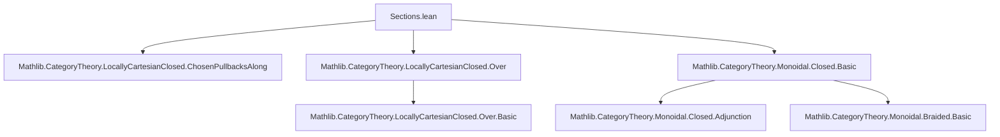

### Technical Brief: `Sections.lean`

---

#### **1. Key Definitions & Theorems**

| Name | Type / Signature | Purpose |
|------|------------------|---------|
| `curryRightUnitorHom` | `abbrev curryRightUnitorHom : 𝟙_ C ⟶ (I ⟶[C] I)` | Defines the curried right unitor as a morphism into the internal hom; used to define the pullback for sections. |
| `sections` | `def sections : Over I ⥤ C` | The *section functor*, mapping an object $X \xrightarrow{f} I$ in `Over I` to the pullback object of sections of $f$ over $I$. |
| `sectionsCurry` | `def sectionsCurry {X : Over I} {A : C} (u : (toOver I).obj A ⟶ X) : A ⟶ (sections I).obj X` | Currying operation: maps a morphism $A \otimes I \to X$ over $I$ to a morphism $A \to \Gamma(X)$ (object of sections). |
| `sectionsUncurry` | `def sectionsUncurry {X : Over I} {A : C} (v : A ⟶ (sections I).obj X) : (toOver I).obj A ⟶ X` | Uncurrying operation: inverse to `sectionsCurry`, reconstructs a morphism over $I$ from a section. |
| `coreHomEquivToOverSections` | `def coreHomEquivToOverSections : CoreHomEquiv (toOver I) (sections I)` | Constructs the natural bijection $\mathrm{Hom}((\mathrm{toOver}\, I)\, A, X) \cong \mathrm{Hom}(A, \mathrm{sections}\, I\, X)$, used to build the adjunction. |
| `toOverSectionsAdj` | `def toOverSectionsAdj : toOver I ⊣ sections I` | The main theorem: the *toOver* functor (tensoring with $I$) is left adjoint to the *sections* functor. |

---

#### **2. Naming Conventions**

- **Prefixes**:
  - `curry_`, `uncurry_`: related to internal hom adjunction.
  - `sections_`: all definitions/theorems about the section functor.
  - `toOver_`: related to the functor $X \mapsto X \otimes I \xrightarrow{\pi_2} I$.
- **Suffixes**:
  - `_hom`: morphism part (e.g., `curryRightUnitorHom`).
  - `_obj`: object part (not used here, but standard in Lean).
  - `_map`: morphism mapping (e.g., `pullbackMap`).
- **Other**:
  - `lift`, `homEquiv`, `naturality`: standard categorical terminology.
  - `adj`, `coreHomEquiv`: indicates adjunction-related structure.

---

#### **3. Tactic Stack**

Frequently used tactics in proofs:
- `simp`: simplification using `simp` lemmas (e.g., `curry_natural_right`, `uncurry_natural_left`, `braiding_hom_fst`, etc.).
- `rw`: rewriting using equations (especially naturality squares and definitions).
- `dsimp`: definitional simplification (e.g., unfolding `curryRightUnitorHom`, `sectionsCurry`, etc.).
- `ext`: extensionality for morphisms (especially in `Over`).
- `cat_disch`: custom tactic (likely from `CategoryTheory` infrastructure) to discharge categorical diagrams.
- `congr`: for congruence reasoning on morphism equalities.
- `apply`, `intro`, `have`, `set`, `cases`: standard Lean tactics.

---

#### **4. Proof Logic**

- **Structure**:
  1. Define `curryRightUnitorHom` to encode the “identity section” $1 \to I \multimap I$.
  2. Define `sections` via a pullback diagram:
     $$
     \begin{array}{ccc}
     \Gamma(X) & \to & I \multimap X \\
     \downarrow & & \downarrow \\
     1 & \xrightarrow{\mathrm{curry}(\rho_I)} & I \multimap I
     \end{array}
     $$
  3. Define `sectionsCurry` and `sectionsUncurry` using the universal property of pullbacks and the braiding + tensor-hom adjunction.
  4. Prove they are inverses (`sectionsCurry_sectionUncurry`, `sectionsUncurry_sectionsCurry`) using:
     - naturality of braiding,
     - properties of `uncurry`/`curry`,
     - terminality of $1$,
     - chosen pullback uniqueness.
  5. Assemble into a `CoreHomEquiv`, then lift to an adjunction `toOverSectionsAdj`.

- **Key Logical Flow**:
  - Use *chosen pullbacks* to get functoriality.
  - Use *braided* and *closed* structure to define currying/uncurrying.
  - Use *naturality* of hom-equivalence and tensor-hom adjunction to verify inverses.

---

#### **5. Imports & Dependencies**

| Import | Purpose |
|--------|---------|
| `Mathlib.CategoryTheory.LocallyCartesianClosed.ChosenPullbacksAlong` | Provides infrastructure for pullbacks along a fixed morphism (used for `sections`). |
| `Mathlib.CategoryTheory.LocallyCartesianClosed.Over` | Defines the over-category `Over I`. |
| `Mathlib.CategoryTheory.Monoidal.Closed.Basic` | Provides internal hom (`⟶`), currying, tensor-hom adjunction, etc. |

Additional assumptions:
- `CartesianMonoidalCategory C`: ensures $(-) \otimes -$ is cartesian product.
- `Closed I`: ensures $I$ is exponentiable (i.e., $-\otimes I$ has a right adjoint).
- `BraidedCategory C`: needed for symmetry in currying/uncurrying (e.g., $\beta_{I,A}$).

---

#### **6. Mermaid Diagrams**

##### **Dependency Graph (Module-Level)**



##### **Overview Diagram (Theoretical Flow)**

```mermaid
graph LR
  C[Cartesian Monoidal Category C] --> I[Exponentiable Object I]
  I --> toOver[toOver I : C → Over I]
  I --> sections[sections I : Over I → C]
  toOver -.->|⊣| sections
  sections <-- pullback --> I⟶X
  I⟶X <-- curryRightUnitorHom --> 1
  sectionsCurry <--> sectionsUncurry
```

##### **Pullback Defining `sectionsObj`**

```mermaid
graph LR
  sectionsObj[X] -->[fst] I ⟶ X
  |                      |
  snd                    | ihom I |>.map X.hom
  v                      v
  1 -->[curryRightUnitorHom] I ⟶ I
```

---

#### **7. Summary**

This file formalizes a foundational result in categorical logic and type theory:  
> In a cartesian monoidal category $C$, for any exponentiable object $I$, the functor $X \mapsto X \otimes I$ (i.e., `toOver I`) has a right adjoint given by taking sections over $I$.

This is a categorical abstraction of *dependent product* or *function space* formation in type theory, and is foundational for internal logic and locally cartesian closed structures.

The proof is constructive and leverages:
- Chosen pullbacks for functoriality,
- Braided monoidal structure for symmetry,
- Closed structure for currying/uncurrying,
- Terminality of $1$ for uniqueness.

It sets the stage for further development of *locally cartesian closed categories* and *dependent type theory semantics* in Lean.

--- 

Let me know if you'd like a formalized summary in `lean` docstring format or a visualization of the naturality squares.
