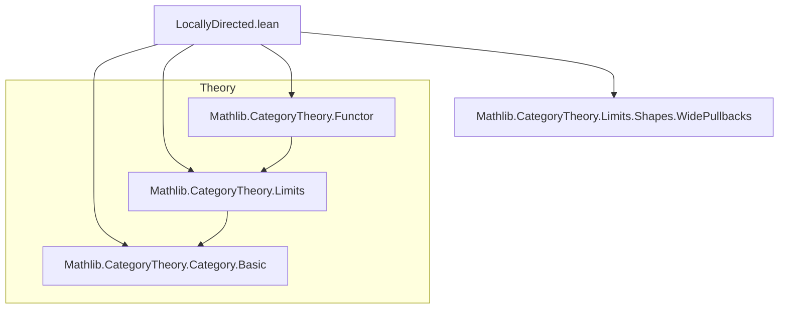
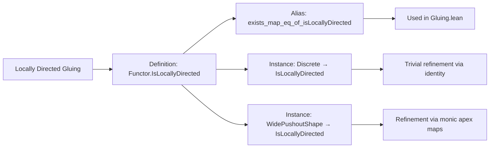

**Technical Brief: `LocallyDirected.lean`**

---

### 1. **Key Definitions & Theorems**

| Name | Type | Purpose |
|------|------|---------|
| `Functor.IsLocallyDirected` | `class (F : J ⥤ Type*) : Prop` | Defines *local directedness*: for any two objects mapping to a common object in the diagram, and any pair of elements in their images that agree under the maps, there exists a common refinement (an object `l` with maps to both) and a witness element mapping to both. |
| `Functor.exists_map_eq_of_isLocallyDirected` | `alias` | Re-exports `cond` under a more descriptive name: `∀ {i j k} fi fj xi xj, F.map fi xi = F.map fj xj → ∃ l fli flj x, F.map fli x = xi ∧ F.map flj x = xj`. |
| `instance Discrete.F.IsLocallyDirected` | `instance` | Shows that any functor from a discrete category is locally directed — trivial because all hom-sets are identities, so the refinement is just the source object itself. |
| `instance WidePushoutShape.F.IsLocallyDirected` | `instance` | Shows that functors from a wide pushout shape (i.e., diagrams shaped like a cocone over a discrete diagram) are locally directed, assuming the apex maps are monic. This uses case analysis on the homs in `WidePushoutShape`. |

---

### 2. **Naming Conventions**

- **Prefixes**:
  - `is_` in `IsLocallyDirected`: indicates a *property* of a structure (here, a functor).
  - `exists_..._of_...`: standard Lean pattern for extracting existence from a hypothesis (e.g., `exists_map_eq_of_isLocallyDirected`).
- **Suffixes**:
  - `_cond`: used for the core condition in the class (internal to the class).
- **Variable naming**:
  - `fi`, `fj`, `fli`, `flj`: morphisms in the indexing category `J`.
  - `xi`, `xj`, `x`: elements in the image sets under `F.obj`.

---

### 3. **Tactic Stack**

- `constructor`: to introduce the single field of the `class`.
- `rintro`: for destructuring nested dependent pairs (e.g., `⟨i⟩`, `⟨j⟩`, etc.).
- `simp only [...]`: heavily used to simplify homs and actions of functors on identities and morphisms.
- `exact fun x ↦ ⟨..., by simp⟩`: standard pattern to construct witnesses and discharge goals via simplification.
- `simp`: used in the `exact` tactic to close goals by rewriting definitions.

No heavy automation (e.g., `aesop`, `ring`, `linarith`) is used — the proofs are mostly definitional simplifications.

---

### 4. **Proof Logic**

- **Structure**: Proofs proceed by:
  1. Introducing the quantified variables (`i, j, k`, morphisms `fi, fj`, elements `xi, xj`).
  2. Using `rintro` to unpack categorical structure (e.g., discrete category objects as `⟨i⟩`, morphisms as identities).
  3. Simplifying using `simp only` with lemmas like `Discrete.functor_map_id`, `FunctorToTypes.map_id_apply`, `forall_eq'`, etc.
  4. Constructing the required witness object `l` and morphisms `fli, flj`, and element `x`, then discharging the proof obligations via `by simp`.

- **Key idea**: In discrete or wide pushout diagrams, the required “common refinement” is either trivial (identity morphisms) or follows from monicity of the apex maps (in the wide pushout case).

---

### 5. **Imports**

- `Mathlib.CategoryTheory.Limits.Shapes.WidePullbacks`  
  *(Note: despite the name, this import is likely used for `WidePushoutShape`, which is defined in the same file or related file. Possibly a typo or alias in the import path.)*

This module is foundational for *gluing constructions* in topology and algebraic geometry, especially for colimits of open embeddings.

---

### 6. **Mermaid Diagrams**

#### **Dependency Graph**

#### **Overview of File Structure**

---

### 7. **Theoretical Context**

- **Goal**: To formalize the condition under which a colimit of open embeddings in `TopCat` behaves like a *gluing* of open subsets.
- **Motivation**: In algebraic geometry (see `Mathlib/AlgebraicGeometry/Gluing.lean`), one often glues schemes or sheaves along open immersions; local directedness ensures that the colimit respects intersections as unions.
- **Interpretation**: The condition says that for any point `x` appearing in two objects of the diagram, there is a third object mapping into both where `x` originates — i.e., the diagram is “locally filtered” around each point.

--- 

Let me know if you'd like the formalization of the *application* to gluing (e.g., `ColimitOfOpenEmbeddingsIsGluing`) or a comparison with related notions like *filtered diagrams*.
