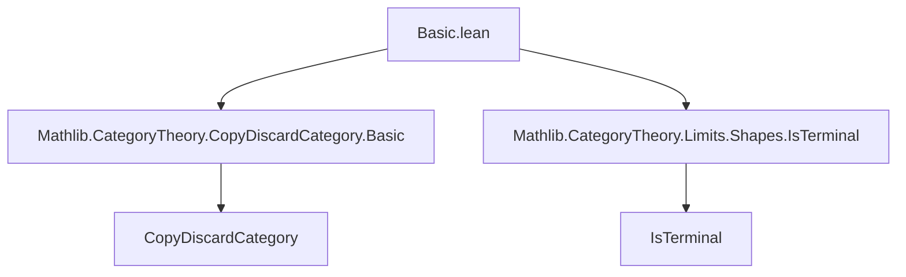

**Technical Brief: `Basic.lean` — Markov Categories in Lean 4**

---

### 1. **Key Definitions & Theorems**

| Name | Type / Signature | Purpose |
|------|------------------|---------|
| `MarkovCategory` | `class MarkovCategory (C : Type u) [Category C] [MonoidalCategory C] extends CopyDiscardCategory C` | Defines a *Markov category* as a copy-discard category where **discard is natural**: for any $f : X \to Y$, $f \gg \varepsilon_Y = \varepsilon_X$. |
| `discard_natural` | `{X Y : C} (f : X ⟶ Y) : f ≫ ε[Y] = ε[X]` | Axiom of `MarkovCategory`: discard commutes with any morphism (i.e., discarding after $f$ is same as discarding before). |
| `eq_discard` | `(X : C) (f : X ⟶ 𝟙_) : f = ε[X]` | Any morphism into the unit object equals discard; follows from naturality of discard and `discard_unit`. |
| `isTerminalUnit` | `IsTerminal (𝟙_ C)` | The monoidal unit $I = \mathbf{1}_C$ is terminal, because all morphisms $X \to I$ are equal (to $\varepsilon_X$). |
| `Subsingleton (X ⟶ 𝟙_)` | `instance (X : C) : Subsingleton (X ⟶ 𝟙_ C)` | Hom-sets into the unit are subsingletons (i.e., at most one morphism), a consequence of terminality. |

---

### 2. **Naming Conventions**

- **Prefixes**:
  - `discard_` — e.g., `discard_natural`, `discard_unit` (used in `CopyDiscardCategory`).
  - `isTerminal_` — e.g., `isTerminalUnit`.
- **Suffixes**:
  - `_natural` — indicates naturality condition (e.g., `discard_natural`).
  - `_unit` — refers to unit object (e.g., `discard_unit`, `isTerminalUnit`).
- **Variable naming**:
  - `C` for the category, `X`, `Y` for objects, `f` for morphisms.
  - `ε` (epsilon) for the discard morphism (standard in copy-discard categories).
  - `𝟙_ C` for the monoidal unit.

---

### 3. **Tactic Stack**

- `rw` — used to rewrite using equalities (e.g., `← Category.comp_id f`, `discard_unit`, `discard_natural`).
- `simp_rw` — applied via `attribute [reassoc (attr := simp)] discard_natural` to enable automatic simplification and reassociation in proofs.
- `exact` / `intro` / `apply` — implicit in `IsTerminal.ofuniqueHom` usage.
- `hom_ext` — used via `isTerminalUnit.hom_ext` to prove subsingleton hom-sets.

No heavy automation (e.g., `aesop`, `linarith`) is used — proofs are mostly direct equational reasoning.

---

### 4. **Proof Logic**

- **Structure**: Lean’s typeclass inference + extensional category theory.
- **Proof pattern**:
  1. Use `← Category.comp_id f` to insert identity.
  2. Apply `discard_unit` (from `CopyDiscardCategory`) to rewrite $\varepsilon_{\mathbf{1}} = \mathrm{id}_{\mathbf{1}}$.
  3. Apply `discard_natural` to swap $f$ and discard.
  4. Simplify to get $f = \varepsilon_X$.
- **Terminality proof**:
  - `IsTerminal.ofuniqueHom _ eq_discard`: shows uniqueness of morphisms into $\mathbf{1}_C$ using `eq_discard`.

Induction or case analysis is *not* used — all arguments are categorical/equational.

---

### 5. **Imports**

| Import | Purpose |
|--------|---------|
| `Mathlib.CategoryTheory.CopyDiscardCategory.Basic` | Provides `CopyDiscardCategory`, `ε`, `discard_unit`, etc. |
| `Mathlib.CategoryTheory.Limits.Shapes.IsTerminal` | Provides `IsTerminal`, `IsTerminal.ofuniqueHom`, `hom_ext`. |

No other dependencies (e.g., no `MeasureTheory`, `Probability`) — purely categorical.

---

### 6. **Mermaid Diagrams**

#### **Dependency Graph (Module-Level)**



#### **Conceptual Overview (Theory Flow)**

```mermaid
flowchart LR
  subgraph Definitions
    A[CopyDiscardCategory] --> B[MarkovCategory]
    B -->|extends| A
    B -->|axiom| C[discard_natural]
  end

  subgraph Consequences
    C --> D[eq_discard]
    D --> E[isTerminalUnit]
    E --> F[Subsingleton (X ⟶ 𝟙_)]
  end

  C -->|natural discard| G[Probabilistic interpretation]
  G --> H[Normalization preservation]
```

#### **Morphism Behavior in Markov Category**

```mermaid
flowchart LR
  X[f] --> Y
  Y[ε[Y]] --> I
  X[ε[X]] --> I
  X[f] --> Y[ε[Y]] == X[ε[X]]  %% discard_natural
```

---

### 7. **Tags & Domain Context**

- **Tags**: `Markov category`, `probability`, `categorical probability`, `copy-discard category`, `terminal object`, `natural transformation`.
- **Domain**: Categorical probability theory — formalizes probabilistic processes where discarding (marginalizing) is globally consistent.
- **Key insight**: Naturality of discard enforces *channel independence* — no information leaks when discarding, enabling Bayesian inversion and disintegration (per cited references).

---

### 8. **References Embedded**

- Cho & Jacobs (2019): *Disintegration and Bayesian inversion via string diagrams*  
- Fritz (2020): *A synthetic approach to Markov kernels, conditional independence and theorems on sufficient statistics*

These motivate the definition and justify the categorical abstraction.

--- 

*End of Technical Brief.*
