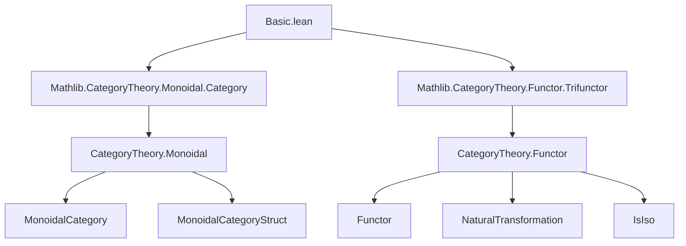
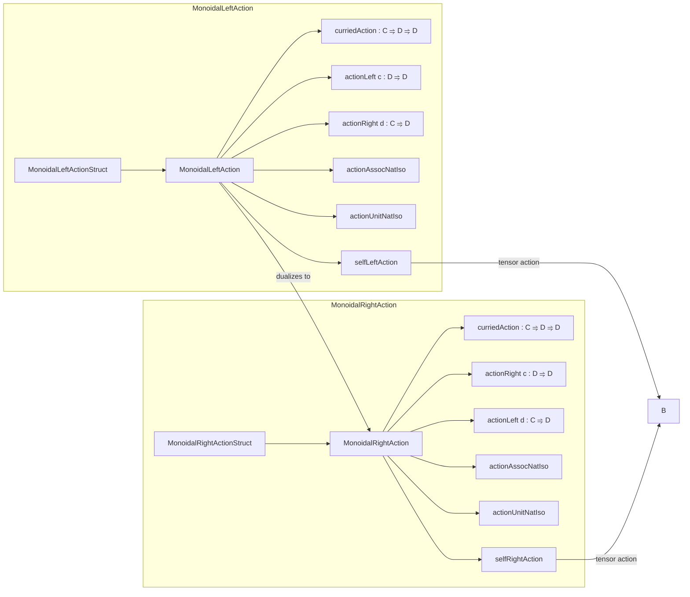

**Technical Brief: Monoidal Actions in Lean 4 (Basic.lean)**  
*Domain: Category Theory — Monoidal Actions on Categories*

---

### 1. KEY DEFINITIONS & THEOREMS

| Name | Type / Signature | Purpose |
|------|------------------|---------|
| `MonoidalLeftActionStruct` | `class` | Core data for a left action: `actionObj : C → D → D`, `actionHomLeft`, `actionHomRight`, `actionAssocIso`, `actionUnitIso`. |
| `MonoidalLeftAction` | `class` | Extends `MonoidalLeftActionStruct` with coherence laws: bifunctoriality, naturality of `αₗ`, `λₗ`, and compatibility with `α_`, `λ_`, `ρ_` in `C`. |
| `MonoidalRightActionStruct` | `class` | Dual data for right actions: `actionObj : D → C → D`, `actionHomLeft`, `actionHomRight`, `actionAssocIso`, `actionUnitIso`. |
| `MonoidalRightAction` | `class` | Right-action coherence laws (dual to left). |
| `curriedAction` (left) | `C ⥤ D ⥤ D` | Curried representation of the left action as a functor into endofunctors on `D`. |
| `curriedAction` (right) | `C ⥤ D ⥤ D` | Curried representation of the right action (note: `obj x y = y ⊙ᵣ x`). |
| `actionLeft` (left) | `c : C ↦ D ⥤ D` | Fixed first argument: `c ⊙ₗ -`. |
| `actionRight` (left) | `d : D ↦ C ⥤ D` | Fixed second argument: `- ⊙ₗ d`. |
| `actionLeft` (right) | `d : D ↦ C ⥤ D` | Fixed second argument: `d ⊙ᵣ -`. |
| `actionRight` (right) | `c : C ↦ D ⥤ D` | Fixed first argument: `- ⊙ᵣ c`. |
| `actionAssocNatIso` (left) | `bifunctorComp₁₂ (curriedTensor C) (curriedAction C D) ≅ bifunctorComp₂₃ (curriedAction C D) (curriedAction C D)` | Encodes associator coherence as a trifunctorial iso. |
| `actionUnitNatIso` (left) | `actionLeft D (𝟙_ C) ≅ 𝟭 D` | Encodes unit coherence. |
| `selfLeftAction` | `instance` | Canonical left action of `C` on itself via tensor: `x ⊙ₗ y := x ⊗ y`. |
| `selfRightAction` | `instance` | Canonical right action of `C` on itself via tensor: `x ⊙ᵣ y := x ⊗ y`. |

**Key Theorems (simplified):**
- `actionHom_def`: `f ⊙ₗₘ g = f ⊵ₗ d ≫ c' ⊴ₗ g`
- `action_exchange`: `w ⊴ₗ g ≫ f ⊵ₗ z = f ⊵ₗ y ≫ x ⊴ₗ g` (interchange law)
- `actionHomRight_comp`, `comp_actionHomLeft`: compatibility with composition
- `tensor_actionHomRight`, `actionHomLeft_action`: interaction with tensor in `C`
- `associator_actionHom`, `leftUnitor_actionHom`, `rightUnitor_actionHom`: coherence with monoidal structure of `C`
- `isIso_actionHomLeft`, `isIso_actionHomRight`, `isIso_actionHom`: action preserves isomorphisms
- `inv_actionHomLeft`, `inv_actionHomRight`, `inv_actionHom`: explicit inverses

---

### 2. NAMING CONVENTIONS

| Pattern | Meaning | Examples |
|--------|---------|----------|
| `actionObj` | Object-level action | `actionObj`, `actionObj d c` (right) |
| `actionHomLeft` / `actionHomRight` | Morphism action on left/right factor | `f ⊵ₗ d`, `c ⊴ₗ f` (left); `f ⊵ᵣ c`, `d ⊴ᵣ f` (right) |
| `actionHom` | Bifunctorial action | `f ⊙ₗₘ g`, `f ⊙ᵣₘ g` |
| `actionAssocIso` / `actionUnitIso` | Structural isomorphisms | `αₗ c c' d`, `λₗ d`, `αᵣ d c c'`, `ρᵣ d` |
| `curriedAction` | Curried functor representation | `curriedAction C D : C ⥤ D ⥤ D` |
| `actionLeft` / `actionRight` | Partial application | `actionLeft c`, `actionRight d` (left); reversed for right |
| `actionHomLeft`, `actionHomRight` (class fields) | Distinguish direction of morphism acted on | `actionHomLeft f c`, `actionHomRight d f` (right) |
| `αₗ`, `λₗ`, `αᵣ`, `ρᵣ` | Notations for structural isos | `αₗ c c' d`, `λₗ d`, `αᵣ d c c'`, `ρᵣ d` |
| `α_`, `λ_`, `ρ_` | Monoidal structure in `C` | `α_ c₁ c₂ c₃`, `λ_ c`, `ρ_ c` |

**Infixes:**
- `⊙ₗ` (70), `⊙ₗₘ` (70), `⊵ₗ`, `⊴ₗ` (81) — left action
- `⊙ᵣ` (70), `⊙ᵣₘ` (70), `⊵ᵣ`, `⊴ᵣ` (81) — right action

---

### 3. TACTIC STACK

| Tactic | Frequency | Role |
|--------|-----------|------|
| `simp` | Very high | Simplification using `@[simp]` lemmas (e.g., `actionHom_def`, `actionHomRight_id`, `action_exchange`) |
| `rw` | High | Rewriting using naturality, iso properties, and coherence lemmas |
| `cat_disch` | Medium | Category-theoretic discharge (likely custom tactic for diagrammatic reasoning) |
| `by simp` / `by rw` / `by cat_disch` | Very high | Used in `where` clauses of class definitions to assert definitional equalities or derive them |
| `reassoc` attribute | Medium | Applied to lemmas to support associativity rewriting (e.g., `@[reassoc]`, `@[reassoc (attr := simp)]`) |
| `ext` / `funext` | Implicit | Used in `@[simps!]` to prove extensionality of functors/natural transformations |
| `iso_ext` / `NatIso.ext` | Implicit | For proving equality of natural isomorphisms |

---

### 4. PROOF LOGIC

**General proof strategy:**
1. **Structural induction / case analysis** on morphism composition (e.g., `f ≫ g`) using `actionHom_comp`.
2. **Naturality** of structural isos (`αₗ`, `λₗ`, `αᵣ`, `ρᵣ`) is enforced via axioms like `actionAssocIso_hom_naturality`.
3. **Compatibility with monoidal coherence** in `C` is enforced via axioms like `associator_actionHom`, `leftUnitor_actionHom`, etc.
4. **Isomorphism preservation** is derived via `IsIso` instances and lemmas like `hom_inv_actionHomLeft'`.
5. **Simp normal forms** are aligned with monoidal category conventions (e.g., left-to-right whiskering, tensor ordering).
6. **Currying/uncurrying** is used to move between bifunctorial and functor-of-functors views (`curriedAction`, `actionLeft`, `actionRight`).

**Typical proof pattern:**
```lean
rw [← actionHom_comp, actionHom_def]
simp [action_exchange]
```
or for naturality:
```lean
rw [actionAssocIso_hom_naturality, Category.assoc]
simp
```

---

### 5. IMPORTS & DEPENDENCIES

| Module | Purpose |
|--------|---------|
| `Mathlib.CategoryTheory.Monoidal.Category` | Provides `MonoidalCategory`, `MonoidalCategoryStruct`, tensor product `⊗`, associator `α_`, unitors `λ_`, `ρ_`, whiskering `◁`, `▷`, etc. |
| `Mathlib.CategoryTheory.Functor.Trifunctor` | Provides `bifunctorComp₁₂`, `bifunctorComp₂₃`, trifunctor composition utilities used in `actionAssocNatIso`. |

**Core dependencies:**
- `CategoryTheory.Category.Basic`
- `CategoryTheory.Functor.Basic`
- `CategoryTheory.NaturalTransformation`
- `CategoryTheory.Isomorphism`
- `CategoryTheory.Monoidal.TensorProduct`
- `CategoryTheory.Monoidal.Coherence`

---

### 6. MERMAID DIAGRAMS

#### Dependency Graph (Top-Level)



#### Module Overview



#### Theory Context (Higher-Level)

```mermaid
graph LR
  A[Monoidal Actions] --> B[Pseudofunctors C → Cat]
  A --> C[Module Objects over Monoids]
  A --> D[Algebras over Monads]
  A --> E[Copowers in Cocomplete Cat]
  B -->|future work| F[Classifying Bicategory]
  C -->|future work| G[Mod_C(M)]
  D -->|future work| H[Algebra M ≅ Mod_M]
  E -->|future work| I[Type u ⊙ -]
```

---

### 7. SUMMARY

This file formalizes **left and right actions of a monoidal category `C` on a category `D`**, generalizing module structures. It provides:
- A **structured interface** (`MonoidalLeftAction`, `MonoidalRightAction`) with explicit coherence laws.
- **Notational support** (`⊙ₗ`, `⊙ᵣ`, `⊵ₗ`, `⊴ₗ`, etc.) aligned with standard mathematical usage.
- **Functorial encodings** (`curriedAction`, `actionLeft`, `actionRight`) to interface with Lean’s functor calculus.
- **Canonical examples** (`selfLeftAction`, `selfRightAction`) and **isomorphism preservation** lemmas.
- **Simp-normalized lemmas** for efficient rewriting in higher-level developments.

The structure is designed to support future work on:
- Equivalence with pseudofunctors `C → Cat`
- Module objects over monoids
- Algebras over monads
- Copower actions in cocomplete categories

This is foundational for higher-categorical algebra and enriched category theory in Lean.
