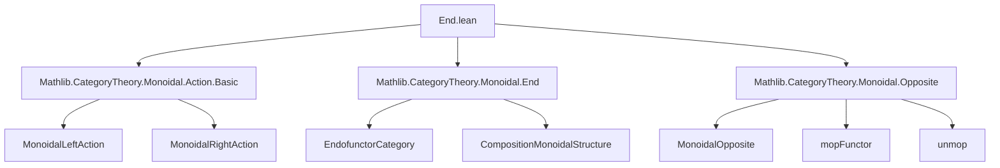

### Technical Brief: `End.lean` — Actions as Monoidal Functors to Endofunctor Categories

---

#### **1. Key Definitions & Theorems**

| Name | Type / Signature | Purpose |
|------|------------------|---------|
| `curriedActionMop` | `C ⥤ (D ⥤ D)ᴹᵒᵖ` | Curried left action functor, valued in the *monoidal opposite* of the endofunctor category. |
| `curriedActionMopMonoidal` | `[F.Monoidal]` instance | Proves `curriedActionMop` is monoidal (oplax monoidal functor). |
| `actionOfMonoidalFunctorToEndofunctorMop` | `C ⥤ (D ⥤ D)ᴹᵒᵖ → MonoidalLeftAction C D` | Converts a monoidal functor to a left action of `C` on `D`. |
| `curriedActionActionOfMonoidalFunctorToEndofunctorMopIso` | `curriedActionMop ≅ F` | Shows the above constructions are inverse up to natural isomorphism. |
| `curriedActionMonoidal` | `[F.Monoidal]` instance | Proves the curried *right* action functor is monoidal. |
| `actionOfMonoidalFunctorToEndofunctor` | `C ⥤ D ⥤ D → MonoidalRightAction C D` | Converts a monoidal functor to a right action. |
| `curriedActionActionOfMonoidalFunctorToEndofunctorIso` | `curriedAction ≅ F` | Isomorphism showing equivalence between right actions and monoidal functors to `D ⥤ D`. |
| `evaluationRightAction` | `MonoidalRightAction (C ⥤ C) C` | The evaluation functor `eval : (C ⥤ C) × C → C` gives a right action of `C ⥤ C` on `C`. |

---

#### **2. Naming Conventions**

- **Prefixes**:
  - `curriedAction*`: Curried action functors (left/right).
  - `actionOfMonoidalFunctor*`: Constructions from monoidal functors to actions.
  - `action*`: Components of an action (e.g., `actionObj`, `actionHomLeft`, `actionAssocIso`).
  - `unmop`: Used to unwrap morphisms from monoidal opposite (`(F.map f).unmop`).
- **Suffixes**:
  - `Mop`: Indicates use of monoidal opposite (e.g., `curriedActionMop`, `actionOfMonoidalFunctorToEndofunctorMop`).
  - `Hom`: For naturality components involving hom-actions (e.g., `actionHom_leftUnitor`).
- **Greek letters**:
  - `αₗ`, `αᵣ`: Left/right associators for actions.
  - `λ_`, `ρ_`: Left/right unitors in `C`.
  - `μ`, `ε`, `δ`: Monoidal structure components (multiplication, unit, comultiplication).

---

#### **3. Tactic Stack**

- **`simp` / `simpa`**: Heavily used for simplification with custom lemmas (e.g., `[-actionHom_leftUnitor]`, `[-associator_actionHom]`).
- **`ext`**: Extensionality for morphisms in functor categories (especially with `MonoidalOpposite.hom_ext`).
- **`apply ... ; rfl` / `rfl`**: For definitional equalities (e.g., `curriedActionMop_map_unmop_app`).
- **`have e := ...; dsimp at e; simp [...] at e`**: Standard pattern to extract and simplify naturality squares.
- **`apply (mopEquiv ...).fullyFaithfulInverse.map_injective`**: To reduce proofs in opposite categories.
- **`rw [Iso.hom_inv_id, Functor.map_id, ...]`**: Rewriting using categorical identities.

---

#### **4. Proof Logic**

- **Structure**:
  1. **Define constructions** (`curriedActionMop`, `actionOfMonoidalFunctorToEndofunctorMop`, etc.).
  2. **Prove monoidality** by constructing `ε`, `μ`, `δ`, `η`, and verifying axioms:
     - `associativity`: Uses naturality of `δ` and invertibility of associators.
     - `left/right unitality`: Uses naturality of `μ` and unitors.
  3. **Show equivalence**:
     - `curriedActionActionOfMonoidalFunctorToEndofunctorMopIso` is `refl _`, i.e., definitional equality.
     - Relies on `@[simps!]` to ensure projections match.

- **Key reasoning pattern**:
  ```lean
  have e := naturality_square
  dsimp at e
  simp [e, ...]
  ```
  This extracts a component-wise equation and rewrites using action-specific lemmas.

- **Opposite category handling**:
  - Morphisms in `(D ⥤ D)ᴹᵒᵖ` are unwrapped via `.unmop`.
  - Proofs often reduce to statements in `D ⥤ D` using `mopEquiv`.

---

#### **5. Imports**

| Import | Role |
|--------|------|
| `Mathlib.CategoryTheory.Monoidal.Action.Basic` | Core definitions of left/right monoidal actions. |
| `Mathlib.CategoryTheory.Monoidal.End` | Endofunctor category and its monoidal structure. |
| `Mathlib.CategoryTheory.Monoidal.Opposite` | Monoidal opposite category machinery (`mopFunctor`, `unmop`, `hom_ext`). |

---

#### **6. Mermaid Diagrams**

##### **Dependency Graph (Module-Level)**



##### **Conceptual Overview (Theory Flow)**

```mermaid
graph LR
  A[Left Action of C on D] -->|curriedActionMop| B[(D ⥤ D)ᴹᵒᵖ]
  B -->|actionOfMonoidalFunctorToEndofunctorMop| A
  B <-->|iso| A

  C[Right Action of C on D] -->|curriedAction| D[D ⥤ D]
  D -->|actionOfMonoidalFunctorToEndofunctor| C
  D <-->|iso| C

  E[(C ⥤ C) acting on C] -->|evaluationRightAction| C
```

##### **Monoidal Functor ↔ Action Equivalence (Left Case)**

```mermaid
graph LR
  F[C ⥤ (D ⥤ D)ᴹᵒᵖ, Monoidal] -->|actionOfMonoidalFunctorToEndofunctorMop| G[MonoidalLeftAction C D]
  G -->|curriedActionMop| F
  F <==|iso| G
```

---

#### **7. Summary**

This file establishes a *categorical equivalence* between:
- **Left actions** of a monoidal category `C` on `D`, and  
- **Monoidal functors** `C → (D ⥤ D)ᴹᵒᵖ`.

Similarly for **right actions** and functors `C → D ⥤ D`.

The key insight is that the usual literature defines evaluation as a *left* action, but mathlib’s monoidal structure on `D ⥤ D` is the *opposite*, hence requiring `(-)ᴹᵒᵖ` for left actions.

The proofs are largely mechanical, leveraging:
- naturality of monoidal structure,
- invertibility of associators/unitors,
- `@[simps!]` for definitional equality of projections.

This forms the backbone for higher-categorical generalizations (e.g., 2-actions, module categories).
