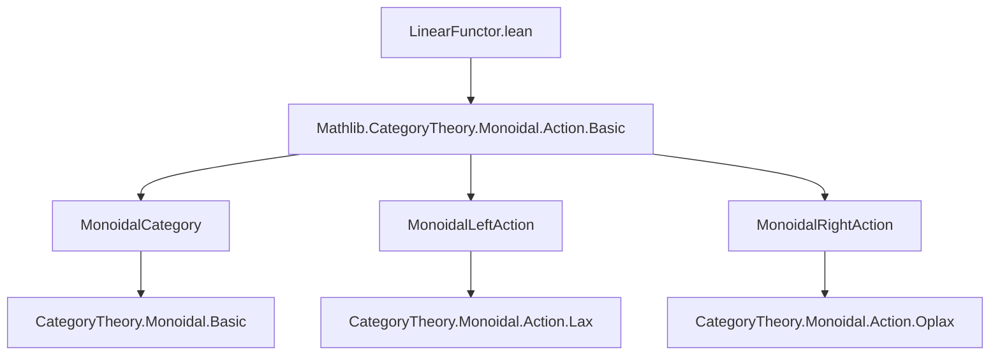
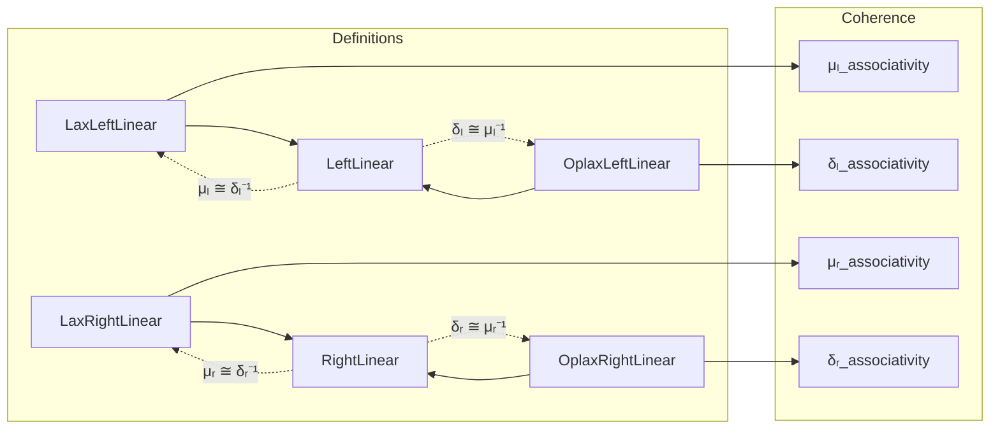

### Technical Brief: `LinearFunctor.lean`

---

#### **1. Key Definitions & Theorems**

| Name | Type / Class | Purpose |
|------|--------------|---------|
| `LaxLeftLinear` | `class` | Bundles a natural transformation `μₗ : c ⊙ₗ F d ⟶ F (c ⊙ₗ d)` satisfying coherence laws for left monoidal actions. |
| `OplaxLeftLinear` | `class` | Bundles a natural transformation `δₗ : F (c ⊙ₗ d) ⟶ c ⊙ₗ F d` satisfying dual coherence laws. |
| `LeftLinear` | `class` | Extends both `LaxLeftLinear` and `OplaxLeftLinear`, requiring `μₗ` and `δₗ` to be inverses (i.e., `F` is *strictly* linear on the left). |
| `LaxRightLinear` | `class` | Bundles `μᵣ : F d ⊙ᵣ c ⟶ F (d ⊙ᵣ c)` for right actions. |
| `OplaxRightLinear` | `class` | Bundles `δᵣ : F (d ⊙ᵣ c) ⟶ F d ⊙ᵣ c` for right actions. |
| `RightLinear` | `class` | Extends both `LaxRightLinear` and `OplaxRightLinear`, with `μᵣ` and `δᵣ` inverses. |
| `μₗIso` | `abbrev` | Constructs the isomorphism `c ⊙ₗ F d ≅ F (c ⊙ₗ d)` under `LeftLinear`. |
| `μᵣIso` | `abbrev` | Constructs the isomorphism `F d ⊙ᵣ c ≅ F (d ⊙ᵣ c)` under `RightLinear`. |
| `inv_μₗ`, `inv_δₗ`, `inv_μᵣ`, `inv_δᵣ` | `lemma` | Identify inverses of lineators: e.g., `inv (μₗ) = δₗ`. |
| `μₗ_associativity_inv`, `δₗ_associativity_inv`, etc. | `lemma` | Inverse versions of coherence laws, useful for simplification. |

---

#### **2. Naming Conventions**

- **Prefixes**:
  - `μₗ`, `μᵣ`: *lax* lineators (structure maps going *into* the functor).
  - `δₗ`, `δᵣ`: *oplax* lineators (structure maps going *out of* the functor).
  - `Lax`, `Oplax`, `Left`, `Right`: classify the flavor of linearity.
- **Suffixes**:
  - `_left`, `_right`: indicate left/right action compatibility.
  - `_naturality_left`, `_naturality_right`: naturality in the action object (`C`) or category object (`D`).
  - `_associativity`, `_unitality`, `_unitality_inv`: coherence conditions.
- **Iso-related**:
  - `μₗIso`, `μᵣIso`: isomorphism bundles.
  - `inv_μₗ`, `inv_δₗ`, etc.: inverse lemmas.

---

#### **3. Tactic Stack**

- **Core tactics**:
  - `by cat_disch`: used in class definitions to discharge category-theoretic proofs automatically.
  - `simp`, `reassoc`: heavily used for simplification and reassociation of morphisms.
  - `simpa`: used in lemmas like `μₗ_associativity_inv` to derive inverse versions from forward ones.
  - `=≫`: tactic for sequential composition in diagrammatic reasoning.
  - `using`, `symm`: for manipulating equalities and isomorphisms.

---

#### **4. Proof Logic**

- **Structure**:
  - Definitions are built as `class`es extending `Functor`, with structure + coherence axioms.
  - Proofs of derived lemmas (e.g., inverse coherence laws) follow a standard pattern:
    1. Start from the forward coherence law (e.g., `μₗ_associativity`).
    2. Pre/post-compose with inverses of associators/unitors.
    3. Use `simpa` with `[-...]` to exclude original lemmas and apply symmetry.
- **Key reasoning**:
  - In `LeftLinear`/`RightLinear`, the compatibility condition (`μₗ ∘ δₗ = id`, `δₗ ∘ μₗ = id`) implies that lineators are isomorphisms.
  - Instances of `IsIso` are derived from the bundled isomorphisms (`μₗIso`, `μᵣIso`).
  - Simplification lemmas (`@[simp]`) are annotated for use in `simp`-based automation.

---

#### **5. Imports**

- **Primary dependency**:
  ```lean
  import Mathlib.CategoryTheory.Monoidal.Action.Basic
  ```
  This provides:
  - `MonoidalCategory`, `MonoidalLeftAction`, `MonoidalRightAction`.
  - Notation for actions: `⊙ₗ`, `⊙ᵣ`, `⊵ₗ`, `⊴ₗ`, `⊵ᵣ`, `⊴ᵣ`.
  - Structural morphisms: `αₗ`, `λₗ`, `ρₗ`, `αᵣ`, `λᵣ`, `ρᵣ`.

---

#### **6. Mermaid Diagrams**

##### **Dependency Graph**



##### **Overview of Theory Flow**



---

#### **7. Summary**

This module formalizes *linear functors* between categories equipped with monoidal actions. It introduces four flavors of linearity (lax/oplax, left/right), and defines *strictly linear* functors as those where the lax and oplax structures are inverse. The development mirrors the theory of *lax/oplax monoidal functors*, but relative to an external monoidal action. The proofs rely heavily on diagrammatic reasoning and `simp`-based automation, with explicit inversion lemmas for coherence laws.

--- 

Let me know if you'd like a formalization roadmap or a comparison with `Mathlib.CategoryTheory.Monoidal.LaxMonoidalFunctor`.
