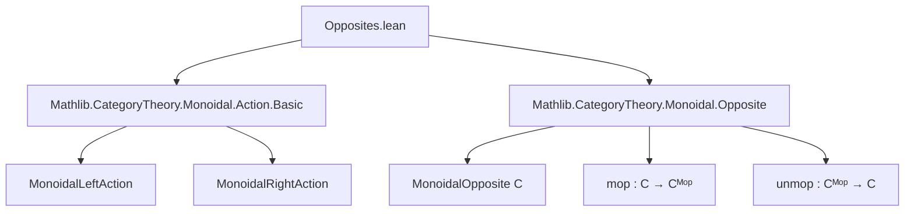
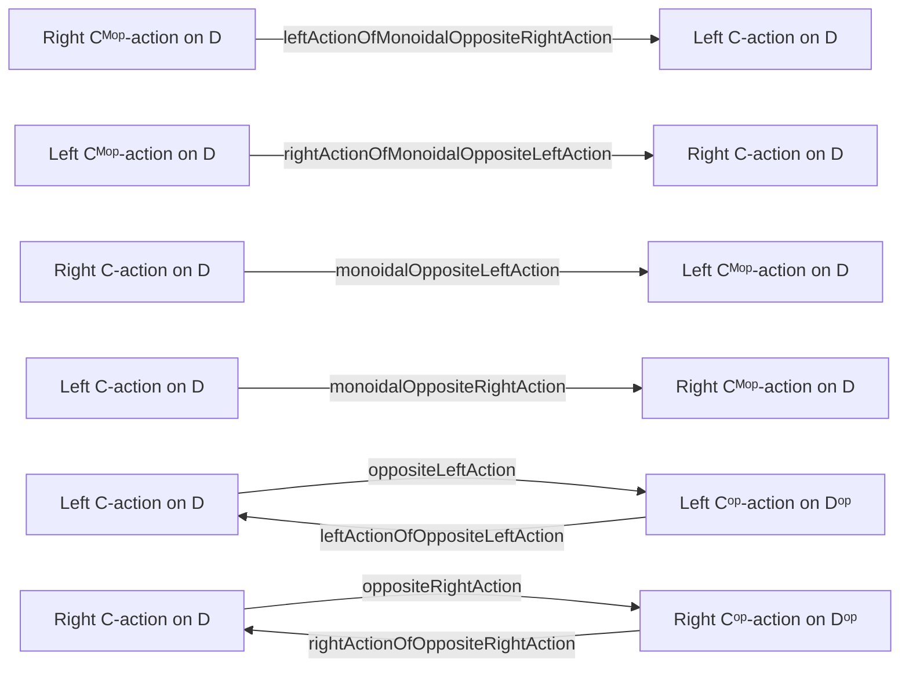

### Technical Brief: Opposites.lean — Monoidal Opposite Actions in Lean 4

---

#### **1. Key Definitions & Theorems**

| Name | Type | Purpose |
|------|------|---------|
| `leftActionOfMonoidalOppositeRightAction` | `[MonoidalRightAction Cᴹᵒᵖ D] → MonoidalLeftAction C D` | Converts a right `Cᴹᵒᵖ`-action on `D` into a left `C`-action via $c ⊙ₗ d := d ⊙ᵣ \mathrm{mop}(c)$. |
| `monoidalOppositeLeftAction` | `[MonoidalRightAction C D] → MonoidalLeftAction Cᴹᵒᵖ D` | Converts a right `C`-action on `D` into a left `Cᴹᵒᵖ`-action via $\mathrm{mop}(c) ⊙ₗ d = d ⊙ᵣ c$. |
| `oppositeLeftAction` | `[MonoidalLeftAction C D] → MonoidalLeftAction Cᵒᵖ Dᵒᵖ` | Converts a left `C`-action on `D` into a left `Cᵒᵖ`-action on `Dᵒᵖ` via $(\mathrm{op}\,c) ⊙ₗ (\mathrm{op}\,d) = \mathrm{op}(c ⊙ₗ d)$. |
| `leftActionOfOppositeLeftAction` | `[MonoidalLeftAction Cᵒᵖ Dᵒᵖ] → MonoidalLeftAction C D` | Converts a left `Cᵒᵖ`-action on `Dᵒᵖ` back to a left `C`-action on `D`. |
| `rightActionOfMonoidalOppositeLeftAction` | `[MonoidalLeftAction Cᴹᵒᵖ D] → MonoidalRightAction C D` | Converts a left `Cᴹᵒᵖ`-action on `D` into a right `C`-action via $d ⊙ᵣ c := \mathrm{mop}(c) ⊙ₗ d$. |
| `monoidalOppositeRightAction` | `[MonoidalLeftAction C D] → MonoidalRightAction Cᴹᵒᵖ D` | Converts a left `C`-action on `D` into a right `Cᴹᵒᵖ`-action via $d ⊙ᵣ \mathrm{mop}(c) = c ⊙ₗ d$. |
| `oppositeRightAction` | `[MonoidalRightAction C D] → MonoidalRightAction Cᵒᵖ Dᵒᵖ` | Converts a right `C`-action on `D` into a right `Cᵒᵖ`-action on `Dᵒᵖ`. |
| `rightActionOfOppositeRightAction` | `[MonoidalRightAction Cᵒᵖ Dᵒᵖ] → MonoidalRightAction C D` | Converts a right `Cᵒᵖ`-action on `Dᵒᵖ` back to a right `C`-action on `D`. |

All definitions are equipped with `@[simps -isSimp]`, indicating they are designed for automatic simplification of action components (obj, hom, associator, unitors), while excluding `isSimp` lemmas to avoid loops.

---

#### **2. Naming Conventions**

- **Prefixes**:
  - `leftActionOf*`: Construct left actions from other data.
  - `*OfMonoidalOpposite*`: Constructions involving monoidal opposite (`Cᴹᵒᵖ`).
  - `*OfOpposite*`: Constructions involving categorical opposite (`Cᵒᵖ`, `Dᵒᵖ`).
  - `monoidalOpposite*`: Conversions *to* or *from* `Cᴹᵒᵖ` actions.

- **Suffixes**:
  - `LeftAction`, `RightAction`: Distinguish variance.
  - `mop`, `unmop`, `op`, `unop`: Indicate use of monoidal or categorical opposites.

- **Action notation**:
  - `⊙ₗ`, `⊙ᵣ`: Left/right action objects.
  - `⊵ₗ`, `⊴ₗ`, `⊵ᵣ`, `⊴ᵣ`: Left/right action morphisms.
  - `⊙ₗₘ`, `⊙ᵣₘ`: Action on morphism pairs.

---

#### **3. Tactic Stack**

Frequent tactics used in proofs:

| Tactic | Usage |
|--------|-------|
| `simpa` | Simplify using lemmas and rewrite rules (e.g., `mop_tensorObj`, `mop_hom_associator`). |
| `apply` + `Iso.inv_eq_inv.mp` | Prove equality of morphisms via isomorphism inversion. |
| `apply Quiver.Hom.{op,unop}_inj` | Reduce proofs to underlying homs in base categories. |
| `simp` / `simp only [...]` | Simplify using `rfl` lemmas and naturality. |
| `haveI := ... ≫= ...` | Use associativity of whiskering and naturality diagrams. |
| `symm` | Flip isomorphisms (e.g., $\alpha$ vs $\alpha^{-1}$). |

---

#### **4. Proof Logic**

**General proof strategy**:

1. **Define action components** (obj, hom, associator, unitors) using the opposite structure.
2. **Verify naturality and coherence**:
   - Use `simpa` with known lemmas (e.g., `MonoidalRightAction.actionHom_def'`).
   - For associator/unitors: reduce to base action coherence via `mop`/`unmop`/`op`/`unop` identities.
   - For naturality: apply `op`/`unop` injectivity to reduce to base category naturality.
3. **Handle inverses**:
   - Use `Iso.op`/`Iso.unop` to lift/squash isomorphisms.
   - Apply `IsIso.inv_eq_inv.mp` to prove morphism equalities via inverse properties.

**Typical flow** (e.g., `associator_actionHom`):
```lean
by
  simpa only [mop_tensorObj, mop_hom_associator, ...] using
    (d ⊴ᵣ (α_ ...).inv) ≫= ... |>.symm
```
→ Translate associator in opposite category to original, then use coherence of original action.

---

#### **5. Imports**

| Import | Purpose |
|--------|---------|
| `Mathlib.CategoryTheory.Monoidal.Action.Basic` | Core definitions of monoidal left/right actions. |
| `Mathlib.CategoryTheory.Monoidal.Opposite` | Definitions of monoidal opposite category (`Cᴹᵒᵖ`), including `mop`, `unmop`, tensor structure. |

---

#### **6. Mermaid Diagrams**

##### **Dependency Graph (Module Scope)**



##### **Overview of Action Conversions**



##### **Theory Context**

- **Monoidal actions** generalize group/ring actions to monoidal categories.
- **Opposites** (`Cᴹᵒᵖ`, `Cᵒᵖ`) reverse morphisms and tensor order.
- These constructions enable **variance switching** and **duality** for module categories.
- Used in higher category theory, representation theory, and semantics of linear logic.

---

#### **7. Summary**

This file formalizes a **dictionary** between left/right actions of a monoidal category `C` and its opposites `Cᴹᵒᵖ` and `Cᵒᵖ`. It enables:
- **Dualization** of module structures,
- **Transfer of coherence data** across variance,
- **Local instance usage** (to avoid global instance loops).

All constructions are explicit, with full coherence proofs, and are designed for composability in larger developments (e.g., module categories, Hopf monads, or quantum groups).
