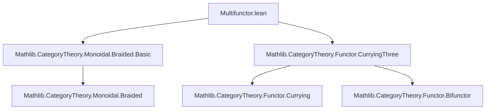
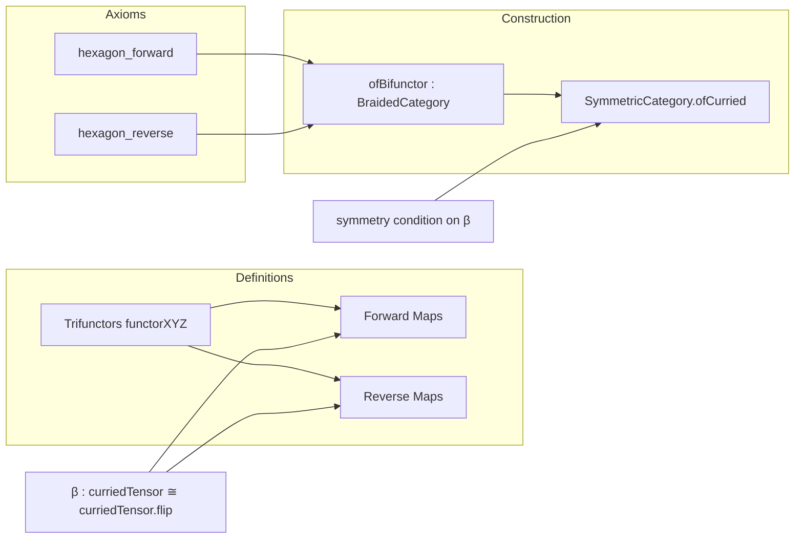

### Technical Brief: `Multifunctor.lean`

---

#### **1. Key Definitions & Theorems**

| Name | Type / Purpose |
|------|----------------|
| `functor₁₂₃`, `functor₁₂₃'`, `functor₂₃₁`, `functor₂₃₁'`, `functor₂₁₃`, `functor₂₁₃'`, `functor₃₁₂'`, `functor₃₁₂`, `functor₁₃₂'`, `functor₁₃₂` | **Trifunctors** $C \to C \to C \to C$ encoding various parenthesizations and permutations of triple tensor products, constructed via `bifunctorComp₁₂`, `bifunctorComp₂₃`, `curriedTensor`, and flips. |
| `Forward.firstMap₂`, `Forward.firstMap₃`, `Forward.secondMap₁`, `Forward.secondMap₂`, `Forward.secondMap₃` | Natural transformations between trifunctors forming the **forward hexagon diagram**, built from the braiding `β` and associator `α`. |
| `Reverse.firstMap₂`, `Reverse.firstMap₃`, `Reverse.secondMap₁`, `Reverse.secondMap₂`, `Reverse.secondMap₃` | Natural transformations forming the **reverse hexagon diagram**, again using `β` and `α`. |
| `ofBifunctor` | **Main theorem**: Constructs a `BraidedCategory C` structure from a natural isomorphism `β : curriedTensor C ≅ (curriedTensor C).flip` and proofs of the two hexagon identities (`hexagon_forward`, `hexagon_reverse`). |
| `SymmetricCategory.ofCurried` | Constructs a `SymmetricCategory C` from a braided category and a proof that the braiding is symmetric: $(\beta \circ \beta^{\mathrm{flip}}) = \mathrm{id}$. |

---

#### **2. Naming Conventions**

- **Trifunctor names**: `functorXYZ` where `XYZ` is a permutation of `123`, indicating the order of arguments:  
  e.g., `functor₂₃₁` corresponds to $(X_2 \otimes X_3) \otimes X_1$.
- **Map names**: `firstMapₙ`, `secondMapₙ` — indicate position in the hexagon diagram (left/right, top/middle/bottom).
- **Prefixes**:
  - `Forward.` / `Reverse.` — distinguishes the two hexagon identities.
  - `curriedTensor`, `curriedAssociatorNatIso` — refer to curried versions of tensor and associator.
- **Suffixes**:
  - `'` (prime) — often denotes a “flipped” or “reparenthesized” variant.
  - `Functor` — e.g., `bifunctorComp₁₂Functor`, `flip₁₃Functor`, `flip₂₃Functor` — denote functors derived from bifunctor composition or flip operations.

---

#### **3. Tactic Stack**

- **`rfl`** — used repeatedly to prove definitional equalities between complex functor expressions (e.g., `bifunctorComp₁₂ ... .flip = ...`).
- **`simp_rw` / `simp`** — implied by `@[simps!]` attributes on definitions; used to simplify applications of trifunctors and natural transformations.
- **`congr_app`** — heavily used in `ofBifunctor` and `SymmetricCategory.ofCurried` to unpack naturality and hexagon identities into componentwise equations on objects.
- **`aesop`** — not explicitly used, but likely applicable for routine naturality/unfolding goals.

---

#### **4. Proof Logic**

- **Structure**:  
  1. Define 10 trifunctors encoding all parenthesized/permutated tensor triple products.
  2. Define 5 natural transformations for each hexagon (forward/reverse), using:
     - `β.hom` (the braiding),
     - `α.assoc` / `α.assoc.inv` (associator),
     - `flipFunctor`, `bifunctorComp₁₂Functor`, `bifunctorComp₂₃Functor`, etc.
  3. State hexagon identities as equalities of composites of natural transformations between trifunctors.
  4. **Main construction** (`ofBifunctor`):
     - Extract componentwise braiding: `(β.app X).app Y`.
     - Derive naturality from `β.hom.naturality`.
     - Unpack hexagon identities via triple `congr_app` to get the standard hexagon laws on objects.
  5. **Symmetric case** (`SymmetricCategory.ofCurried`):
     - Use symmetry condition on curried braiding: $\beta \circ \beta^{\mathrm{flip}} = \mathrm{id}$.
     - Unpack to object-level using `congr_app`.

- **Logical flow**:  
  > *Given* a natural isomorphism `β` of curried tensor bifunctors,  
  > *and* proofs that two hexagon diagrams commute (as natural transformations),  
  > *then* `β` induces a braided category structure via componentwise application.

---

#### **5. Imports**

- `Mathlib.CategoryTheory.Monoidal.Braided.Basic`  
  → Provides foundational definitions: `BraidedCategory`, `braiding`, hexagon laws, etc.
- `Mathlib.CategoryTheory.Functor.CurryingThree`  
  → Supplies `curriedTensor`, `curriedAssociatorNatIso`, and trifunctor machinery (`bifunctorComp₁₂`, `flip`, etc.).

---

#### **6. Mermaid Diagrams**

##### **Dependency Graph (Module Level)**



##### **Overview of Theoretical Flow**



##### **Hexagon Identity Diagram (Forward)**

```mermaid
flowchart TD
  A[(X₁⊗X₂)⊗X₃] -->|associator| B[X₁⊗(X₂⊗X₃)]
  A -->|β⊗id| C[(X₂⊗X₁)⊗X₃]
  B -->|id⊗β| D[X₁⊗(X₃⊗X₂)]
  C -->|associator| E[(X₂⊗X₃)⊗X₁]
  D -->|associator| F[X₂⊗(X₃⊗X₁)]
  E -->|β⊗id| F
  B -->|firstMap₂| E
  E -->|firstMap₃| F
  A -->|secondMap₁| C
  C -->|secondMap₂| D
  D -->|secondMap₃| F
```

*(Note: The formal version uses trifunctor morphisms; this is the object-level diagram.)*

---

#### **7. Summary**

This file formalizes an **alternative construction of braided and symmetric monoidal categories** using **natural transformations between trifunctors**, rather than the traditional object-based hexagon identities. It leverages:
- Curried tensor bifunctors,
- Flips and associators as natural isomorphisms,
- Systematic trifunctor constructions for all permutations of three objects.

The approach is particularly suited for **higher-categorical or type-theoretic treatments**, where naturality and coherence are expressed at the level of functors/natural transformations rather than on objects alone.

--- 

Let me know if you'd like a formalized dependency graph in `leanpkg` format or a visualization of the trifunctor lattice.
