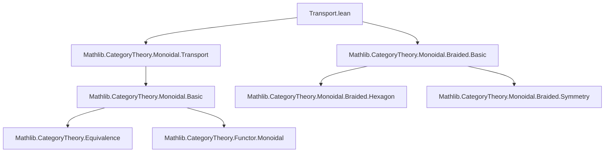

Here's a structured technical brief based on the provided `Transport.lean` file:

---

### **1. Key Definitions & Theorems**

| Name | Type / Signature | Purpose |
|------|------------------|---------|
| `Transported.instBraidedCategory` | `instance (e : C ≌ D) [MonoidalCategory C] [BraidedCategory C] : BraidedCategory (Transported e)` | Constructs a braided monoidal structure on the transported category `Transported e` along an equivalence `e : C ≌ D`. |
| `BraidedCategory.ofFaithful` | Used implicitly in instance proofs | A method to lift braided structure via a faithful functor (here, `e.inverse`). |
| `transportedFunctorCompInverseLaxBraided` | `def (e : C ≌ D) [MonoidalCategory C] [BraidedCategory C] : ((e' e).functor ⋙ (e' e).inverse).LaxBraided` | Provides a lax braided structure on the composite functor `F ⋙ G` (where `F = e.functor`, `G = e.inverse`) using the unit isomorphism of the equivalence. |
| `transportedFunctorCompInverseBraided` | `def (e : C ≌ D) [MonoidalCategory C] [BraidedCategory C] : ((e' e).functor ⋙ (e' e).inverse).Braided` | Upgrades the lax braided structure to a full braided one (used to resolve diamond in typeclass inference). |
| `instSymmetricCategory` | `instance (e : C ≌ D) [MonoidalCategory C] [SymmetricCategory C] : SymmetricCategory (Transported e)` | Lifts symmetric monoidal structure along equivalence (uses `ofFaithful` again). |
| `e'` notation | `local notation "e'" e => equivalenceTransported e` | Shorthand for `equivalenceTransported e`, i.e., the induced equivalence `C ≌ D ⇒ Transported e ≌ D`. |

---

### **2. Naming Conventions**

- **Prefixes**:
  - `inst*`: Typeclass instances (e.g., `instBraidedCategory`, `instSymmetricCategory`)
  - `transported*`: Related to transport of structure along equivalence (e.g., `transportedFunctorCompInverseLaxBraided`)
  - `ofFaithful`: Pattern for constructing structure via faithful functor
- **Suffixes**:
  - `LaxBraided`, `Braided`, `SymmetricCategory`: Reflect hierarchy of monoidal enhancements
- **Notation**:
  - `e'` for `equivalenceTransported e`
  - `β_ X Y` for braiding isomorphisms
  - `μ`, `δ`, `α` for monoidal structure components (used in `simp` lemmas)

---

### **3. Tactic Stack**

- `simp` (heavily used, with many `only` and `at` modifiers)
- `apply`, `have`, `simp?` (for discovery of missing simp lemmas)
- `assoc`, `comp_id`, `comp_μ`, `comp_δ`, `Functor.*` lemmas (e.g., `Functor.comp_map`, `Functor.comp_obj`)
- `Functor.CoreMonoidal.toLaxMonoidal`, `toOplaxMonoidal`, `toMonoidal` conversions
- `Functor.map_injective` (to reduce proofs to morphism level)
- `symm_*`, `inv_*`, `unitIso` reasoning (from equivalence data)

---

### **4. Proof Logic**

- **Structure lifting**: Use faithfulness of `e.inverse` to transport structure from `C` to `Transported e`.
- **Braiding construction**:
  1. Define braiding on `Transported e` via `β ↦ e.inverse.mapIso (β_)`.
  2. Prove naturality & hexagon identities using `simp` and properties of `e.inverse`.
- **Diamond resolution**:
  - Since both `e.functor` and `e.inverse` are braided, their composite is automatically braided.
  - But typeclass inference may get stuck, so define `transportedFunctorCompInverseLaxBraided` and `transportedFunctorCompInverseBraided` explicitly as *defs* (not instances) to guide inference.
- **Symmetric case**:
  - Follows from braided case + extra axiom (`β_{X,Y} ∘ β_{Y,X} = id`) — handled by `ofFaithful`.

---

### **5. Imports & Dependencies**

- **Core imports**:
  ```lean
  Mathlib.CategoryTheory.Monoidal.Braided.Basic
  Mathlib.CategoryTheory.Monoidal.Transport
  ```
- **Key dependencies**:
  - `CategoryTheory.MonoidalCategory`
  - `Functor.LaxMonoidal`, `Functor.OplaxMonoidal`
  - `Equivalence`, `Transported` (from `Transport` module)
  - `BraidedCategory`, `SymmetricCategory`

---

### **6. Mermaid Diagrams**

#### **Dependency Graph (Module Level)**



#### **Overview of Theory Flow**

```mermaid
flowchart LR
  C[Category C] -- equivalence e --> D[Category D]
  C -- monoidal + braided --> M[C has Monoidal + Braided]
  M -- transport along e --> T[Transported e]
  T -- instance --> B[BraidedCategory (Transported e)]
  T -- instance --> S[SymmetricCategory (Transported e)]
  C -- equivalence e --> F[e.functor]
  D -- equivalence e --> G[e.inverse]
  F & G -- unit/counit iso --> U[Composite F ⋙ G ≅ id]
  U -- lax braided --> LB[LaxBraided structure]
  LB -- upgrade --> B
```

---

Let me know if you'd like a formalized dependency graph in `leanpkg` format or a visualization of the typeclass inference diamond.
