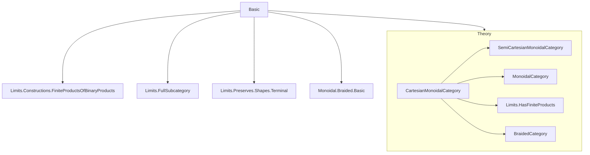
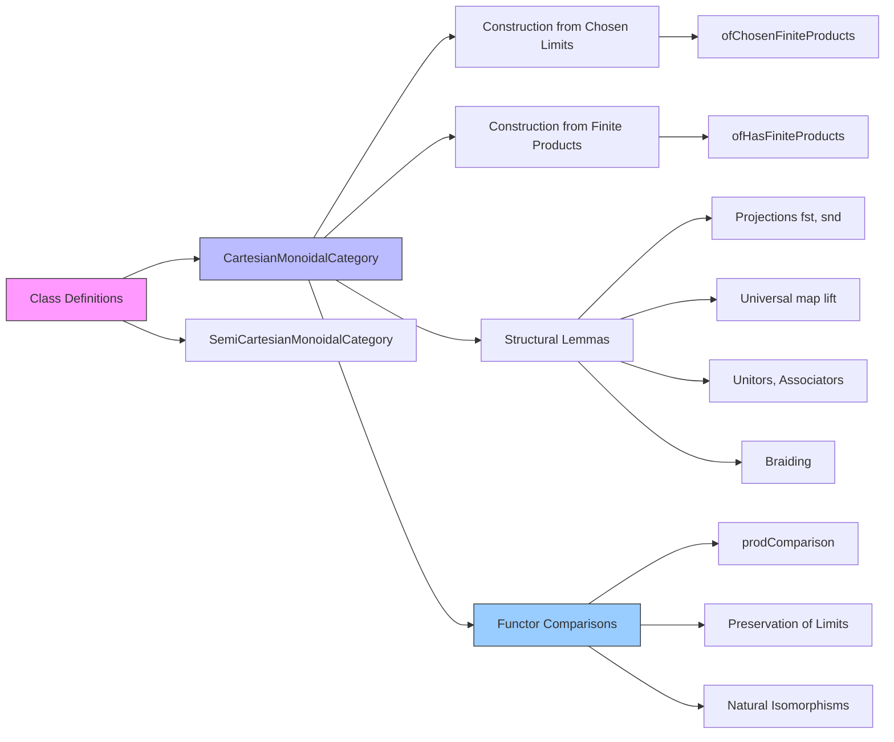

### Technical Brief: `Basic.lean` — Cartesian Monoidal Categories in Lean 4

---

#### **1. Key Definitions & Theorems**

| Name | Type / Signature | Purpose |
|------|------------------|---------|
| `SemiCartesianMonoidalCategory` | `class` extending `MonoidalCategory` | A monoidal category where the unit object is terminal; equipped with projections `fst`, `snd` from tensor product. |
| `CartesianMonoidalCategory` | `class` extending `SemiCartesianMonoidalCategory` | Bundles *explicit* choices of terminal object and binary products; ensures tensor product is categorical product. |
| `ofChosenFiniteProducts` | `abbrev` | Constructs a `CartesianMonoidalCategory` from a chosen terminal object and binary product limit cones. |
| `ofHasFiniteProducts` | `abbrev` | Noncomputable construction of `CartesianMonoidalCategory` assuming finite products exist. |
| `lift` | `def {T X Y : C} (f : T ⟶ X) (g : T ⟶ Y) : T ⟶ X ⊗ Y` | Universal map into product given two components. |
| `homEquivToProd` | `def (Z ⟶ X ⊗ Y) ≃ (Z ⟶ X) × (Z ⟶ Y)` | Hom-set equivalence expressing universal property of product. |
| `prodComparison` | `def F.obj (A ⊗ B) ⟶ F.obj A ⊗ F.obj B` | Canonical comparison map for a functor preserving products. |
| `prodComparisonIso` | `noncomputable def F.obj (A ⊗ B) ≅ F.obj A ⊗ F.obj B` | Isomorphism when `F` preserves binary product limits. |
| `prodComparisonNatTrans`, `prodComparisonBifunctorNatTrans` | `nat trans` | Natural families of `prodComparison` morphisms. |
| `prodComparisonNatIso`, `prodComparisonBifunctorNatIso` | `nat iso` | Natural isomorphisms when all `prodComparison`s are isos. |
| `ofCartesianMonoidalCategory` | `def` | Constructs a `BraidedCategory` (hence symmetric) from `CartesianMonoidalCategory`. |
| `toUnit`, `toUnit_unique`, `comp_toUnit` | lemmas | Properties of unique maps to terminal object. |
| `fst_def`, `snd_def` | lemmas | Definitional equalities for projections in terms of unitors and terminal maps. |
| `tensorHom_*`, `whisker_*`, `associator_*`, `lift_*` lemmas | many `@[reassoc]`, `@[simp]` lemmas | Structural compatibility of tensor/hom with projections, unitors, associators, braiding. |

---

#### **2. Naming Conventions**

- **Prefixes**:
  - `isTerminal_`: properties of terminal objects (`isTerminalTensorUnit`).
  - `toUnit`: maps into terminal object.
  - `fst`, `snd`: projections from tensor/product.
  - `lift`: universal map into product.
  - `prodComparison`: comparison maps for functors.
  - `tensorHom`, `tensorObj`: internal tensor implementation in `ofChosenFiniteProducts`.
  - `ofChosenFiniteProducts`: prefix for constructions from chosen limits.

- **Suffixes**:
  - `_def`: definitional equalities (e.g., `fst_def`, `snd_def`).
  - `_naturality`: naturality of structural maps (e.g., `leftUnitor_naturality`).
  - `_hom`, `_inv`: for components of isomorphisms (e.g., `associator_hom_fst`, `braiding_inv_snd`).
  - `_assoc`: for associativity variants (e.g., `comp_toUnit_assoc`).
  - `_NatTrans`, `_BifunctorNatTrans`: natural transformations built from `prodComparison`.

- **Notable patterns**:
  - `whiskerLeft_*`, `whiskerRight_*`: lemmas about interaction of whiskering with projections.
  - `lift_*`: lemmas about `lift` interacting with other structure (e.g., `lift_fst`, `lift_snd`, `lift_map`, `lift_braiding_hom`).
  - `prodComparison_*`: naturality, whiskering, and iso properties.

---

#### **3. Tactic Stack**

Frequent tactics used in proofs:

| Tactic | Usage |
|--------|-------|
| `simp` | Simplification using `@[simp]` lemmas (e.g., `lift_fst`, `comp_toUnit`, `tensorHom_*`). |
| `ext` | Extensionality for morphisms into products (`hom_ext`, `prodComparison_*`). |
| `cat_disch` | Category-theoretic discharge tactic (used in many `by aesop`-like proofs). |
| `aesop` | Automated reasoning for simple diagrams and equalities. |
| `apply ... hom_ext` | Proving equality of morphisms into product via projections. |
| `rw [← Iso.eq_comp_inv]` | Rewriting using inverse of isomorphism. |
| `dsimp`, `unfold` | For unfolding definitions like `tensorHom`, `prodComparison`. |
| `infer_instance` | Inferring `IsIso`, `Mono`, `Unique`, etc. |
| `cancel_mono`, `cancel_epi` | Cancellation lemmas for monos/epis. |
| `congr` | For proving equality of structures (e.g., `Subsingleton` arguments). |

---

#### **4. Proof Logic**

- **Inductive/structural style**: Most proofs are *diagrammatic* and rely on universal properties (limit cones, terminal objects).
- **Typical flow**:
  1. **Unfold definitions** (`dsimp`, `unfold`).
  2. **Apply `hom_ext`** or `isLimit.hom_ext` to reduce to projections.
  3. **Simplify projections** using `simp` with `fst_def`, `snd_def`, `lift_fst`, etc.
  4. **Use naturality** or uniqueness of mediating maps (`isLimit.lift_unique`, `toUnit_unique`).
- **Key lemmas**:
  - `hom_ext`: equality of maps into product determined by projections.
  - `toUnit_unique`: uniqueness of maps to terminal object.
  - `isLimit.hom_ext`: equality of maps into limit cone determined by components.
- **Iso arguments**: Many proofs about `prodComparison` involve showing it’s an iso iff the functor preserves the corresponding limit.

---

#### **5. Imports**

| Module | Purpose |
|--------|---------|
| `Mathlib.CategoryTheory.Limits.Constructions.FiniteProductsOfBinaryProducts` | Tools for constructing finite products from binary products + terminal. |
| `Mathlib.CategoryTheory.Limits.FullSubcategory` | For embedding full subcategories (used implicitly in constructions). |
| `Mathlib.CategoryTheory.Limits.Preserves.Shapes.Terminal` | Preservation of terminal objects. |
| `Mathlib.CategoryTheory.Monoidal.Braided.Basic` | Braided monoidal categories, needed for symmetric structure. |

---

#### **6. Mermaid Diagrams**

##### **Dependency Graph (Module-Level)**

##### **Overview of `Basic.lean` Structure**

##### **Theory Context**

- **Base**: `CategoryTheory.MonoidalCategory`
- **Extension**: `SemiCartesianMonoidalCategory` → `CartesianMonoidalCategory`
- **Bridge**: `CartesianMonoidalCategory` → `BraidedCategory` (via symmetry of product)
- **Functor Theory**: `CartesianMonoidalCategory` → `PreservesLimit`, `NaturalTransformations`, `MonoidalFunctors`

---

#### **7. Summary**

This file formalizes **Cartesian monoidal categories** as *structured* monoidal categories where the tensor is the categorical product and the unit is terminal. It emphasizes *definitional* control (e.g., via `ofChosenFiniteProducts`) to support practical reasoning in categories like `Type`, while avoiding diamonds in functor categories by allowing arbitrary `OplaxMonoidal`/`Monoidal` instances.

The theory is rich in lemmas about interaction of product structure with monoidal structure (unitors, associators, braiding), and includes a full development of how functors compare products — central for monoidal functor theory and applications (e.g., affine schemes, sheaves).
