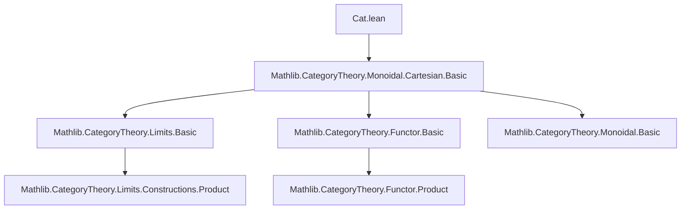
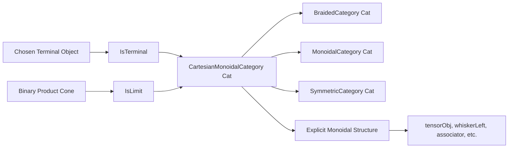
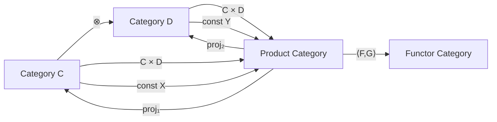

### Technical Brief: `Cat.lean` — Chosen Finite Products in `Cat`

---

#### **1. Key Definitions & Theorems**

| Name | Type / Signature | Purpose |
|------|------------------|---------|
| `chosenTerminal` | `Cat.{v, u}` | Constructs a specific terminal object in `Cat` using `ULift` to manage universes. |
| `chosenTerminalIsTerminal` | `IsTerminal chosenTerminal` | Proves the constructed object is terminal: unique morphism from any category. |
| `fromChosenTerminalEquiv` | `Cat.chosenTerminal ⥤ C ≃ C` | Equivalence between functors out of the chosen terminal category and objects of `C`. |
| `prodCone` | `BinaryFan C D` | Constructs the product cone from the categorical product `C × D`. |
| `isLimitProdCone` | `IsLimit (prodCone X Y)` | Proves the product cone is a limit cone (i.e., `C × D` is the product in `Cat`). |
| `CartesianMonoidalCategory Cat` | Instance | Establishes `Cat` as a Cartesian monoidal category via chosen finite products. |
| `tensorObj` | `C ⊗ D = Cat.of (C × D)` | Identifies the monoidal tensor with the categorical product. |
| `whiskerLeft`, `whiskerRight`, `tensorHom` | Lemmas about monoidal structure | Explicitly describe left/right whiskering and tensor on morphisms in terms of product functors. |
| `associator_hom/inv`, `leftUnitor_hom/inv`, `rightUnitor_hom/inv` | Lemmas | Provide concrete descriptions of the monoidal coherence isomorphisms (associator, unitors) as product-based functors. |

---

#### **2. Naming Conventions**

- **Prefixes**:
  - `chosen*`: For canonical constructions (e.g., `chosenTerminal`, `chosenTerminalIsTerminal`).
  - `from*Equiv`: For equivalences involving canonical objects (e.g., `fromChosenTerminalEquiv`).
  - `prod*`: For product-related constructions (`prodCone`, `isLimitProdCone`).
  - `whisker*`, `tensor*`, `associator*`, `leftUnitor*`, `rightUnitor*`: For monoidal structure components.

- **Suffixes**:
  - `IsTerminal`, `IsLimit`: Property-based definitions.
  - `Equiv`, `Hom`, `Inv`: For equivalences and morphism components.

- **Notable patterns**:
  - `toCatHom`: Converts a functor to a morphism in `Cat`.
  - `Prod.fst`, `Prod.snd`: Projection functors from product categories.
  - `Functor.prod'`: Product of functors (unprimed `prod` is for objects).

---

#### **3. Tactic Stack**

- **Core tactics**:
  - `rfl`: Used extensively for definitional equalities (e.g., `tensorObj`, `whiskerLeft`).
  - `simp`: Simplifies using product/functor lemmas.
  - `ext`: Functor extensionality (`Functor.ext`, `Cat.Hom.ext`).
  - `dsimp`, `rw`: Rewriting with definitional equalities and lemmas.
  - `intro`, `rintro`, `exact`: Basic proof structure.

- **Higher-level automation**:
  - `apply Functor.ext`: To prove equality of functors.
  - `Functor.hext`: To prove equality of natural transformations (via component-wise equality).
  - `Prod.ext`: To prove equality of morphisms in product categories.

---

#### **4. Proof Logic**

- **Structure**:
  - **Canonical constructions**: Use `ULift` to ensure universe consistency for terminal object and products.
  - **Limit verification**: For `isLimitProdCone`, construct the mediating morphism using `prod'` (product of functors), then verify uniqueness via `Cat.Hom.ext` and `Functor.hext`.
  - **Monoidal coherence**: All structure maps (associator, unitors) are defined explicitly as functors built from projections and sections of products; their inverses use section maps (`Prod.sectL`, `Prod.sectR`).
  - **Instance derivation**: `CartesianMonoidalCategory Cat` is derived from `ofChosenFiniteProducts`, requiring terminal object and binary products with limits.

- **Typical proof flow**:
  1. Define candidate object/morphism.
  2. Prove universal property (e.g., uniqueness of mediating morphism).
  3. Use definitional equalities (`rfl`) where possible.
  4. For naturality/uniqueness, apply extensionality lemmas (`ext`, `hext`).

---

#### **5. Imports**

- **Primary dependency**:
  ```lean
  Mathlib.CategoryTheory.Monoidal.Cartesian.Basic
  ```
  - Provides foundational definitions for Cartesian monoidal categories, including `ofChosenFiniteProducts`, `CartesianMonoidalCategory`, and related lemmas.

- **Implicit imports** (via `Mathlib.CategoryTheory.*`):
  - `Limits`: For `BinaryFan`, `IsLimit`, `IsTerminal`.
  - `CategoryTheory.Functor.Basic`: For `prod'`, `const`, `Functor.ext`, `hext`.
  - `CategoryTheory.Category.Basic`: For `Hom`, `comp`, identities.
  - `CategoryTheory.Monoidal.Basic`: For `MonoidalCategory`, `whiskerLeft`, `tensorObj`, etc.

---

#### **6. Mermaid Diagrams**

##### **Dependency Graph (Module-Level)**



##### **Overview of `Cat.lean` Theory**



##### **Monoidal Structure in `Cat`**



---

#### **7. Summary**

This file formalizes the Cartesian monoidal structure on `Cat`, where:
- The tensor is the categorical product `C × D`.
- The unit is a chosen terminal category.
- All coherence isomorphisms are explicitly constructed from product projections and sections.

It leverages Lean’s universe management (`ULift`) and extensionality principles to ensure correctness across universes and functors. The proofs are largely definitional or rely on standard categorical extensionality lemmas, making the formalization both rigorous and efficient.

--- 

Let me know if you'd like a visualization of the `prodCone` universal property or a step-by-step proof sketch for `isLimitProdCone`.
