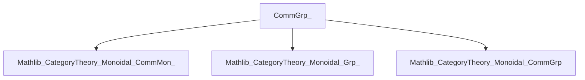

**Technical Brief: `CommGrp_.lean` — Yoneda Embedding for Commutative Group Objects**

---

### 1. **Key Definitions & Theorems**

| Name | Type / Signature | Purpose |
|------|------------------|---------|
| `CommGrpObj X` | `class` | Abbreviation for an *unbundled* commutative group object: combines `GrpObj X` and `IsCommMonObj X`. |
| `CommGrpObj.ofRepresentableBy` | `(F : Cᵒᵖ ⥤ CommGrpCat) → (F ⋙ forget _).RepresentableBy X → CommGrpObj X` | Constructs a commutative group object from a representable presheaf of commutative groups. |
| `yonedaCommGrpGrpObj G` | `G : CommGrp C → (Grp C)ᵒᵖ ⥤ CommGrpCat` | Yoneda embedding of a *bundled* commutative group object `G` into a presheaf of commutative groups. |
| `yonedaCommGrpGrp` | `CommGrp C ⥤ (Grp C)ᵒᵖ ⥤ CommGrpCat` | The full Yoneda embedding functor from the category of commutative group objects in `C` to presheaves of commutative groups. |

> **Note**: ` CommGrp C` denotes the category of *bundled* commutative group objects in `C`, i.e., internal commutative group objects with morphisms being morphisms of group objects.

---

### 2. **Naming Conventions**

- **Prefixes**:
  - `CommGrpObj.*`: unbundled internal structure (class/def).
  - `yoneda*`: Yoneda-related constructions (embedding, functor).
  - `ofRepresentableBy`: construction from representability.
- **Suffixes**:
  - `Obj`: unbundled object-level notion.
  - No suffix on `yonedaCommGrpGrp`: functor-level.
- **Aliases**:
  - `CommGrp_Class` → deprecated alias for `CommGrpObj`.
  - `CommGrp_Class.ofRepresentableBy` → deprecated alias for `CommGrpObj.ofRepresentableBy`.

---

### 3. **Tactic Stack**

Frequent tactics used in proofs:

- `ext`: extensionality for function equality (especially in `map_one'`, `map_mul'`).
- `simp` / `simpa`: simplification using `Mon.Hom.hom_one`, `map_mul`, etc.
- `ext; simp [Mon.Hom.hom_one]`: standard pattern for verifying monoid homomorphism axioms.
- `simpa using ((yonedaGrpObj G.X).map f.unop.hom.hom.op).hom.map_mul g.hom.hom h.hom.hom`: leverages known naturality/morphism properties from earlier lemmas.

No heavy automation (e.g., `aesop`, `ring`, `linarith`) — proofs are mostly structural and rely on `simp`-based reasoning.

---

### 4. **Proof Logic**

- **Structure**: Proofs are *element-wise* (via `ext`) and *naturality-driven*.
- **Typical flow**:
  1. Introduce equality goal (e.g., `map_mul'`).
  2. Apply `ext` to reduce to pointwise equality.
  3. Simplify using `simpa` with known morphism laws (e.g., `map_mul` of Yoneda image).
- **Induction**: Not used — all constructions are categorical and functorial, not inductive.
- **Dependence on prior lemmas**: Heavily relies on `yonedaGrpObj`, `yonedaGrp`, and their properties (e.g., `map_mul` preserved under Yoneda).

---

### 5. **Imports & Dependencies**

| Import | Role |
|--------|------|
| `Mathlib.CategoryTheory.Monoidal.Cartesian.CommMon_` | Defines `CommMonObj`, `CommMonCat`, and related constructions. |
| `Mathlib.CategoryTheory.Monoidal.Cartesian.Grp_` | Defines `GrpObj`, `GrpCat`, and unbundled/bundled group objects. |
| `Mathlib.CategoryTheory.Monoidal.CommGrp` | Defines `CommGrpObj`, `CommGrpCat`, and category of commutative group objects. |

> **Context assumptions**:
- `C` is a category with Cartesian monoidal structure and braiding.
- `C` has all finite products (via `CartesianMonoidalCategory`).
- `Opposite`, `MonObj`, `Limits`, `CartesianMonoidalCategory`, `BraidedCategory` are opened.

---

### 6. **Mermaid Diagrams**

#### **Dependency Graph (Module-Level)**



#### **Conceptual Overview & Flow**

```mermaid
graph LR
  A[Category C<br>(Cartesian, Braided)] --> B[CommGrpObj X<br>(unbundled)]
  A --> C[CommGrp C<br>(bundled category)]
  C --> D[yonedaCommGrpGrpObj G<br>presheaf of commutative groups]
  C --> E[yonedaCommGrpGrp<br>functor CommGrp C → (Grp C)ᵒᵖ ⥤ CommGrpCat]
  B --> F[ofRepresentableBy<br>from representable presheaves]
```

#### **Yoneda Embedding Functor Diagram**

```mermaid
graph LR
  G[CommGrp C] -->|yonedaCommGrpGrp| H[(Grp C)ᵒᵖ ⥤ CommGrpCat]
  G -.->|obj| G_obj[G]
  H -.->|eval at H| H_H[(Grp C)ᵒᵖ ⥤ CommGrpCat]
  G_obj -->|yonedaCommGrpGrpObj G| H_H
  H_H -->|app Y| H_Y[unop Y ⟶ G]
```

Where:
- `G` is a commutative group object in `C`.
- For each `H ∈ (Grp C)ᵒᵖ`, `yonedaCommGrpGrpObj G H = (H ⟶ G)` as a commutative group (via pointwise operations).
- Morphisms in `(Grp C)ᵒᵖ` act by precomposition.

---

### 7. **Summary**

This file formalizes the Yoneda embedding of the category of internal commutative group objects in a Cartesian braided monoidal category `C` into the category of presheaves of commutative groups. It builds on prior developments for monoids, groups, and their commutative variants, and uses standard Yoneda machinery with careful verification of group-theoretic structure preservation.

The key insight is that representability of a presheaf of commutative groups implies the representing object carries a canonical commutative group object structure — and conversely, every internal commutative group object yields a representable presheaf via hom-sets.

--- 

Let me know if you'd like a formalized dependency graph (e.g., `.lean` file-level), or a comparison with the non-commutative `Grp_` version.
