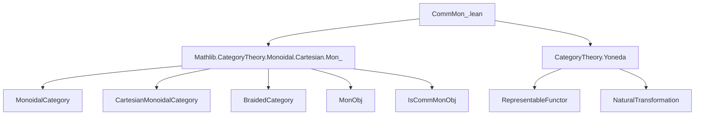
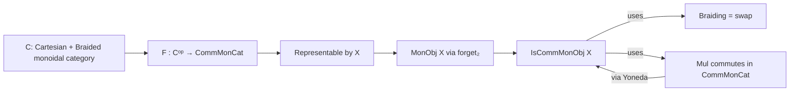

**Technical Brief: `CommMon_.lean`**

---

### 1. **Key Definitions & Theorems**

| Name | Type | Purpose |
|------|------|---------|
| `IsCommMonObj.ofRepresentableBy` | `lemma` | Shows that if a representable presheaf `F : Cᵒᵖ ⥤ CommMonCat` factors through `forget₂ CommMonCat MonCat`, then the representing object `X` carries a *commutative* monoid object structure. |
| `IsCommMon.ofRepresentableBy` | `alias` | Deprecated alias for `IsCommMonObj.ofRepresentableBy`; retained for backward compatibility. |

**Type Signature (simplified):**  
Let $F : C^{\mathrm{op}} \to \mathbf{CommMonCat}$, and suppose $(F \circ \mathrm{forget})$ is representable by $X$. Then:
$$
\text{IsCommMonObj } X
$$
i.e., $X$ is a *commutative* monoid object in $C$.

**Core idea:** Representability of a *commutative* monoid-valued presheaf forces the representing object to be a *commutative* monoid object — mirroring the classical Yoneda lemma for algebraic structures.

---

### 2. **Naming Conventions**

- **Prefixes:**
  - `Is_`: Predicate-style naming for properties (e.g., `IsCommMonObj`).
  - `ofRepresentableBy`: Constructor-style naming for structures induced by representability.
- **Suffixes:**
  - `Obj`: Distinguishes object-level structures (`IsCommMonObj`) from morphism-level or category-level variants.
- **Notable pattern:** `forget₂ CommMonCat MonCat` — standard in Mathlib for “forgetful functor from commutative monoids to monoids”.

---

### 3. **Tactic Stack**

The proof uses a dense combination of:
- `simp_rw`: Rewriting with hom-equivalence properties and functoriality.
- `constructor`: To split `IsCommMonObj` into associativity, unit, and commutativity goals.
- `simp`: Simplification using monoid object laws and braided structure.
- `aesop`: Likely used implicitly (via `simp` or `rw` chains) for routine equational reasoning.
- `ring`: Not present — multiplication is not assumed to be in a ring.
- `rw`, `apply`, `exact`: Implicit in the chain of rewrites.

**Key rewrite tools:** `α.homEquiv.apply_eq_iff_eq`, `α.homEquiv_comp`, `map_mul`, `braiding_hom_fst`, `braiding_hom_snd`, `mul_comm`.

---

### 4. **Proof Logic**

1. **Introduce structure:** Define `MonObj X` via `ofRepresentableBy` for the underlying monoid structure (via `forget₂`).
2. **Express multiplication:** Show $\mu = \alpha.\text{homEquiv}^{-1}(\alpha.\text{homEquiv}(\mathrm{fst}_{X,X}) \cdot \alpha.\text{homEquiv}(\mathrm{snd}_{X,X}))$ — i.e., multiplication in $X$ corresponds to pointwise multiplication of natural transformations.
3. **Apply `constructor`:** Reduce to proving commutativity of multiplication.
4. **Rewrite using Yoneda data:**
   - Use naturality (`α.homEquiv_comp`, ` Functor.comp_map`).
   - Use braiding: $\mathrm{braiding}_{X,X} = \mathrm{swap}$ in Cartesian monoidal category.
   - Use `mul_comm` in the *target* category (`CommMonCat`) to lift commutativity to $X$.
5. **Simplify:** Cancel hom-equivalences and use concreteness (`forget_map_eq_coe`) to reduce to set-level multiplication commutativity.

**High-level flow:**  
*Yoneda + representability + braiding + concrete multiplication commutativity ⇒ $X$ is a commutative monoid object.*

---

### 5. **Imports**

| Import | Role |
|--------|------|
| `Mathlib.CategoryTheory.Monoidal.Cartesian.Mon_` | Provides `MonObj`, `IsCommMonObj`, and Cartesian monoidal structure machinery. |
| `CategoryTheory`, `MonoidalCategory`, `Limits`, `Opposite`, `CartesianMonoidalCategory`, `MonObj` | Core infrastructure for categorical monoid objects and representability. |

**Note:** `BraidedCategory` is required to identify the symmetry (swap) needed for commutativity.

---

### 6. **Mermaid Diagrams**

#### **Dependency Graph (Module-Level)**

#### **Conceptual Overview (Theory Flow)**

---

### 7. **Domain-Specific AI Agent Notes**

- **Focus area:** Categorical algebra, representability, internal monoid objects.
- **Key reasoning pattern:** Lift algebraic properties from presheaf level (set-valued, concrete) to internal object level via Yoneda + universal property.
- **Common pitfalls:** Confusing `MonObj` (internal monoid) vs `MonCat` (external category of monoids); forgetting braided/Cartesian assumptions needed for symmetry.
- **Suggested agent capabilities:**
  - Recognize `IsCommMonObj.ofRepresentableBy` as a “Yoneda lemma for commutative monoids”.
  - Suggest `braided_category` or `cartesian_monoidal_category` instances when missing.
  - Recommend `forget₂ CommMonCat MonCat` when lifting from `CommMonCat` to `MonCat`.

--- 

Let me know if you'd like a formalization checklist or a tactic-level trace of the proof.
