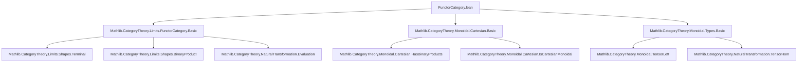
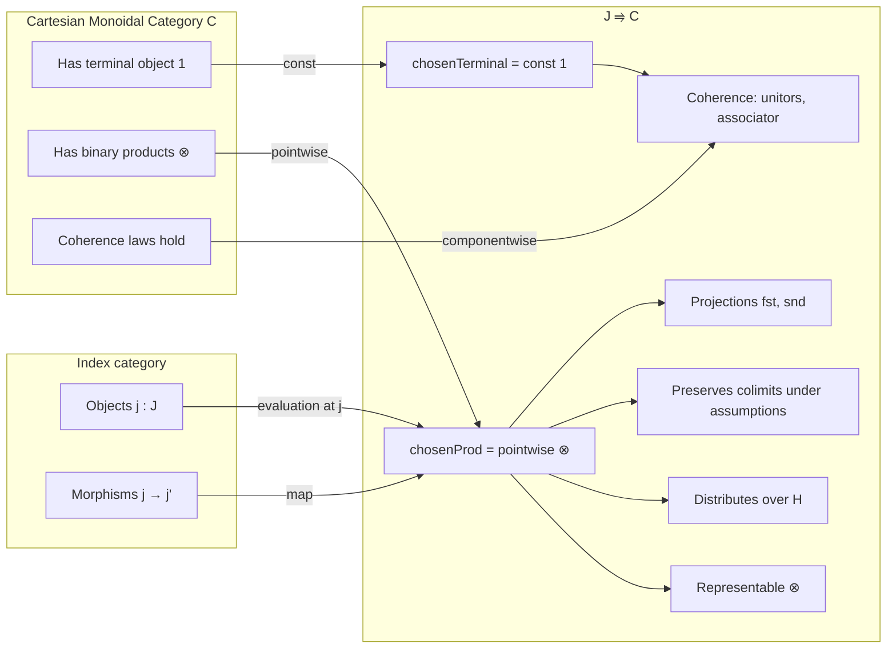

### Technical Brief: `FunctorCategory.lean`

---

#### **1. Key Definitions & Theorems**

| Name | Type / Signature | Purpose |
|------|------------------|---------|
| `chosenTerminal` | `abbrev chosenTerminal : J ⥤ C` | Defines the constant functor at the terminal object of `C`, serving as the chosen terminal object in the functor category `J ⥤ C`. |
| `chosenTerminalIsTerminal` | `def chosenTerminalIsTerminal : IsTerminal (...)` | Proves that `chosenTerminal J C` is terminal in `J ⥤ C`. |
| `chosenProd` | `def chosenProd : J ⥤ C` | Defines the pointwise tensor product (i.e., binary product in a Cartesian monoidal category) of two functors `F₁, F₂ : J ⥤ C`. |
| `chosenProd.fst`, `chosenProd.snd` | `def fst / snd : chosenProd F₁ F₂ ⟶ F₁ / F₂` | Natural transformations implementing the product projections. |
| `chosenProd.isLimit` | `def isLimit : IsLimit (...)` | Shows that `chosenProd F₁ F₂` with projections is a limit cone — i.e., a binary product. |
| `cartesianMonoidalCategory` | `instance cartesianMonoidalCategory : CartesianMonoidalCategory (J ⥤ C)` | Constructs the Cartesian monoidal structure on the functor category using chosen finite products. |
| `tensorObj_obj`, `tensorObj_map` | `@[simp] lemma ...` | Describe the action of the tensor product on objects and morphisms in `J ⥤ C`. |
| `fst_app`, `snd_app` | `@[simp] lemma ...` | Describe the components of the projection natural transformations. |
| `leftUnitor_hom_app`, `rightUnitor_hom_app`, `associator_hom_app` | `@[simp] lemma ...` | Describe the components of the unitors and associator isomorphisms in the functor category. |
| `tensorHom_app_fst`, `tensorHom_app_snd` | `@[reassoc] lemma ...` | Compatibility of tensor product of natural transformations with projections. |
| `whiskerLeft_app_fst`, `whiskerRight_app_snd`, etc. | `@[reassoc] lemma ...` | Compatibility of left/right whiskering with projections. |
| `preservesColimitsOfShape_of_evaluation` (used in `instance`) | `instance` | Shows that `tensorLeft F` preserves colimits of shape `K` under assumptions. |
| `tensorObjComp` | `noncomputable def tensorObjComp : (F ⊗ G) ⋙ H ≅ (F ⋙ H) ⊗ (G ⋙ H)` | Natural isomorphism expressing that a finite-products-preserving functor `H` distributes over the tensor product of functors. |
| `RepresentableBy.tensorObj` | `protected def RepresentableBy.tensorObj` | Shows that the tensor product of representable functors is representable by the tensor of representing objects. |

---

#### **2. Naming Conventions**

- **Prefixes**:
  - `chosen*`: Indicates *chosen* (i.e., constructive) finite products (e.g., `chosenTerminal`, `chosenProd`).
  - `tensor*`: Relates to the monoidal structure (e.g., `tensorObj`, `tensorHom`, `tensorLeft`).
  - `whisker*`: Refers to left/right whiskering of natural transformations.
- **Suffixes**:
  - `_app`: Component at an object `j : J` of a natural transformation.
  - `_hom`, `_inv`: For components of isomorphisms (e.g., `λ_ F`.hom, `α_`.inv).
- **Infixes**:
  - `⊗`: Tensor product of objects/natural transformations.
  - `◁`, `▷`: Left/right whiskering.

---

#### **3. Tactic Stack**

- `simp`: Heavily used, especially with `@[simp]` lemmas.
- `rw`: For rewriting using lemmas and definitions.
- `ext`: For extensionality (e.g., `hom_ext`, `funext`, `prod.ext`).
- `cat_disch`: Category-theoretic tactic for discharging morphism equalities.
- `all_goals`: Applied in `chosenProd.isLimit`.
- `change`, `apply`, `exact`, `refine`: Basic proof scripting.
- `dsimp`, `convert`, `congr'`: Used in `tensorObjComp`.
- `cancel_mono`: Used to cancel monos in proofs involving inverses.

---

#### **4. Proof Logic**

- **Structure**: The proof proceeds by constructing *chosen* finite products pointwise, leveraging the Cartesian monoidal structure on `C`.
- **Key Strategy**:
  1. Define `chosenTerminal` and `chosenProd` *pointwise*.
  2. Show they satisfy the universal property via `evaluationJointlyReflectsLimits`, which reduces limits in functor categories to limits in each component.
  3. Use `IsLimit.ofIsoLimit` and known facts about `C` (e.g., `tensorProductIsBinaryProduct`) to lift limits.
  4. For coherence laws (unitors, associators), verify componentwise using `hom_ext` and naturality.
  5. For colimit preservation, use `preservesColimitsOfShape_of_evaluation` and natural isomorphisms.
  6. For representability, use the universal property of products and representables.

---

#### **5. Imports**

- `Mathlib.CategoryTheory.Limits.FunctorCategory.Basic`: Provides foundational facts about limits in functor categories (e.g., `evaluationJointlyReflectsLimits`).
- `Mathlib.CategoryTheory.Monoidal.Cartesian.Basic`: Cartesian monoidal categories and their properties.
- `Mathlib.CategoryTheory.Monoidal.Types.Basic`: Basic monoidal category machinery (e.g., `tensorLeft`, `tensorRight`, unitors, associators).

---

#### **8. Mermaid Diagrams**

##### **Dependency Graph (Module-Level)**

##### **Overview of Theory Flow**

---

#### **Summary**

This file establishes that the functor category `J ⥤ C` inherits a Cartesian monoidal structure from `C`, provided `C` has chosen finite products. It constructs the terminal object and binary products *pointwise*, verifies universal properties via evaluation, and proves coherence laws and compatibility with colimits and representables. The formalization is highly structured, leveraging `simp`-friendly definitions and `hom_ext`-based reasoning for naturality and uniqueness.
