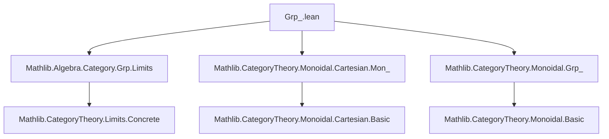

### Technical Brief: `Grp_.lean` — Yoneda Embedding for Group Objects

---

#### **1. Key Definitions & Theorems**

| Name | Type / Signature | Purpose |
|------|------------------|---------|
| `GrpObj.ofRepresentableBy` | `(F : Cᵒᵖ ⥤ GrpCat) → (F ⋙ forget _).RepresentableBy X → GrpObj X` | Constructs a group object from a representable presheaf of groups. |
| `Hom.group` | `[GrpObj G] → Group (X ⟶ G)` | Equips hom-sets with a group structure induced by the group object structure on `G`. |
| `yonedaGrpObj` | `[GrpObj G] → Cᵒᵖ ⥤ GrpCat` | The Yoneda embedding of a group object `G`, sending `X ↦ Hom(X, G)` with group structure. |
| `yonedaGrpObjRepresentableBy` | `(yonedaGrpObj G ⋙ forget _).RepresentableBy G` | Shows `yonedaGrpObj G` is represented by `G`. |
| `GrpObj.ofRepresentableBy_yonedaGrpObjRepresentableBy` | Equality proof | Verifies that reconstructing a group object from its Yoneda presheaf recovers the original. |
| `yonedaGrpObjIsoOfRepresentableBy` | `F ≅ yonedaGrpObj X` | Isomorphism between a representable presheaf of groups and the Yoneda image of its representing object. |
| `yonedaGrp` | `Grp C ⥤ Cᵒᵖ ⥤ GrpCat` | The Yoneda embedding functor for group objects. |
| `yonedaGrpFullyFaithful` | `yonedaGrp.FullyFaithful` | Proves the Yoneda embedding is fully faithful. |
| `essImage_yonedaGrp` | Equality of essential image sets | Characterizes the essential image as representable presheaves of groups. |
| `GrpObj.inv_comp`, `GrpObj.div_comp`, `GrpObj.zpow_comp`, `GrpObj.comp_inv`, etc. | Lemmas about interaction of group operations with composition | Show that group operations are natural w.r.t. morphisms (e.g., `f⁻¹ ≫ g = (f ≫ g)⁻¹`). |
| `GrpObj.inv_eq_inv`, `GrpObj.one_inv` | `ι = (𝟙 G)⁻¹`, `η ≫ ι = η` | Relate group object structure maps to inverse and unit in hom-sets. |
| `Grp.instMonObj`, `Grp.instGrpObj`, `Grp.instIsCommMonObj` | Instances for `Grp C` when `H.X` is commutative | Lifts group object structure to the category of group objects. |
| `Hom.commGroup` | `[IsCommMonObj G] → CommGroup (X ⟶ G)` | Commutative group structure on hom-sets when target is commutative. |

---

#### **2. Naming Conventions**

- **Prefixes**:
  - `GrpObj.`: Properties/constructs about group objects (e.g., `GrpObj.ofRepresentableBy`, `GrpObj.inv_comp`).
  - `Hom.`: Group structure on hom-sets (e.g., `Hom.group`, `Hom.inv_def`, `Hom.commGroup`).
  - `yonedaGrpObj`: Yoneda embedding of a *single* group object.
  - `yonedaGrp`: The *functorial* Yoneda embedding `Grp C → [Cᵒᵖ, GrpCat]`.
  - `Grp.`: Constructs in the *target* category `Grp C` (e.g., `Grp.instMonObj`, `Grp.Hom` namespace).

- **Suffixes**:
  - `_def`: Definition lemmas (e.g., `Hom.inv_def`).
  - `_comp`: Naturality of operations under composition (e.g., `GrpObj.inv_comp`, `GrpObj.div_comp`).
  - `_repr`: Representability-related (e.g., `yonedaGrpObjRepresentableBy`).
  - `_Iso`: Isomorphism constructions (e.g., `yonedaGrpObjIsoOfRepresentableBy`).

- **Other patterns**:
  - `ofRepresentableBy`: Reconstructing algebraic structure from representability.
  - `fullyFaithful`: Fullness/faithfulness of embeddings.
  - `essImage`: Essential image characterizations.

---

#### **3. Tactic Stack**

Frequent tactics used in proofs:

| Tactic | Usage |
|--------|-------|
| `simp` | Simplifying hom-sets, group operations, Yoneda components. |
| `ext` | Extensionality for morphisms, homomorphisms, natural transformations. |
| `congr` | Congruence for equality of morphisms/natural transformations. |
| `rw` / `apply` | Rewriting using definitions or lemmas (e.g., `rw [Category.assoc]`). |
| `change` | Adjusting goal to match known lemmas. |
| `cases` | Case analysis on integers (`ℤ`) or natural numbers. |
| `induction` | Inductive proofs over `ℕ` (e.g., for powers). |
| `apply α.homEquiv.injective` | Leveraging Yoneda equivalence injectivity. |
| `simp only [...]` | Fine-grained simplification with explicit lemmas. |
| `aesop` (not present) | Not used — proofs are highly structured and manual. |

---

#### **4. Proof Logic**

- **Core Strategy**: Use the Yoneda embedding and representability to transfer algebraic structure between objects and presheaves.
- **Typical Flow**:
  1. Assume representability: `F ⋙ forget _ ≅ Hom(-, X)`.
  2. Use monoid-case (`MonObj.ofRepresentableBy`) as base.
  3. Define inverse via `α.homEquiv.symm (1)⁻¹`.
  4. Prove group axioms by transporting via `α.homEquiv`, using naturality and properties of `Hom(-, G)` as a monoid presheaf.
  5. For functoriality: define `yonedaGrp` on objects/morphisms using `yonedaGrpObj` and `yonedaMon`.
  6. Prove fully faithful: reduce to monoid case (`yonedaMonFullyFaithful`) and lift via `forget₂ GrpCat MonCat`.
  7. Essential image: show representable presheaves ↔ group objects via `ofRepresentableBy` and `yonedaGrpObjIsoOfRepresentableBy`.

- **Key Lemmas**:
  - `GrpObj.ofRepresentableBy_yonedaGrpObjRepresentableBy`: Shows reconstruction is inverse to Yoneda.
  - `yonedaGrpObjIsoOfRepresentableBy`: Natural isomorphism between representable presheaf and Yoneda image.
  - `GrpObj.inv_comp`, `comp_inv`, etc.: Naturality of group operations — proven via action of `yonedaGrp` on morphisms.

---

#### **5. Imports & Dependencies**

| Import | Role |
|--------|------|
| `Mathlib.Algebra.Category.Grp.Limits` | Limits in `GrpCat`, background on group objects. |
| `Mathlib.CategoryTheory.Monoidal.Cartesian.Mon_` | Monoid objects in cartesian monoidal categories. |
| `Mathlib.CategoryTheory.Monoidal.Grp_` | Group objects as invertible monoid objects. |

**Core dependencies**:
- `CategoryTheory.Yoneda`
- `CategoryTheory.Limits.Representable`
- `CategoryTheory.Monoidal.Cartesian`
- `Algebra.Group.Hom`
- `Algebra.Group.Basic` (via `GrpCat`)

---

#### **6. Mermaid Diagrams**

##### **Dependency Graph (Module Level)**



##### **Theoretical Overview**

```mermaid
graph LR
  subgraph "Source Category"
    C[Category C<br/>Cartesian Monoidal]
    GrpC[Grp C<br/>Group objects in C]
  end

  subgraph "Target Category"
    [Cᵒᵖ, GrpCat][Presheaves of groups<br/>[Cᵒᵖ, GrpCat]]
  end

  GrpC -- yonedaGrp --> [Cᵒᵖ, GrpCat]
  C -- yoneda --> [Cᵒᵖ, SetCat]
  GrpC -.->|forget| MonC[Mon C]
  MonC -- yonedaMon --> [Cᵒᵖ, MonCat]

  style GrpC fill:#f9f,stroke:#333
  style [Cᵒᵖ, GrpCat] fill:#9ff,stroke:#333
```

##### **Key Equivalences**

```mermaid
graph LR
  GrpObj[G ∈ Grp C] -- yonedaGrpObj --> Hom(-,G)[Presheaf of groups]
  Hom(-,G) -- representable --> G
  GrpObj <-->|iso| Hom(-,G)
  style GrpObj fill:#f9f,stroke:#333
  style Hom(-,G) fill:#9ff,stroke:#333
```

---

#### **7. Summary**

This file establishes the foundational equivalence between **group objects in a cartesian monoidal category `C`** and **representable presheaves of groups on `C`**. It constructs the Yoneda embedding `yonedaGrp : Grp C → [Cᵒᵖ, GrpCat]`, proves it is fully faithful, and identifies its essential image as the representable functors. The proofs rely heavily on the Yoneda lemma, naturality of group operations, and lifting monoid-case results to the group case via inversion and division operations.

The structure mirrors the monoid case (`Mon_`), but introduces new lemmas for inverses, division, and integer powers, and verifies their compatibility with composition and functoriality.

--- 

Let me know if you'd like a formalized dependency graph (e.g., in `.lean` format) or a summary of missing lemmas for future work.
