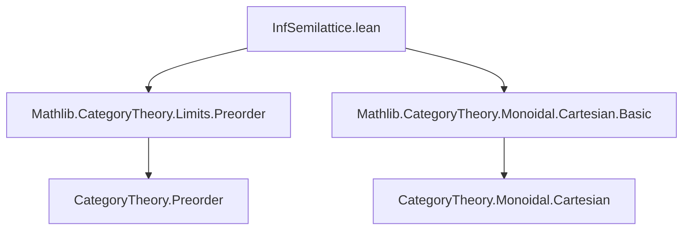
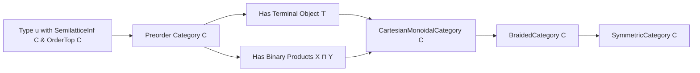

**Technical Brief: `InfSemilattice.lean`**

---

### 1. **Key Definitions & Theorems**

| Name | Type / Signature | Purpose |
|------|------------------|---------|
| `cartesianMonoidalCategory` | `CartesianMonoidalCategory C` | Constructs a Cartesian monoidal structure on the preorder category of a meet-semilattice `C` with a top element. Built via `ofChosenFiniteProducts`, using `⊤` as terminal object and binary meets `X ⊓ Y` as products. |
| `braidedCategory` | `BraidedCategory C` | Derives a braided (in fact symmetric) monoidal structure from the Cartesian monoidal structure via `ofCartesianMonoidalCategory`. |
| `tensorObj` | `X ⊗ Y = X ⊓ Y` | Identifies the monoidal tensor product in the preorder category with the meet (infimum) in the semilattice. |
| `tensorUnit` | `𝟙_ C = ⊤` | Identifies the monoidal unit with the greatest element (top) of the preorder. |
| `Preorder.isTerminalTop` | `IsTerminal ⊤` | Standard fact: in a preorder category, `⊤` is terminal. |
| `Preorder.isLimitBinaryFan` | `IsLimit (binaryFan X Y)` | Standard fact: the binary fan induced by `X ⊓ Y` is a limit cone (i.e., product) in the preorder category. |

---

### 2. **Naming Conventions**

- **Prefixes**:
  - `is_`: Used for properties (e.g., `isTerminalTop`, `isLimitBinaryFan`).
  - `tensor_`: For monoidal structure components (`tensorObj`, `tensorUnit`).
- **Suffixes**:
  - `Category`: For category-level structures (`cartesianMonoidalCategory`, `braidedCategory`).
  - `Fan`: For limit cones (`binaryFan`, `isLimitBinaryFan`).
- **Operators**:
  - `⊓`: Meet (infimum) in `SemilatticeInf`.
  - `⊤`: Top element in `OrderTop`.
  - `⊗`, `𝟙_`: Standard monoidal notation.

---

### 3. **Tactic Stack**

- **`rfl`**: Used in `tensorObj` and `tensorUnit` to prove definitional equalities.
- **Implicit use of `aesop` / `simp`**: Likely used internally by `ofChosenFiniteProducts`, `ofCartesianMonoidalCategory`, and related constructors (not explicit in snippet, but standard in Mathlib).
- **`instance` resolution**: Heavy reliance on typeclass inference (`[SemilatticeInf C]`, `[OrderTop C]`, etc.).

No explicit tactic blocks (`by ...`) appear in this file — proofs are via definitional equality and typeclass inference.

---

### 4. **Proof Logic**

- **Construction-based reasoning**:
  - The Cartesian monoidal structure is *defined* by choosing:
    - Terminal object: `⊤` (via `Preorder.isTerminalTop`).
    - Binary products: `X ⊓ Y` (via `Preorder.isLimitBinaryFan X Y`).
  - The `ofChosenFiniteProducts` constructor verifies that these choices satisfy the finite product axioms.
  - The braided structure is *derived* from the Cartesian structure (Cartesian ⇒ symmetric ⇒ braided).
- **No induction or case analysis** is needed — the structure is *definitional* in the preorder setting.

---

### 5. **Imports**

| Import | Role |
|--------|------|
| `Mathlib.CategoryTheory.Limits.Preorder` | Provides `isTerminalTop`, `isLimitBinaryFan`, and general facts about limits in preorder categories. |
| `Mathlib.CategoryTheory.Monoidal.Cartesian.Basic` | Provides `CartesianMonoidalCategory`, `BraidedCategory.ofCartesianMonoidalCategory`, and Cartesian monoidal structure machinery. |

---

### 6. **Dependency & Theory Overview**

#### **Mermaid Diagram: Module Dependencies**

#### **Mermaid Diagram: Theoretical Flow**

#### **Summary**

This module formalizes the well-known fact that the category associated with a meet-semilattice (viewed as a preorder category) admits a Cartesian monoidal structure, where:
- The monoidal product is meet (`∧` or `⊓`),
- The unit is the top element (`⊤`),
- All coherence isomorphisms are unique (since hom-sets are subsingletons).

It leverages Mathlib’s general machinery for constructing Cartesian monoidal structures from chosen finite products, and inherits symmetry automatically.

--- 

Let me know if you'd like the corresponding diagram for the dual case (join-semilattice with bottom → cocartesian monoidal).
