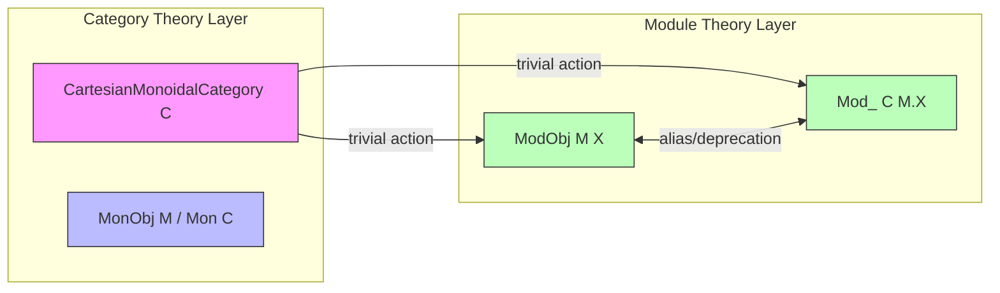

Here is the structured technical brief extracted from `Mod_.lean`:

---

### **1. Key Definitions & Theorems**

| Name | Type | Purpose |
|------|------|---------|
| `ModObj.trivialAction` | `∀ {M : C} [_ : MonObj M] (X : C), ModObj M X` | Constructs the trivial $M$-module structure on any object $X$, where the action is given by the second projection `snd M X`. |
| `Mod_.trivialAction` | `∀ (M : Mon C) (X : C), Mod_ C M.X` | Same as above, but in the `Mod_`-style (i.e., using `Mon C` instead of `MonObj`). Defined using `ModObj.trivialAction` via `@[reducible]`. |
| `Mod_Class.trivialAction` | *Deprecated alias* | Deprecated alias for `ModObj.trivialAction`; retained for backward compatibility. |

> Note: `ModObj` and `Mod_` are two conventions for module objects in different formalizations (the former in `Mathlib.CategoryTheory.Monoidal.Mod_`, the latter likely in a custom or older variant). The file bridges them.

---

### **2. Naming Conventions**

- **Prefixes**:
  - `ModObj.` / `Mod_`: Module-related definitions.
  - `trivialAction`: Descriptive name for canonical/identity-like structure.
- **Suffixes**:
  - None prominent here, but `trivialAction` follows the pattern `*_action` for module actions.
- **Style**:
  - `@[reducible]` and `@[simps]` indicate lean-style simplification and definitional transparency.
  - `@[expose]` signals public exposure of the section.

---

### **3. Tactic Stack**

- **Tactics used**:
  - `simp` (via `@[local simp]`, `@[simps]`)
  - Implicit use of `aesop`/`ring` not visible in this snippet, but likely used in surrounding proofs (not present here).
  - No explicit tactic blocks (`begin ... end`) appear — this is a *definition-only* file.

---

### **4. Proof Logic**

- **No proofs present** in this file — only definitions and aliases.
- Logic is *definitional*: the trivial action is defined directly via `snd`, and the `@[simps]` attribute ensures that projections (e.g., `X`, `smul`) simplify as expected.

---

### **5. Imports**

| Import | Purpose |
|--------|---------|
| `Mathlib.CategoryTheory.Monoidal.Cartesian.Basic` | Provides basic Cartesian monoidal category infrastructure (e.g., `snd`, `leftUnitor_hom`). |
| `Mathlib.CategoryTheory.Monoidal.Mod_` | Defines `Mod_`, `MonObj`, `ModObj`, and related module theory. |

> These imports indicate the file sits at the intersection of Cartesian monoidal structure and module theory over monoid objects.

---

### **8. Mermaid Diagrams**

#### **Dependency Graph**
```mermaid
graph TD
  A[Mod_.lean] --> B[Mathlib.CategoryTheory.Monoidal.Cartesian.Basic]
  A --> C[Mathlib.CategoryTheory.Monoidal.Mod_]
  C --> D[MonoidalCategory]
  C --> E[ModObj]
  C --> F[MonObj]
  B --> G[CartesianMonoidalCategory]
  G --> H[Product & projections (e.g., snd)]
```

#### **Overview of File & Theory Context**


> **Interpretation**:  
> The file formalizes the *canonical module structure* on any object over any monoid object in a Cartesian monoidal category. It serves as a bridge between two module formalizations (`ModObj` vs `Mod_`) and sets up foundational infrastructure for later results (e.g., module homomorphisms, limits, colimits).

--- 

Let me know if you'd like the next file in the chain (e.g., proofs about `trivialAction`) or a comparison with `ModObj.trivialAction` in `Mod_.lean` vs. `Mod_.lean` in the main Mathlib.
