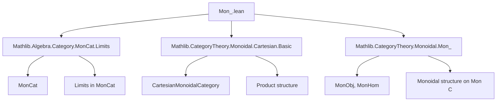

### Technical Brief: `Mon_.lean` — Yoneda Embedding of Monoid Objects in Cartesian Monoidal Categories

---

#### **1. Key Definitions & Theorems**

| Name | Type / Signature | Purpose |
|------|------------------|---------|
| `MonObj` | Typeclass | Defines a *monoid object* in a Cartesian monoidal category: an object $M$ equipped with multiplication $\mu : M \otimes M \to M$ and unit $\eta : 1 \to M$, satisfying associativity, unitality. |
| `IsMonHom` | Typeclass | A morphism $f : M \to N$ is a *monoid homomorphism* if it preserves multiplication and unit. |
| `lift f g` | `A ⟶ B` | The universal morphism induced by the universal property of the product: $A \xrightarrow{\langle f, g \rangle} B \times B \xrightarrow{\mu} B$. |
| `Mon C` | Category | The category of monoid objects in $C$ and monoid homomorphisms between them. |
| `Hom.monoid` | Instance | For $M : \text{MonObj } C$, the hom-set $\text{Hom}(X, M)$ inherits a monoid structure via $f * g := \text{lift } f\,g \circ \mu$. |
| `Hom.commMonoid` | Instance | If $M$ is *commutative*, then $\text{Hom}(X, M)$ is a *commutative* monoid. |
| `MonObj.ofRepresentableBy` | Definition | Given a presheaf of monoids $F : C^{op} \to \text{MonCat}$ represented by $X$, constructs a monoid object structure on $X$. |
| `yonedaMonObj` | Definition | For $M : \text{MonObj } C$, the contravariant hom-functor $\text{Hom}(-, M)$ lifts to a presheaf of monoids $C^{op} \to \text{MonCat}$. |
| `yonedaMonObjIsoOfRepresentableBy` | Isomorphism | If $F$ is representable as a presheaf of monoids, then $F \cong \text{Hom}(-, X)$ as presheaves of monoids. |
| `yonedaMon` | Functor | The Yoneda embedding of monoid objects: $ \text{Mon } C \to [C^{op}, \text{MonCat}] $. |
| `yonedaMonFullyFaithful` | Instance | The Yoneda embedding is fully faithful. |
| `essImage_yonedaMon` | Lemma | The essential image of `yonedaMon` is precisely the representable presheaves of monoids. |

---

#### **2. Naming Conventions**

- **Prefixes / Suffixes**:
  - `is_`: Typeclass for properties (e.g., `IsMonHom`, `IsCommMonObj`)
  - `hom_`: Morphism part of a structure (e.g., `hom_one`, `hom_mul`)
  - `lift_`: Derived from universal property of product (e.g., `lift_lift_assoc`, `lift_comp_one_left`)
  - `yonedaMon_`: Related to the Yoneda embedding of monoid objects
  - `MonObj.` / `Mon.` / `Hom.`: Namespace prefixes for constructions over monoid objects, categories of monoids, and hom-sets respectively.

- **Suffixes**:
  - `_def`: Definitional equalities (e.g., `lift_hom`, `fst_hom`)
  - `_assoc`: Associativity variants (e.g., `lift_lift_assoc`)
  - `_comp`: Compatibility with composition (e.g., `mul_comp`, `pow_comp`)
  - `_unique`: Uniqueness of morphisms to terminal object (e.g., `toUnit_unique`)

---

#### **3. Tactic Stack**

- **Core tactics**:
  - `simp` (with `reassoc`, `at`, `only`, `congr`)
  - `rw` / `rwa` (rewriting with lemmas, often with `assoc` variants)
  - `ext` (extensionality for morphisms, homs, natural transformations)
  - `congr` (for proving equality of composite morphisms)
  - `aesop_cat` (automated category-theoretic reasoning)
  - `induction` (for natural number arguments, e.g., powers)
  - `change`, `trans`, `exact`, `refine`

- **Pattern**:
  - Use `hom_ext` / `MonCat.hom_ext` to reduce morphism equality to underlying hom-set equality.
  - Use `Equiv.apply_symm_apply`, `Functor.comp_map`, `ConcreteCategory.forget_map_eq_coe` to manipulate representability data.
  - `cat_disch` / `aesop_cat` for routine diagram chasing.

---

#### **4. Proof Logic**

- **Inductive structure**:
  - Proofs of monoid laws for `Hom(X, M)` use representability (via `homEquiv.injective`) and naturality of the representing isomorphism.
  - For `lift_*` lemmas: apply known monoid laws (e.g., `one_mul`, `mul_assoc`) to the *tensor* level, then use `lift_*` whiskering lemmas to transport back.

- **Representability arguments**:
  - To show a presheaf of monoids is representable ⇔ its representing object is a monoid object:  
    - `ofRepresentableBy` constructs monoid structure from representability.  
    - `yonedaMonObjIsoOfRepresentableBy` shows the Yoneda lift recovers the original presheaf.

- **Yoneda embedding**:
  - Fully faithfulness: construct inverse to $\text{Hom}_{\text{Mon } C}(M, N) \to \text{Nat}(\text{Hom}(-, M), \text{Hom}(-, N))$ via evaluation at $\text{id}_M$.
  - Essential image: use representability of presheaves of monoids ⇔ existence of monoid structure on representing object.

- **Diagrammatic reasoning**:
  - Heavy use of naturality of $\mu$, $\eta$, and the braiding (when present).
  - `reassoc` attributes on `simp` lemmas to normalize associators/unitors automatically.

---

#### **5. Imports & Dependencies**

```lean
import Mathlib.Algebra.Category.MonCat.Limits
import Mathlib.CategoryTheory.Monoidal.Cartesian.Basic
import Mathlib.CategoryTheory.Monoidal.Mon_
```

- **Scope**: Works in a *Cartesian monoidal category* $C$, i.e., with finite products as tensor.
- **Key dependencies**:
  - `MonCat`: Category of (external) monoids.
  - `MonObj`: Internal monoid objects in $C$.
  - `CartesianMonoidalCategory`: Provides product structure and terminal object.
  - `BraidedCategory`: Required for commutativity and symmetry of tensor (used in `Mon C` being Cartesian).
  - `Limits`: For products, terminal objects, etc.

---

#### **6. Mermaid Diagrams**

##### **Dependency Graph (Module-Level)**



##### **Theoretical Overview (Conceptual Flow)**

```mermaid
graph LR
  C[Cartesian Monoidal Category C] --> MonC[Category Mon C]
  MonC --> yonedaMon[Functor yonedaMon : Mon C → [Cᵒᵖ, MonCat]]
  yonedaMon --> FF[Fully Faithful]
  yonedaMon --> E[Essential Image = Representable Presheaves of Monoids]

  C --> HomMon[Hom(X, -) : Cᵒᵖ → MonCat]
  HomMon --> Yoneda[Representability ⇔ Monoid Object Structure]

  subgraph Representability
    F[Presheaf F : Cᵒᵖ → MonCat]
    R[Representable F ≅ Hom(-, X)]
    M[MonObj X]
    R -->|ofRepresentableBy| M
    M -->|yonedaMonObj| Hom(-, M)
    Hom(-, M) -->|yonedaMonObjIsoOfRepresentableBy| R
  end
```

##### **Key Equivalences**

- **Monoid structure on hom-sets**:
  $$
  \text{Hom}(X, M) \cong \text{MonoidHom}(1, M) \times \text{MonoidHom}(X \times X, M)
  $$
  via $\eta, \mu$, and multiplication defined as $\text{lift}(f,g) \circ \mu$.

- **Yoneda embedding**:
  $$
  \text{Mon } C \xrightarrow{y} [C^{op}, \text{MonCat}]
  $$
  is fully faithful and essentially surjective onto representable presheaves of monoids.

---

#### **7. Summary**

This file establishes the *internal–external correspondence* for monoid objects in Cartesian monoidal categories:

- A monoid object $M$ in $C$ ⇔ the presheaf $\text{Hom}(-, M)$ takes values in monoids.
- The Yoneda embedding of monoid objects is fully faithful, and its essential image is exactly the representable presheaves of monoids.

This is a foundational step toward internalizing algebraic structures (e.g., groups, rings) via Yoneda, and is used in higher categorical and homotopical contexts (e.g., internal classifying spaces, internal sheaves of rings).
