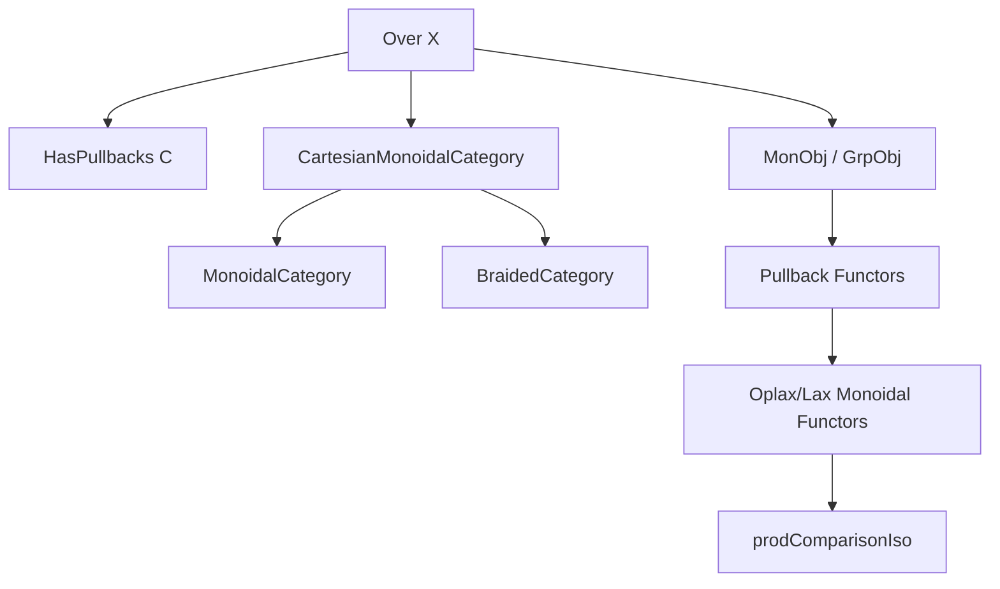
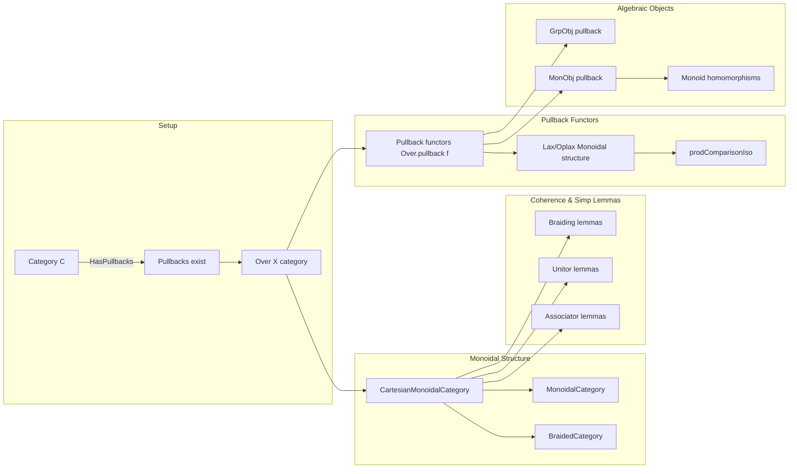

Here is the **technical metadata extraction** for the provided Lean 4 file `Over.lean`, structured as requested:

---

### **1. Key Definitions & Theorems**

| Name | Type / Signature | Purpose |
|------|------------------|---------|
| `cartesianMonoidalCategory` | `X : C → CartesianMonoidalCategory (Over X)` | Constructs a Cartesian monoidal structure on `Over X` using pullbacks as binary products and terminal object `Over.mk (𝟙 X)`. |
| `braidedCategory` | `X : C → BraidedCategory (Over X)` | Derives a braided structure on `Over X` from its Cartesian monoidal structure. |
| `tensorObj_left`, `tensorObj_hom`, `tensorUnit_left`, `tensorUnit_hom` | `@[simp]` lemmas | Describe the underlying object and structure morphism of tensor product and unit in `Over X`. |
| `lift_left`, `toUnit_left` | `@[simp]` lemmas | Describe the underlying morphism of the universal property (lift) and terminal morphism (toUnit). |
| `associator_hom_*`, `associator_inv_*` | `@[reassoc (attr := simp)]` lemmas | Characterize the components of associator and its inverse in terms of pullback projections. |
| `leftUnitor_hom_left`, `rightUnitor_hom_left`, `leftUnitor_inv_*`, `rightUnitor_inv_*` | `@[reassoc (attr := simp)]` lemmas | Describe unitors and their inverses via pullback projections. |
| `whiskerLeft_left`, `whiskerRight_left`, `tensorHom_left` | `rfl` lemmas | Describe how whiskering and tensor product of morphisms act on underlying objects. |
| `tensorHom_left_fst`, `tensorHom_left_snd` | `@[reassoc (attr := simp)]` lemmas | Describe how tensor product of morphisms interacts with pullback projections. |
| `braiding_hom_left`, `braiding_inv_left` | `@[simp]` lemmas | Describe braiding isomorphism and its inverse as pullback symmetry. |
| `η_pullback_left`, `ε_pullback_left` | `@[simp]` lemmas | Describe the oplax/lax monoidal structure maps for pullback functors. |
| `μ_pullback_left_*` | `@[simp]` lemmas | Describe the multiplication natural transformation for pullback functors in terms of pullback projections. |
| `preservesTerminalIso_pullback` | `@[simp]` lemma | Identifies the canonical iso from preservation of terminal object for pullback. |
| `prodComparisonIso_pullback_*` | `@[simp]` lemmas | Describe the comparison iso between pullbacks and products in the codomain. |
| `monObjMkPullbackSnd` | `MonObj (Over.mk (pullback.snd f g))` | Pullback of a monoid object along `g` yields a monoid object. |
| `grpObjMkPullbackSnd` | `GrpObj (Over.mk (pullback.snd f g))` | Pullback of a group object along `g` yields a group object. |
| `isMonHom_pullbackFst_id_right` | `IsMonHom` instance | Shows that projection `pullback.fst f (𝟙 X)` is a monoid homomorphism. |

---

### **2. Naming Conventions**

- **Prefixes**:
  - `tensorObj_*`, `tensorUnit_*`, `lift_*`, `toUnit_*`: describe structure maps of monoidal category.
  - `associator_*`, `leftUnitor_*`, `rightUnitor_*`, `braiding_*`: coherence isomorphisms.
  - `whiskerLeft_*`, `whiskerRight_*`, `tensorHom_*`: describe morphism-level monoidal operations.
  - `μ_pullback_*`, `η_pullback_*`, `ε_pullback_*`: monoidal structure maps for pullback functors.
  - `prodComparisonIso_pullback_*`: comparison maps for monoidal structure.

- **Suffixes**:
  - `_left`, `_fst`, `_snd`: refer to components of pullback cones (projections or factorizations).
  - `_hom`, `_inv`: refer to forward/inverse components of isomorphisms.
  - `_pullback`: indicates dependency on pullback constructions.

- **Special**:
  - `monObjMkPullbackSnd`, `grpObjMkPullbackSnd`: indicate construction of algebraic objects via pullback.
  - `isMonHom_*`: indicates monoid homomorphism property.

---

### **3. Tactic Stack**

Frequently used tactics in proofs and simplifications:

| Tactic | Usage |
|--------|-------|
| `rfl` | For definitional equalities (e.g., `tensorObj_left`, `lift_left`). |
| `simp` / `simp only` | For simplifying using `@[simp]` lemmas, especially projection lemmas. |
| `ext` | For extensionality arguments (e.g., proving morphism equality in `Over X`). |
| `rw [...]` | Rewriting using lemmas like `Monoidal.μ_of_cartesianMonoidalCategory`, `Iso.hom_inv_id`. |
| `cancel_epi` | To cancel epimorphisms on the left (common in pullback-based proofs). |
| `limit.lift_π`, `limit.lift_π_assoc` | For reasoning about limits (pullbacks as limits). |
| `Category.comp_id`, `Category.assoc` | Basic category theory rewrites. |
| `congr 1` + `ext` | For proving equality of morphisms via component-wise equality. |
| `dsimp`, `unfold` | For unfolding definitions like `monObjMkPullbackSnd_mul`. |

---

### **4. Proof Logic**

- **Structure**: Most proofs follow a pattern:
  1. **Unfold definitions** (e.g., `monObjMkPullbackSnd_mul`, `prodComparisonIso`).
  2. **Apply `simp`** using `@[simp]` lemmas about pullback projections.
  3. **Use universal property of pullbacks** (`limit.lift_π`, `pullback.hom_ext`).
  4. **Cancel epimorphisms** when needed (`cancel_epi`).
  5. **Use coherence laws** from `CartesianMonoidalCategory` (e.g., `Monoidal.μ_of_cartesianMonoidalCategory`).

- **Induction**: Not used — all proofs are *computational* and *diagrammatic*, relying on universal properties and simp lemmas.

- **Extensionality**: Morphism equality in `Over X` is often proven via `pullback.hom_ext` or `Over.OverMorphism.ext`.

---

### **5. Imports**

| Import | Purpose |
|--------|---------|
| `Mathlib.CategoryTheory.Adjunction.Limits` | General limit theory (used for pullbacks as limits). |
| `Mathlib.CategoryTheory.Comma.Over.Pullback` | Pullback functors on over-categories. |
| `Mathlib.CategoryTheory.Limits.Constructions.Over.Products` | Products in over-categories via pullbacks. |
| `Mathlib.CategoryTheory.Monoidal.CommMon_`, `Grp_` | Monoid/group objects and their properties. |
| `Mathlib.CategoryTheory.Limits.Shapes.Pullback.IsPullback.Basic` | Basic pullback theory (e.g., `pullback.fst`, `pullback.snd`). |

---

### **6. Mermaid Diagrams**

#### **Dependency Graph (High-Level)**

#### **Overview of File Structure**

---

Let me know if you'd like a **dependency graph of lemmas** or a **proof automation summary** (e.g., which lemmas are auto-provable by `simp`/`aesop`).
