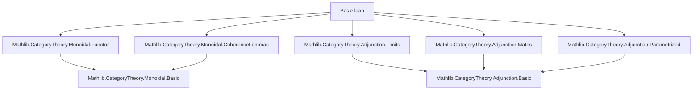

### Technical Brief: `Basic.lean` — Closed Monoidal Categories in Lean 4

---

#### **1. Key Definitions & Theorems**

| Name | Type / Signature | Purpose |
|------|------------------|---------|
| `Closed X` | `Class` | States that object `X` is *right closed*, i.e., `tensorLeft X ⊣ rightAdj X`. Carries a *specific* choice of right adjoint. |
| `MonoidalClosed C` | `Class` | asserts *every* object in `C` is closed (via `closed X : Closed X`). |
| `ihom A` | `C ⥤ C` | Internal hom functor: `A ⟶[C] -`. Defined as `Closed.rightAdj A`. |
| `ev A : ihom A ⋙ tensorLeft A ⟶ 𝟭 C` | `natural transformation` | Counit of the adjunction `tensorLeft A ⊣ ihom A`. Evaluation map. |
| `coev A : 𝟭 C ⟶ tensorLeft A ⋙ ihom A` | `natural transformation` | Unit of the adjunction. Coevaluation map. |
| `A ⟶[C] B` | Notation | Internal hom object: `ihom A.obj B`. |
| `curry f` | `(A ⊗ Y ⟶ X) → (Y ⟶ A ⟶[C] X)` | Currying isomorphism (hom-set equivalence). |
| `uncurry f` | `(Y ⟶ A ⟶[C] X) → (A ⊗ Y ⟶ X)` | Uncurrying (inverse of `curry`). |
| `pre f` | `(B ⟶ A) → (ihom A ⟶ ihom B)` | Pre-composition natural transformation (contravariant in domain). |
| `internalHom` | `Cᵒᵖ ⥤ C ⥤ C` | Parametrized internal hom functor. |
| `internalHomAdjunction₂` | `curriedTensor C ⊣₂ internalHom` | Parametrized adjunction (2-variable adjunction). |
| `ofEquiv` | `MonoidalClosed D → (F : C ≌ D) → MonoidalClosed C` | Transport monoidal closed structure across monoidal equivalence. |
| `id x`, `comp x y z` | `id : 𝟙_ C ⟶ ihom x.obj x`, `comp : ihom x.obj y ⊗ ihom y.obj z ⟶ ihom x.obj z` | Enrichment data: identity and composition for `C`-enrichment. |
| `curry' f`, `uncurry' g` | `(X ⟶ Y) ↔ (𝟙_ C ⟶ ihom X.obj Y)` | Enrichment over base object: morphism ↔ arrow from unit. |

**Key Theorems**:
- `curry_uncurry`, `uncurry_curry`: `curry` and `uncurry` are inverses.
- `curry_natural_left/right`, `uncurry_natural_left/right`: naturality of currying.
- `pre_id`, `pre_map`: `pre` is a contravariant functor.
- `id_comp`, `comp_id`, `assoc`: enriched category axioms (unitality, associativity).
- `curry'_id`, `curry'_comp`: `curry'` preserves identities and composition (enrichment over base).
- `ofEquiv_curry_def`, `ofEquiv_uncurry_def`: explicit description of currying/uncurrying after transport.

---

#### **2. Naming Conventions**

| Pattern | Meaning | Examples |
|--------|---------|----------|
| `is_`, `has_` | Not used here — instead, `Closed`, `MonoidalClosed` are *classes*. | — |
| `ihom_`, `ev_`, `coev_`, `pre_`, `curry_`, `uncurry_`, `comp_`, `id_` | Core operations on internal homs. | `ihom.adjunction`, `ev_naturality`, `pre_map`, `curry_natural_left`, `comp_id` |
| `_app`, `_hom`, `_obj` | Standard functor/nat trans notation. | `coev A`.app X, `ihom A`.obj B |
| `_transpose` | Uncurried version of a map. | `compTranspose` |
| `_eq`, `_def` | Lemmas unfolding definitions. | `comp_eq`, `ofEquiv_curry_def` |
| ` whiskerLeft_`, ` whiskerRight_`, ` associator_`, ` unitors_` | Monoidal coherence data. | `whiskerLeft_curry_ihom_ev_app`, `associator_inv_naturality_middle_assoc` |

---

#### **3. Tactic Stack**

| Tactic | Frequency | Role |
|--------|-----------|------|
| `simp` | Very high | Simplify using `@[simp]` lemmas (e.g., `ev_naturality`, `coev_naturality`, `curry_uncurry`). |
| `rw` | High | Rewrite using naturality, triangle identities, coherence laws. |
| `apply` / `intro` | Medium | Introduce hypotheses, apply lemmas (e.g., `apply uncurry_injective`). |
| `rfl` | Medium | Prove definitional equalities (e.g., `curry_eq`, `comp_eq`). |
| `dsimp` | Medium | Simplify definitional reductions (e.g., in `ofEquiv_curry_def`). |
| `exact` / `assumption` | Low | Rarely needed due to `simp`/`rw`. |
| `congr` / `ext` | Low | For extensionality (e.g., natural transformations). |
| `cases` | Low | Rarely used; structure is categorical, not inductive. |
| `ring` / `abel` | None | Not applicable (no additive structure). |
| `aesop` | None | Not used — proofs are highly structured and manual. |

**Typical proof pattern**:
```lean
apply uncurry_injective
rw [uncurry_natural_left, comp_eq, uncurry_curry, ...]
simp
```

---

#### **4. Proof Logic**

- **Inductive structure**: None — proofs are *categorical*, relying on adjunctions, naturality, and coherence.
- **Core strategy**:
  1. **Adjoint transpose**: Use `uncurry_injective` / `curry_injective` to reduce equalities to the tensor-hom adjunction.
  2. **Unfold definitions**: Use `comp_eq`, `curry_eq`, `uncurry_eq`, `compTranspose_eq`.
  3. **Apply triangle identities**: `ev_coev`, `coev_ev`.
  4. **Use naturality & coherence**: `whisker_exchange`, `associator_naturality`, `unitors`.
  5. **Simplify**: `simp` with `@[reassoc]` lemmas.

- **Transport across equivalence** (`ofEquiv`):
  - Construct new adjunction via composition: `F ⊣ G`, `F(X) ⊣ ihom(F(X))`, `G ⊣ F`.
  - Use `ofNatIsoLeft` to adjust for monoidal structure (`commTensorLeft`).
  - Prove correctness via explicit `homEquiv` manipulation.

- **Enrichment proofs**:
  - Reduce to uncurried form.
  - Apply `uncurry_curry` to collapse adjoint pairs.
  - Use coherence (associator, unitors) to rearrange.

---

#### **5. Imports & Dependencies**

| Module | Purpose |
|--------|---------|
| `Mathlib.CategoryTheory.Monoidal.Functor` | Monoidal functors, tensor product functors (`tensorLeft`). |
| `Mathlib.CategoryTheory.Monoidal.CoherenceLemmas` | Coherence isomorphisms (`α_`, `λ_`, `ρ_`) and their naturality. |
| `Mathlib.CategoryTheory.Adjunction.Limits` | Preservation of colimits by left adjoints (`PreservesColimits`). |
| `Mathlib.CategoryTheory.Adjunction.Mates` | Mates, conjugate equivalences (`conjugateEquiv`, `conjugateIsoEquiv`). |
| `Mathlib.CategoryTheory.Adjunction.Parametrized` | Parametrized adjunctions (`⊣₂`). |

**Core dependencies**:
- `CategoryTheory.MonoidalCategory`
- `CategoryTheory.Adjunction`
- `CategoryTheory.Limits`

---

#### **6. Mermaid Diagrams**

##### **Dependency Graph (Module-Level)**



##### **Overview of `Basic.lean` Theory**

```mermaid
flowchart LR
  subgraph Definitions
    C[Closed X] --> CL[Class]
    MC[MonoidalClosed C] --> MCL[Class]
    IH[ihom A] --> IF[Functor C ⥤ C]
    EV[ev A] --> NT[Natural Transformation]
    CO[coev A] --> NT
    CUR[curry] --> BI[ Bijection Hom(A⊗Y,X) ↔ Hom(Y,A⇒X) ]
    PRE[pre f] --> CT[Contravariant Action]
    INT[internalHom] --> PA[Parametrized Adjunction]
  end

  subgraph Properties
    CURINV[curry_uncurry, uncurry_curry]
    NAT[curry_natural_left/right]
    ENR[id_comp, comp_id, assoc]
    TRAN[ofEquiv_curry_def]
  end

  C --> CL
  MC --> MCL
  IH --> IF
  EV --> NT
  CO --> NT
  CUR --> BI
  PRE --> CT
  INT --> PA

  BI --> CURINV
  IF --> NAT
  PA --> ENR
  MC --> TRAN
```

##### **Enrichment Construction Flow**

```mermaid
flowchart LR
  A[Closed X] --> B[id x : 𝟙 → X⇒X]
  A --> C[compTranspose : X⊗(X⇒Y)⊗(Y⇒Z) → Z]
  C --> D[comp : (X⇒Y)⊗(Y⇒Z) → X⇒Z]
  B --> E[Enriched Category Axioms]
  D --> E
  E --> F[C-enriched category]
```

---

#### **7. Summary**

This file formalizes the theory of **(right) closed monoidal categories**, including:
- Internal homs (`ihom`, `A ⟶[C] -`)
- Currying/uncurrying isomorphisms
- Contravariant pre-composition (`pre`)
- Parametrized adjunctions (`internalHomAdjunction₂`)
- Transport across monoidal equivalences (`ofEquiv`)
- Enrichment over self (`id`, `comp`, `curry'`, `uncurry'`)

It is foundational for higher categorical structures (e.g., enriched categories, closed monoidal toposes), and sets up the stage for Cartesian closed categories and internal logic.

The proofs are highly structured, leveraging adjunctions, naturality, and coherence, with minimal automation — typical of advanced category theory formalizations in Lean.
