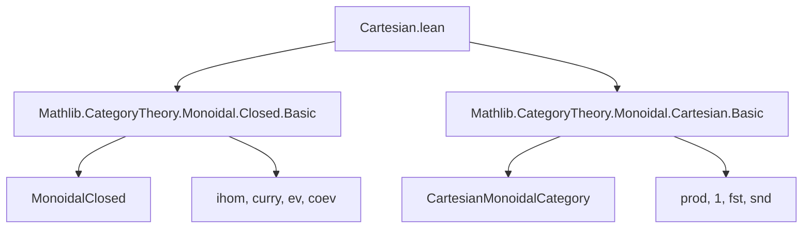
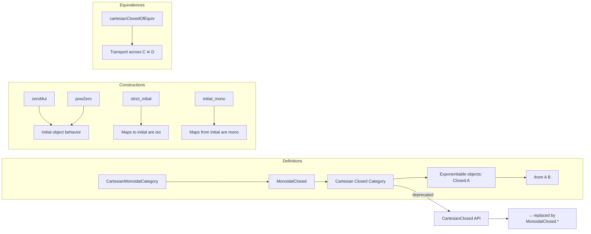

### Technical Brief: Cartesian Closed Categories in Lean 4 (Mathlib)

---

#### **1. Key Definitions & Theorems**

| Name | Type / Signature | Purpose |
|------|------------------|---------|
| `CartesianMonoidalCategory` | `Class` | A category with finite products, viewed as a monoidal category via `⊗ := ×`, `I := 1`. |
| `Closed A` | `Class` | Object `A` is *exponentiable*: the functor `A ⨯ -` has a right adjoint `ihom A`. |
| `MonoidalClosed C` | `Class` | Every object is exponentiable (`Closed A` for all `A`), i.e., `C` is *cartesian closed*. |
| `ihom A B` | `C` | Internal hom object, right adjoint to `A ⨯ -`. |
| `internalizeHom f` | `1 ⟶ A ⟹ Y` | Currying of `f : A ⟶ Y`, representing `f` as an internal morphism from the terminal object. |
| `zeroMul t` | `A ⊗ I ≅ I` | Isomorphism when `I` is initial: tensoring with initial object yields initial. |
| `mulZero t` | `I ⊗ A ≅ I` | Symmetric version of `zeroMul`, using braiding. |
| `powZero t` | `I ⟹ B ≅ 1` | Exponential with initial base is terminal. |
| `prodCoprodDistrib` | `(Z ⊗ X) ⨿ (Z ⊗ Y) ≅ Z ⊗ (X ⨿ Y)` | Distributivity of tensor over coproduct (deprecated; use `coprodComparison` instead). |
| `strict_initial t f` | `IsIso f` | Any map `A ⟶ I` (with `A` exponentiable, `I` initial) is an iso. |
| `initial_mono B t` | `Mono (t.to B)` | Any map *from* an initial object is monic. |
| `cartesianClosedOfEquiv e` | `MonoidalClosed D` | Transport of cartesian closed structure along an equivalence `C ≌ D`. |

---

#### **2. Naming Conventions**

- **Prefixes / Suffixes**:
  - `zero_`, `mulZero`, `powZero`: relate to behavior with initial object.
  - `internal_`: e.g., `internalizeHom`, `internalHom` (deprecated alias).
  - `strict_`: e.g., `strict_initial`.
  - `exp` → deprecated; replaced by `ihom`.
  - `CartesianClosed.*` → deprecated; replaced by `MonoidalClosed.*`.
- **Notation**:
  - `A ⟹ B` = `ihom A B` (internal hom).
  - `B ^^ A` = `ihom A B` (alternative notation, less common).
- **Aliases**:
  - `Exponentiable := Closed`
  - `CartesianClosed := MonoidalClosed`
  - `exp := ihom`

---

#### **3. Tactic Stack**

Frequently used tactics in proofs:
- `simp` / `simp_rw`: for simplifying hom-sets and using `isInitial`/`isIso` properties.
- `apply t.hom_ext _ _`: uniqueness of maps into initial objects.
- `rw [← curry_eq_iff]`, `rw [← eq_curry_iff]`: manipulation of currying.
- `apply t.hom_ext`: leveraging initiality to prove equality of morphisms.
- `exact mono_comp _ _`, `exact isIso_of_mono_of_isSplitEpi`: categorical reasoning about monos/isos.
- `haveI := ...`: introducing instance proofs inline.
- `asIso`: converting a comparison morphism to an isomorphism.

---

#### **4. Proof Logic**

- **Pattern**: Most proofs rely on:
  1. **Initial object properties**: uniqueness of maps `I ⟶ X`, `X ⟶ I`.
  2. **Currying/uncurrying naturality**: e.g., `curry_natural_left`, `uncurry_natural_right`.
  3. **Adjunction calculus**: using `ihom.adjunction` to move between `A ⊗ B ⟶ C` and `B ⟶ A ⟹ C`.
  4. **Isomorphism construction**: define `hom`, `inv`, then prove `hom_inv_id` and `inv_hom_id` using initiality or uniqueness.
  5. **Transport across equivalences**: using `ofChosenFiniteProducts` and `ofEquiv`.

- **Typical flow**:
  ```text
  [Assume I initial]
  → construct candidate iso (e.g., zeroMul)
  → define hom/inv
  → use t.hom_ext (initiality) to prove composites = id
  ```

---

#### **5. Imports**

- `Mathlib.CategoryTheory.Monoidal.Closed.Basic`
- `Mathlib.CategoryTheory.Monoidal.Cartesian.Basic`

These provide:
- `MonoidalClosed`, `ihom`, `curry`, `ev`, etc.
- `CartesianMonoidalCategory`, finite products, `prod.functor`, `fst`, `snd`.

---

#### **6. Mermaid Diagrams**

##### **Dependency Graph (Top-Level)**



##### **Conceptual Overview of `Cartesian.lean`**



##### **Theory Context**

- **Base theory**: Monoidal categories, finite products.
- **Extension**: Cartesian closed structure via internal homs.
- **Special cases**: behavior with initial objects, strictness, monicity.
- **Equivalence invariance**: cartesian closedness is preserved under categorical equivalence.

---

#### **7. Notes & Deprecations**

- **`CartesianClosed`** is deprecated in favor of `MonoidalClosed`.
- **`exp`** → `ihom`.
- **Notation**: `A ⟹ B` is preferred over `B ^^ A`.
- **`quotPrecheck false`** is set to avoid elaboration issues with notation.
- **`prodCoprodDistrib`** is deprecated; use `asIso (coprodComparison ...)` instead.

--- 

Let me know if you'd like a formalized dependency graph (e.g., for `leanpkg`), or a visualization of the `ihom` adjunction triangle.
