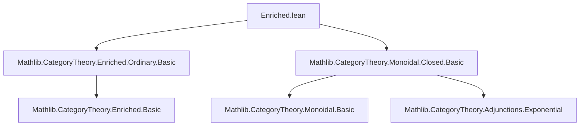
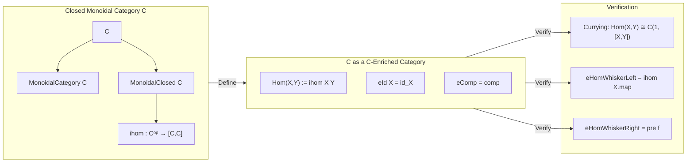
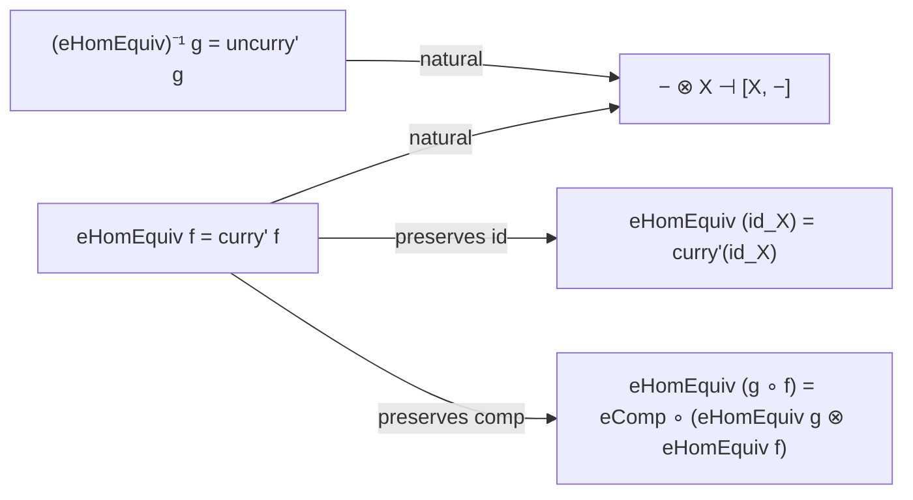

**Technical Brief: `Enriched.lean` (Enrichment Module)**  
*Domain: Category Theory — Enriched Categories over Monoidal Closed Categories*  

---

### 1. **Key Definitions & Theorems**

| Name | Type / Signature | Purpose |
|------|------------------|---------|
| `enrichedCategorySelf` | `scoped instance EnrichedCategory C C` | Constructs a `C`-enriched category structure on `C` itself, using internal homs (`ihom`) for hom-objects. |
| `enrichedOrdinaryCategorySelf` | `scoped instance EnrichedOrdinaryCategory C C` | Upgrades the above to an *enriched ordinary category* (i.e., one satisfying the “ordinary” enrichment axioms via curried hom equivalences). |
| `enrichedCategorySelf_hom` | `EnrichedCategory.Hom X Y = (ihom X).obj Y` | Identifies the enriched hom-object with the internal hom. |
| `enrichedCategorySelf_id` | `eId C X = id X` | Shows the enriched identity morphism coincides with the categorical identity. |
| `enrichedCategorySelf_comp` | `eComp C X Y Z = comp X Y Z` | Shows enriched composition coincides with ordinary composition. |
| `enrichedOrdinaryCategorySelf_eHomWhiskerLeft` | `eHomWhiskerLeft C X g = (ihom X).map g` | Describes left whiskering of enriched homs via internal hom functoriality. |
| `enrichedOrdinaryCategorySelf_eHomWhiskerRight` | `eHomWhiskerRight C f Y = (pre f).app Y` | Describes right whiskering via precomposition (i.e., `pre f := ihom f 1`). |
| `enrichedOrdinaryCategorySelf_homEquiv` | `eHomEquiv C f = curry' f` | The hom-equivalence of the enriched ordinary category is given by currying. |
| `enrichedOrdinaryCategorySelf_homEquiv_symm` | `(eHomEquiv C).symm g = uncurry' g` | Inverse of the hom-equivalence is uncurrying. |

> **Notation**:  
> - `ihom X` = internal hom functor $X \multimap - : C \to C$  
> - `curry' f` = curried morphism $1 \to [X,Y]$ corresponding to $f : X \to Y$  
> - `pre f` = natural transformation $[Y,Z] \to [X,Z]$ induced by $f : X \to Y$  

---

### 2. **Naming Conventions**

- **Prefixes**:
  - `enrichedCategorySelf_*`: Fields of the `EnrichedCategory` instance.
  - `enrichedOrdinaryCategorySelf_*`: Fields of the `EnrichedOrdinaryCategory` instance.
  - `eId`, `eComp`, `eHomEquiv`, `eHomWhiskerLeft`, `eHomWhiskerRight`: Standard enriched-category field names (from `EnrichedCategory`/`EnrichedOrdinaryCategory`).
- **Suffixes**:
  - `hom`, `id`, `comp`: Standard categorical operations.
  - `symm`: Denotes inverse of an equivalence (e.g., `homEquiv_symm`).
- **Functional style**: `curry'`, `uncurry'`, `pre`, `ihom` — all derived from closed monoidal structure.

---

### 3. **Tactic Stack**

| Tactic | Usage Frequency | Role |
|--------|-----------------|------|
| `rw` | High | Rewriting definitions (e.g., `eComp`, `eId`, `curry'`) and known lemmas (`whiskerLeft_curry'_comp`, `curry'_whiskerRight_comp`). |
| `change` | Medium | Aligning goal with target expression before rewriting. |
| `rw [Iso.inv_hom_id_assoc]` | Medium | Simplifying composites involving isomorphisms (e.g., unit/counit of closed structure). |
| `rfl` | High | Proving definitional equalities (e.g., `eId = id`, `eComp = comp`, `eHomEquiv = curry'`). |
| `change ... = _` + `rw [...]` | Medium | Common pattern in whiskering lemmas to reduce to known naturality/adjunction identities. |

No heavy automation (`aesop`, `simp`, `linarith`) is used — proofs are mostly *definition-chasing* using properties of closed monoidal categories.

---

### 4. **Proof Logic**

- **Structure**:  
  1. **Define** the enriched category structure (`Hom`, `id`, `comp`) *definitionally* using internal hom and ordinary composition.  
  2. **Verify** enrichment axioms (`assoc`, `left_id`, `right_id`) by appeal to `rfl` — they hold *by definition* because `assoc`, `left_id`, `right_id` are already available in `CategoryTheory`.  
  3. For the *enriched ordinary category* structure:  
     - Define `homEquiv` as `curry'` (from closed structure).  
     - Prove `homEquiv_id` and `homEquiv_comp` using `curry'_id` and `curry'_comp` (from `MonoidalClosed.lean`).  
     - Prove whiskering lemmas by unfolding definitions, then applying naturality of `curry'` and unit/counit triangle identities (via `Iso.inv_hom_id_assoc`).  

- **Logical Flow**:  
  > *Definition → rfl verification for basic fields → adjunction-based verification for hom-equivalence and whiskering.*  
  > Relies heavily on the universal property of the internal hom (i.e., the adjunction $-\otimes X \dashv [X,-]$).

---

### 5. **Imports**

| Import | Role |
|--------|------|
| `Mathlib.CategoryTheory.Enriched.Ordinary.Basic` | Provides `EnrichedCategory`, `EnrichedOrdinaryCategory`, and their field types. |
| `Mathlib.CategoryTheory.Monoidal.Closed.Basic` | Provides `MonoidalClosed`, `ihom`, `curry'`, `uncurry'`, `pre`, and key lemmas (`curry'_id`, `curry'_comp`, `whiskerLeft_curry'_comp`, etc.). |

> **Note**: The module assumes `C` is a `Type u` with `Category`, `MonoidalCategory`, and `MonoidalClosed` instances.

---

### 6. **Mermaid Diagrams**

#### **Dependency Graph (Module-Level)**

#### **Conceptual Overview of the Construction**

#### **Enriched Ordinary Category Structure**

---

### 7. **Theoretical Significance**

- This module realizes the *canonical self-enrichment* of a closed monoidal category — a foundational result used throughout enriched category theory (e.g., in the theory of internal homs, enriched limits, and monoidal functor categories).
- The use of `scoped instance` avoids conflicts when `C` admits multiple enrichment structures (e.g., `SSet` as simplicial objects vs. as a closed monoidal category).
- The construction is *definitional* for `Hom`, `id`, `comp`, but *proof-relevant* for the enriched ordinary structure (requiring adjunction coherence).

--- 

*End of Technical Brief.*
