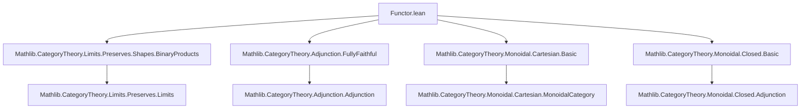
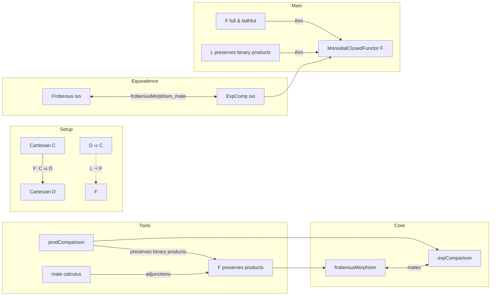

### Technical Brief: Cartesian Closed Functors in Lean 4 (Functor.lean)

---

#### **1. Key Definitions & Theorems**

| Name | Type / Signature | Purpose |
|------|------------------|---------|
| `frobeniusMorphism` | `L ⊣ F → A : C → TwoSquare (tensorLeft (F.obj A)) L L (tensorLeft A)` | Constructs a natural transformation $L(F A \times B) \to F A \times L B$ from an adjunction $L \dashv F$, using product comparison and the counit. Central to Frobenius reciprocity. |
| `expComparison` | `A : C → TwoSquare (ihom A) F F (ihom (F.obj A))` | Natural transformation comparing exponentials: $[A, -] \Rightarrow F^\ast [F A, -]$. $F$ is Cartesian closed iff this is an iso for all $A$. |
| `MonoidalClosedFunctor` | `Prop` (class) | Predicate: $F$ preserves exponentials iff `expComparison F A` is an iso for all $A$. |
| `frobeniusMorphism_mate` | `conjugateEquiv (...) (frobeniusMorphism ...).natTrans = (expComparison ...).natTrans` | Shows Frobenius morphism and exponential comparison are *mates* under adjunctions — key equivalence. |
| `frobeniusMorphism_iso_of_expComparison_iso` | `IsIso (expComparison F A) → IsIso (frobeniusMorphism F h A)` | One direction of Frobenius reciprocity: exponential comparison iso ⇒ Frobenius iso. |
| `expComparison_iso_of_frobeniusMorphism_iso` | `IsIso (frobeniusMorphism F h A) → IsIso (expComparison F A)` | Converse direction: Frobenius iso ⇒ exponential comparison iso. |
| `cartesianClosedFunctorOfLeftAdjointPreservesBinaryProducts` | `L ⊣ F`, `F` full & faithful, `L` preserves binary products ⇒ `MonoidalClosedFunctor F` | Main existence theorem: under these conditions, $F$ is Cartesian closed. |

---

#### **2. Naming Conventions**

- **Prefixes**:
  - `frobeniusMorphism_`: for Frobenius-related constructions.
  - `expComparison_`: for exponential comparison maps and properties.
  - `prodComparison_`: for binary product comparison natural transformations.
  - `curriedTensor_`: for internal hom adjoints (via currying of tensor).
- **Suffixes**:
  - `_iso`: indicates a proof that a morphism is an isomorphism.
  - `_natTrans`: refers to the underlying natural transformation of a `TwoSquare`.
  - `_app`: used in lemmas about components of natural transformations.
- **Other**:
  - `whiskerLeft`, `whiskerRight`, `whiskerBottom`, `whiskerTop`: standard 2-categorical whiskering.
  - `uncurry`, `ev`, `coev`: internal hom operations.

---

#### **3. Tactic Stack**

- **Core tactics**:
  - `simp` / `simp only`: heavily used for simplification of whiskering, mate, and comparison maps.
  - `rw`: for rewriting using naturality, adjunction, and isomorphism properties.
  - `convert`: for equational reasoning with partial unification.
  - `congr 1`: to reduce equality of natural transformations to pointwise equality.
  - `ext`: (via `IsIso.inv_eq_of_hom_inv_id`) to prove inverses.
  - `infer_instance`: to discharge typeclass goals (e.g., `IsIso`).
  - `slice_lhs`: for localized rewriting in complex expressions.
  - `unfold`: to expand definitions (e.g., `expComparison`, `frobeniusMorphism`).
- **Advanced**:
  - `mateEquiv`, `conjugateEquiv`, `iterated_mateEquiv_conjugateEquiv`: for manipulating mates under adjunctions.
  - `NatIso.isIso_of_isIso_app`: to lift pointwise isos to natural isomorphisms.

---

#### **4. Proof Logic**

- **Structure**:
  1. **Define constructions** (`frobeniusMorphism`, `expComparison`) using existing categorical tools (product comparison, mates, adjunctions).
  2. **Prove naturality & coherence** (e.g., `expComparison_whiskerLeft`) using:
     - Mate calculus (`mateEquiv_conjugateEquiv_vcomp`, `conjugateEquiv_mateEquiv_vcomp`)
     - Naturality of product comparison (`prodComparison_natural_whiskerLeft`, `prodComparison_natural_whiskerRight_assoc`)
  3. **Relate Frobenius and exponential comparison** via `frobeniusMorphism_mate`, showing they are conjugate equivalences ⇒ isomorphism equivalence.
  4. **Main theorem**: Use `frobeniusMorphism_iso_of_expComparison_iso` + `frobeniusMorphism_iso_of_preserves_binary_products` to conclude `MonoidalClosedFunctor F`.

- **Typical proof pattern**:
  > *Induction-free*. Relies on:
  > - **Mate calculus** to translate between product- and exponential-level structure.
  > - **Naturality squares** and ** whiskering lemmas** to manage 2-categorical structure.
  > - **Isomorphism lifting** via pointwise inverses (`NatIso.isIso_of_isIso_app`).

---

#### **5. Imports & Dependencies**

| Module | Role |
|--------|------|
| `Mathlib.CategoryTheory.Limits.Preserves.Shapes.BinaryProducts` | Provides `Limits.PreservesLimitsOfShape (Discrete WalkingPair)`, i.e., preservation of binary products. |
| `Mathlib.CategoryTheory.Adjunction.FullyFaithful` | Supplies `Full`, `Faithful`, and adjunction machinery (`⊣`, `counit`, etc.). |
| `Mathlib.CategoryTheory.Monoidal.Cartesian.Basic` | Cartesian monoidal categories, product tensor `⨯`, terminal object. |
| `Mathlib.CategoryTheory.Monoidal.Closed.Basic` | Monoidal closed structure: internal hom `ihom`, evaluation `ev`, coevaluation `coev`, uncurrying. |

---

#### **6. Mermaid Diagrams**

##### **Dependency Graph (Module-Level)**

##### **Conceptual Overview (Theory Flow)**

---

#### **7. Summary**

This file formalizes the theory of **Cartesian closed functors** in Lean 4, bridging product preservation and exponential preservation via:
- **Frobenius reciprocity**: equivalence between Frobenius morphism and exponential comparison being isomorphisms.
- **Constructive criterion**: A full and faithful functor with a left adjoint preserving binary products is Cartesian closed.

The development leverages advanced 2-categorical machinery (mates, conjugate equivalences) and is highly structured around naturality and coherence. It serves as a foundational module for higher categorical and type-theoretic applications (e.g., semantics of dependent types in CCCs).
