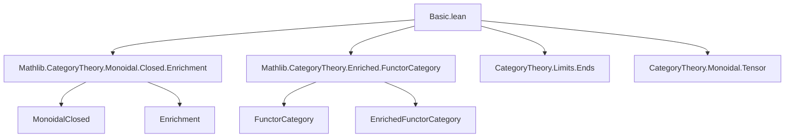

Here is the **technical metadata** extracted from the provided Lean 4 file `Basic.lean`, structured as requested:

---

### 1. **Key Definitions & Theorems**

| Name | Type / Signature | Purpose |
|------|------------------|---------|
| `homEquiv` | `(F₁ ⊗ F₂ ⟶ F₃) ≃ (F₂ ⟶ functorEnrichedHom C F₁ F₃)` | Establishes the internal hom adjunction in the functor category, using enrichment and ends. |
| `homEquiv_naturality_two_symm` | `homEquiv.symm (f₂ ≫ g) = F₁ ◁ f₂ ≫ homEquiv.symm g` | Naturality of the inverse equivalence in the *domain* (precomposition with `f₂ : F₂ → F₂'`). |
| `homEquiv_naturality_three` | `homEquiv (f ≫ f₃) = homEquiv f ≫ (ρ_ _).inv ≫ _ ◁ functorHomEquiv _ f₃ ≫ functorEnrichedComp C F₁ F₃ F₃'` | Naturality of the equivalence in the *codomain* (postcomposition with `f₃ : F₃ → F₃'`), involving the right unitor and enriched composition. |
| `adj F` | `MonoidalCategory.tensorLeft F ⊣ (eHomFunctor _ _).obj ⟨F⟩` | Shows that left tensoring with `F` has a right adjoint given by the enriched hom functor. |
| `closed F` | `Closed F` | Packages the adjunction as a witness that `tensorLeft F` is closed. |
| `monoidalClosed` | `MonoidalClosed (J ⥤ C)` | Instance proving that the functor category `J ⥤ C` is monoidal closed, assuming `C` is monoidal closed and has suitable limits (ensured by `HasFunctorEnrichedHom` and `HasEnrichedHom`). |

---

### 2. **Naming Conventions**

- **Prefixes**:
  - `homEquiv_`: for properties of the hom equivalence.
  - `enrichedHom_`, `functorEnriched_`: for enriched hom constructions.
  - `tensorHom_`, `tensorObj_`: for tensor-related morphism/object constructions.
  - `end_.lift_`, `end_.π`: for ends (limit over the comma category).
  - `curry_`, `uncurry_`: for currying/uncurrying in closed structure.
  - ` whisker_`, `◁`, `▷`: for left/right whiskering of natural transformations.

- **Suffixes**:
  - `_assoc`: for associativity variants used in rewriting.
  - `_naturality_*`: for naturality conditions.
  - `_symm`: for inverses of equivalences or isomorphisms.

- **Other patterns**:
  - `eHomFunctor` = enriched hom functor.
  - `functorEnrichedHom` = enriched hom object in the functor category.
  - `functorEnrichedComp` = enriched composition in the functor category.

---

### 3. **Tactic Stack**

Frequently used tactics in proofs:

- `dsimp`, `simp`, `simp only [...]`: heavy use of simplification with explicit lemmas.
- `rw [...]`: rewriting using naturality, associativity, and enriched category laws.
- `congr`: to reduce equality of natural transformations to pointwise equality.
- `ext`: extensionality for natural transformations and functors.
- `cat_disch`: likely a custom tactic for category-theoretic discharge (used in `left_inv`).
- `let ... := ...`: local definitions for morphisms in under/structured arrow categories.

---

### 4. **Proof Logic**

- **Structure**:
  1. Define `homEquiv` as a bijection using ends and the universal property of ends (`end_.lift`).
  2. Prove it's an equivalence by constructing inverse and verifying unit/counit identities.
  3. Prove naturality in both arguments (two lemmas).
  4. Use `Adjunction.mkOfHomEquiv` to lift `homEquiv` to an adjunction.
  5. Package the adjunction into `Closed F` and finally into `MonoidalClosed (J ⥤ C)`.

- **Typical flow**:
  - *Induction* is not used.
  - *Extensionality* (`ext j`, `ext k`) reduces goals to component-wise equalities.
  - *Simplification* with a large `simp only [...]` list (often auto-generated via `simp?`) handles pointwise verification.
  - *Enriched naturality squares* (e.g., `enrichedHom_condition`) are invoked to relate enriched and ordinary structure.

---

### 5. **Imports**

- `Mathlib.CategoryTheory.Monoidal.Closed.Enrichment`: Provides enrichment over monoidal closed categories.
- `Mathlib.CategoryTheory.Enriched.FunctorCategory`: Defines enriched structure on functor categories (e.g., `functorEnrichedHom`, `functorEnrichedComp`).

These imports indicate the module builds on:
- Monoidal category theory (`MonoidalCategory`, `MonoidalClosed`)
- Enriched category theory (`Enriched.FunctorCategory`, `HasEnrichedHom`, `HasFunctorEnrichedHom`)
- Limits (especially ends via `Limits.End`)

---

### 6. **Mermaid Diagrams**

#### Dependency Graph (Top-Level)



#### Overview of Theoretical Flow

```mermaid
flowchart LR
  C[MonoidalClosed C] -->|limits| D[HasFunctorEnrichedHom]
  D --> E[Enriched Functor Category]
  E --> F[functorEnrichedHom]
  F --> G[homEquiv: (F₁⊗F₂→F₃) ≃ (F₂→[F₁,F₃])]
  G --> H[Adjunction: tensorLeft F ⊣ eHom F]
  H --> I[Closed F]
  I --> J[MonoidalClosed (J ⥤ C)]
```

---

Let me know if you'd like a formalized dependency graph in `leanpkg` format or a visualization of the `homEquiv` construction.
