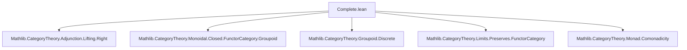

Here is the structured technical brief extracted from `Complete.lean`:

---

### **1. Key Definitions & Theorems**

| Name | Type / Signature | Purpose |
|------|------------------|---------|
| `incl I` | `Discrete I ⥤ I` | Inclusion of the discrete category on objects `I` into `I` via identity on objects/morphisms. |
| `ReflectsIsomorphisms (whiskeringLeft _ _ C).obj (incl I)` | Instance | Shows that left whiskering with `incl I` reflects isomorphisms. |
| `Comonad.PreservesLimitOfIsCoreflexivePair ...` | Instance | Shows the comonad induced by `incl I` preserves coreflexive equalizers. |
| `ComonadicLeftAdjoint ...` | Instance | Establishes that `whiskeringLeft (incl I)` is comonadic (via Beck’s criterion). |
| `IsLeftAdjoint (tensorLeft (incl I ⋙ F))` | Instance | Tensoring with `incl I ⋙ F` has a left adjoint (i.e., is a right adjoint in a monoidal closed category). |
| `functorCategoryClosed I C F` | `Closed F` | Auxiliary construction of internal hom for a functor `F : I ⥤ C`, assuming existence of required limits. |
| `functorCategoryMonoidalClosed` | `MonoidalClosed (I ⥤ C)` | Main theorem: under limit assumptions, the functor category `I ⥤ C` is monoidal closed. |

---

### **2. Naming Conventions**

- **Prefixes**:
  - `incl_`: inclusion functors (e.g., `incl`)
  - `whiskeringLeft _ _ C`: left whiskering with a functor into `C`
  - `tensorLeft _`: tensoring with a fixed object (here, a functor)
  - `functorCategory_`: constructions on functor categories
- **Suffixes**:
  - `_Closed`: indicates a `Closed` structure (internal hom exists)
  - `_isLeftAdjoint`, `_isIso`: properties of morphisms/functors
- **Pattern**: `X_of_Y_Z` for composite constructions (e.g., `functorCategoryClosed`, `ComonadicLeftAdjoint`)

---

### **3. Tactic Stack**

Frequent tactics used in proofs:
- `simp only [...] at *`: simplification with precise lemmas
- `intro X`: introduce variables/objects
- `exact h ⟨X⟩`: apply hypothesis to constructed term
- `inferInstance`: auto-synthesis of typeclass instances
- `Adjunction.ofIsLeftAdjoint`: construct adjunction from known left adjoint
- `set_option backward.privateInPublic true`: used to allow private definitions in public instances (for internal use)

No heavy automation (e.g., `aesop`, `ring`, `linarith`) — proofs are mostly typeclass-based and structural.

---

### **4. Proof Logic**

- **High-level strategy**:
  1. Use the inclusion `incl : Discrete I ⥤ I` to relate functors `I ⥤ C` to diagrams in `C`.
  2. Show that left whiskering with `incl` reflects isomorphisms and preserves coreflexive equalizers.
  3. Apply Beck’s comonadicity theorem to deduce that `whiskeringLeft (incl I)` is comonadic.
  4. Use monoidal closed structure of `C` to lift internal homs to the functor category via right Kan extensions / adjoint lifting.
  5. Construct `functorCategoryClosed` using adjoint lifting lemmas (`isLeftAdjoint_square_lift_comonadic`).
  6. Assemble into `MonoidalClosed (I ⥤ C)`.

- **Induction / recursion**: Not used — relies on categorical universal properties (limits, adjoints, Kan extensions).

---

### **5. Imports**

Primary dependencies (define scope and assumptions):
- `Mathlib.CategoryTheory.Adjunction.Lifting.Right`: for adjoint lifting theorems.
- `Mathlib.CategoryTheory.Monoidal.Closed.FunctorCategory.Groupoid`: related structure on groupoid-valued functors.
- `Mathlib.CategoryTheory.Groupoid.Discrete`: discrete category constructions.
- `Mathlib.CategoryTheory.Limits.Preserves.FunctorCategory`: preservation of limits in functor categories.
- `Mathlib.CategoryTheory.Monad.Comonadicity`: Beck’s comonadicity criterion.

---

### **6. Mermaid Diagrams**

#### **Dependency Graph (Module-Level)**



#### **Theoretical Overview (Proof Structure)**

```mermaid
flowchart LR
  I[Discrete I ⥤ I incl] --> W[WhiskeringLeft incl]
  W --> R[ReflectsIso]
  W --> P[PreservesCoreflexiveEqualizers]
  R & P --> C[ComonadicLeftAdjoint]
  C --> L[AdjointLifting]
  L --> F[FunctorCategoryClosed]
  F --> M[MonoidalClosed (I ⥤ C)]
```

#### **Functor Category Construction**

```mermaid
flowchart LR
  C[MonoidalClosed C] --> T[TensorLeft F]
  T --> LA[IsLeftAdjoint]
  LA --> CH[Closed F]
  CH --> MC[MonoidalClosed (I ⥤ C)]
```

---

### **7. Summary**

This module proves that if `C` is a monoidal closed category with certain limits (e.g., right Kan extensions along `Discrete I ⥤ I`, coreflexive equalizers), then the functor category `[I, C]` inherits a monoidal closed structure. The construction is abstract (via adjoint lifting and comonadicity), and the authors note that a more explicit description of internal homs remains future work.

--- 

Let me know if you'd like a formalized summary in Lean syntax or a diagram of the internal hom construction.
