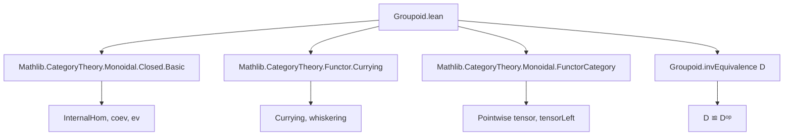

**Technical Brief: `Groupoid.lean` — Functor Category from a Groupoid into a Monoidal Closed Category**

---

### 1. **Key Definitions & Theorems**

| Name | Type / Signature | Purpose |
|------|------------------|---------|
| `closedIhom (F : D ⥤ C)` | `(D ⥤ C) ⥤ D ⥤ C` | Auxiliary definition of the internal hom functor in the functor category, constructed via whiskering and the inverse equivalence of the groupoid `D`. |
| `closedUnit (F : D ⥤ C)` | `𝟭 (D ⥤ C) ⟶ tensorLeft F ⋙ closedIhom F` | Unit of the adjunction `(tensorLeft F) ⊣ (ihom F)`; natural transformation whose component at `G` is built from `ihom.coev (F.obj X)` applied to `G.obj X`. |
| `closedCounit (F : D ⥤ C)` | `closedIhom F ⋙ tensorLeft F ⟶ 𝟭 (D ⥤ C)` | Counit of the adjunction; component at `G` uses `ihom.ev (F.obj X)` applied to `G.obj X`. |
| `closed (F : D ⥤ C)` | `Closed F` | Instance showing that every functor `F : D ⥤ C` is closed (i.e., `tensorLeft F` has a right adjoint `ihom F`) under the assumptions. |
| `monoidalClosed` | `MonoidalClosed (D ⥤ C)` | Main theorem: the functor category `D ⥤ C` (with pointwise monoidal structure) is monoidal closed when `D` is a groupoid and `C` is monoidal closed. |
| `ihom_map`, `ihom_ev_app`, `ihom_coev_app` | `rfl`-provable equalities | Technical lemmas identifying the abstract `ihom` operations with their concrete definitions via `closedIhom`, `closedCounit`, and `closedUnit`. |

---

### 2. **Naming Conventions**

- **Prefixes**:
  - `closed*`: for constructions related to the closed structure (e.g., `closedIhom`, `closedUnit`, `closedCounit`).
  - `ihom*`: for derived or identified operations on the internal hom (e.g., `ihom_map`, `ihom_ev_app`, `ihom_coev_app`).
- **Suffixes**:
  - `app`: for components of natural transformations at objects.
  - `naturality`: used in proofs verifying naturality conditions.
- **Structure**:
  - `whiskeringRight₂ D Cᵒᵖ C C`: indicates use of 2-categorical whiskering.
  - `Groupoid.invEquivalence D`: uses the equivalence between `D` and its opposite induced by inversion in a groupoid.

---

### 3. **Tactic Stack**

Frequent tactics used in proofs and simplifications:

- `simp only [...]`: for targeted simplification using specific lemmas.
- `rw [...]`: for rewriting using definitional or proven equalities.
- `dsimp`: for definitional simplification (e.g., unfolding `ihom`, `tensorObj`, etc.).
- `simp only [coev_app_comp_pre_app_assoc, ← Functor.map_comp, tensorHom_def]`: specialized rewriting using monoidal closed structure lemmas.
- `rw [tensorHom_def]`: to expand tensor on morphisms.
- `simp`: for general simplification after `rw` or `dsimp`.

No heavy automation (e.g., `aesop`, `tauto`) is used—proofs rely on structured manipulation of naturality and monoidal coherence.

---

### 4. **Proof Logic**

The logical flow follows a standard adjunction verification pattern:

1. **Construct candidates**:
   - Define `closedIhom F` as the internal hom functor.
   - Define `closedUnit F` and `closedCounit F` using the unit/counit of the internal hom in `C`.

2. **Verify naturality**:
   - For `closedUnit` and `closedCounit`, prove naturality in `G` (i.e., in the functor category) using:
     - `ihom.coev_naturality`
     - `pre_comm_ihom_map`
     - `tensorHom_def`
     - `coev_app_comp_pre_app_assoc`

3. **Establish adjunction**:
   - Package `closedUnit` and `closedCounit` into an `Adjunction` instance for `tensorLeft F ⊣ closedIhom F`.
   - Use this to instantiate `Closed F`.

4. **Lift to monoidal closed structure**:
   - Use the fact that every object is closed to conclude `MonoidalClosed (D ⥤ C)`.

5. **Identify abstract operations**:
   - Prove `ihom_*` lemmas by `rfl`, confirming that the `ihom` operations in the `Closed` instance match the concrete definitions.

---

### 5. **Imports & Dependencies**

| Import | Purpose |
|--------|---------|
| `Mathlib.CategoryTheory.Monoidal.Closed.Basic` | Internal hom, closed structure, `ihom.coev`, `ihom.ev`, etc. |
| `Mathlib.CategoryTheory.Functor.Currying` | Currying and uncurrying of natural transformations; used implicitly in `whiskeringRight₂`. |
| `Mathlib.CategoryTheory.Monoidal.FunctorCategory` | Pointwise monoidal structure on functor categories, including `tensorLeft`, `tensorObj`, etc. |

Additional background assumptions:
- `[Groupoid.{v} D]`: ensures `D` has inverses, giving an equivalence `D ≌ Dᵒᵖ`.
- `[MonoidalCategory C]`, `[MonoidalClosed C]`: provides the internal hom and tensor structure on `C`.

---

### 6. **Mermaid Diagrams**

#### **Dependency Graph (Module-Level)**



#### **Theoretical Overview (Structure of Proof)**

```mermaid
flowchart LR
  A[Groupoid D] -->|invEquivalence| B[D ≌ Dᵒᵖ]
  C[MonoidalClosed C] --> D[Internal Hom in C]
  B & D --> E[Define closedIhom F]
  E --> F[Define closedUnit, closedCounit]
  F --> G[Verify naturality]
  G --> H[Construct Adjunction tensorLeft F ⊣ closedIhom F]
  H --> I[Instance Closed F]
  I --> J[Instance MonoidalClosed (D ⥤ C)]
```

---

### 7. **Summary**

This file establishes that **functors from a groupoid into a monoidal closed category form a monoidal closed category**, using the pointwise monoidal structure. The key insight is that the groupoid structure (via inversion) allows us to “twist” the internal hom in `C` to get a well-defined internal hom in the functor category. The proof is constructive and explicit, with all components (unit, counit, naturality) verified manually using monoidal closed axioms and groupoid properties.

--- 

Let me know if you'd like a formalized summary in Lean syntax or a visualization of the `closedIhom` construction.
