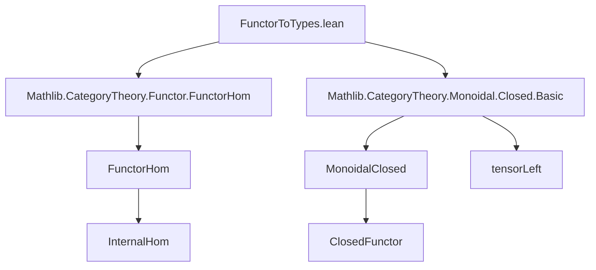
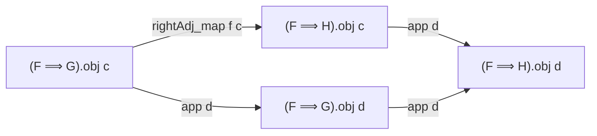

### Technical Brief: `FunctorToTypes.lean`

---

#### **1. Key Definitions & Theorems**

| Name | Type / Signature | Purpose |
|------|------------------|---------|
| `functorHomEquiv` | `(G H : C ⥤ Type max w v u) → (G ⟶ F.functorHom H) ≃ (F ⊗ G ⟶ H)` | Establishes the hom-isomorphism central to closedness: morphisms into the internal hom correspond to morphisms out of the tensor product. |
| `rightAdj_map` | `(f : G ⟶ H) → (c : C) → (F.functorHom G).obj c → (F.functorHom H).obj c` | Defines the action of the right adjoint on morphisms: post-composition with `f` in the internal hom. |
| `rightAdj` | `C ⥤ Type max w v u ⥤ C ⥤ Type max w v u` | The right adjoint functor to `tensorLeft F`, sending `G ↦ F ⟹ G` (internal hom). |
| `adj` | `tensorLeft F ⊣ rightAdj F` | Constructs the adjunction between left tensoring and internal hom. |
| `closed` | `Closed F` | Instance showing that `F` admits an internal hom (i.e., `tensorLeft F` has a right adjoint). |
| `monoidalClosed` | `MonoidalClosed (C ⥤ Type max w v u)` | Main theorem: the functor category `C ⥤ Type max w v u` is monoidal closed. |

> Note: `F.functorHom H` is the internal hom object in the functor category, defined via `Functor.functorHom` from `Mathlib.CategoryTheory.Functor.FunctorHom`.

---

#### **2. Naming Conventions**

- **Prefixes**:
  - `functorHom_`: Relates to internal hom in functor categories (`functorHomEquiv`, `functorHom`).
  - `rightAdj_`: Pertains to the right adjoint construction (`rightAdj`, `rightAdj_map`).
  - `tensorLeft`: Standard for left tensoring functor in monoidal categories.

- **Suffixes**:
  - `_equiv`: Denotes equivalence (e.g., `functorHomEquiv`).
  - `_map`: Denotes morphism part of a functor or natural transformation (e.g., `rightAdj_map`).
  - `_obj`: Used for object part (implied in `rightAdj.obj`, `rightAdj.map`).

- **Pattern**: `left_ ⊣ right_` for adjunctions; `adj` for the adjunction data.

---

#### **3. Tactic Stack**

- **`aesop`**: Used in naturality proof for `rightAdj_map` to automate diagram chasing.
- **`simp` / `dsimp`**: For simplification and definitional unfolding (e.g., in `adj.unit.naturality`).
- **`ext`**: To prove equality of natural transformations by extensionality.
- **`change`**: To rewrite goals into equivalent forms for clarity (in `naturality` proof).
- **`simp_rw`** (implied via `simps!` attribute): Automatically generates simp lemmas for constructors.

---

#### **4. Proof Logic**

The proof follows a standard pattern for showing functor categories are monoidal closed:

1. **Define internal hom**: Use `F.functorHom H`, which is defined pointwise as `c ↦ (F ⟶ const (H.obj c))`.
2. **Construct equivalence**: `functorHomEquiv` uses `Functor.functorHomEquiv` and `homObjEquiv` to get the required bijection.
3. **Define right adjoint**:
   - On objects: `G ↦ F.functorHom G`
   - On morphisms: `f ↦ rightAdj_map f`, verified to be natural.
4. **Construct adjunction**:
   - **Unit**: `η_G : G → F ⟹ (F ⊗ G)` corresponds to `𝟙_{F ⊗ G}` under the equivalence.
   - **Counit**: `ε_G : F ⊗ (F ⟹ G) → G` corresponds to `𝟙_{F ⟹ G}`.
   - Verify triangle identities (implicitly via `simps!` and `simp`).
5. **Conclude closedness**:
   - `closed` instance gives `Closed F`.
   - `monoidalClosed` lifts this to the whole functor category.

Induction or case analysis is *not* used—proofs are categorical and diagrammatic.

---

#### **5. Imports**

- `Mathlib.CategoryTheory.Functor.FunctorHom`: Provides `Functor.functorHom`, `Functor.functorHomEquiv`, `homObjEquiv`.
- `Mathlib.CategoryTheory.Monoidal.Closed.Basic`: Provides `Closed`, `MonoidalClosed`, `tensorLeft`, and related infrastructure.

> These imports indicate the module sits at the intersection of **functor category theory** and **monoidal closed structure**.

---

#### **8. Mermaid Diagrams**

##### **Dependency Graph (Module-Level)**



##### **Overview of Theoretical Flow**

```mermaid
flowchart LR
  C[Category C] -->|Functor Category| F[C ⥤ Type]
  F -->|Tensor| T[F ⊗ G]
  F -->|Internal Hom| H[F ⟹ G]
  T -->|Adjunction| A[tensorLeft F ⊣ rightAdj F]
  A -->|Closed| CL[Closed F]
  CL -->|Global| MC[MonoidalClosed (C ⥤ Type)]
```

##### **Key Construction Diagram (Naturality Square)**

For `f : G ⟶ H`, `a : (F ⟹ G)(c)`, the map `rightAdj_map f c a` is defined by:
```math
(F ⟹ G)(c) \xrightarrow{(F ⟹ f)(c)} (F ⟹ H)(c)
```
i.e., post-composition with `f`, which is natural in `c`:



---

### Summary

This module formalizes that the functor category `C ⥤ Type` is **monoidal closed**, assuming `C` is a category in `Type u` with morphism types in `Type v`. It constructs the internal hom via `F.functorHom`, proves the tensor-hom adjunction, and concludes with `MonoidalClosed`. The proofs are categorical, leveraging existing infrastructure in `Mathlib`, and rely on `simps!` and `aesop` for automation. The TODO suggests extending to **Cartesian closedness**, which would require `×` instead of `⊗`.
