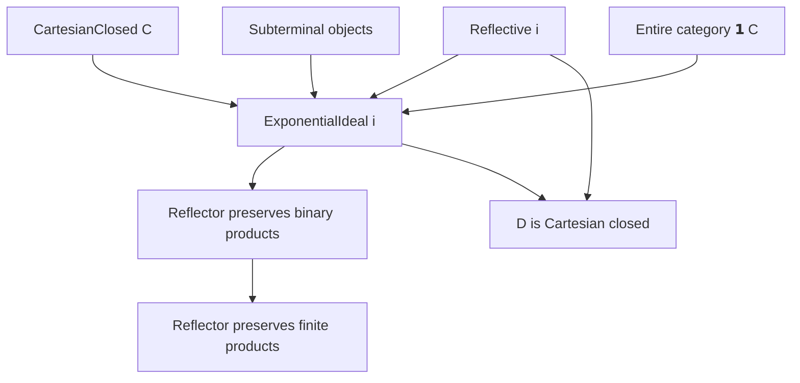

### Technical Brief: `Ideal.lean` — Exponential Ideals in Cartesian Closed Categories

---

#### **1. Key Definitions & Theorems**

| Name | Type / Signature | Purpose |
|------|------------------|---------|
| `ExponentialIdeal` | `class ExponentialIdeal : Prop` | Defines when a reflective subcategory inclusion `i : D ⥤ C` is an *exponential ideal*: for all `B ∈ D`, `A ∈ C`, the exponential `A ⟹ B` lies in the essential image of `i`. |
| `ExponentialIdeal.mk'` | `(∀ (B : D) (A : C), i.essImage (A ⟹ i.obj B)) → ExponentialIdeal i` | A practical introduction rule: it suffices to check exponentials against objects *in* `D`. |
| `exponentialIdealReflective` | `[Reflective i] → [ExponentialIdeal i] → i ⋙ ihom A ⋙ reflector i ⋙ i ≅ i ⋙ ihom A` | For reflective `i`, exponential idealness ⇔ natural iso between `A ⟹ iB` and its reflector-lift. |
| `ExponentialIdeal.mk_of_iso` | `[Reflective i] → (∀ A, i ⋙ ihom A ⋙ reflector i ⋙ i ≅ i ⋙ ihom A) → ExponentialIdeal i` | Converse of above: existence of such iso implies exponential ideal. |
| `CartesianMonoidalCategory.ofReflective` | `[CartesianMonoidalCategory C] → [Reflective i] → CartesianMonoidalCategory D` | Constructs finite products in `D` via reflector, assuming `C` has finite products. |
| `cartesianClosedOfReflective'` | `(l : i.EssImageSubcategory ⥤ D) → (φ : l ⋙ i ≅ i.essImage.ι) → MonoidalClosed D` | Constructs Cartesian closed structure on `D` using a chosen lift `l`. Allows definitional control. |
| `cartesianClosedOfReflective` | `[ExponentialIdeal i] → [Reflective i] → MonoidalClosed D` | Simpler version: uses `reflector i` as lift, less control over definitional equality. |
| `bijection` | `(A B : C) (X : D) → ((reflector i).obj (A ⊗ B) ⟶ X) ≃ ((reflector i).obj A ⊗ (reflector i).obj B ⟶ X)` | Key bijection used to prove reflector preserves binary products under exponential ideal assumption. |
| `bijection_symm_apply_id` | `(bijection i A B _).symm (𝟙 _) = prodComparison _ _ _` | Shows the inverse of the bijection sends identity to the product comparison map. |
| `bijection_natural` | Naturality of `bijection` in codomain `X`. | Enables proof that `prodComparison` is iso. |
| `prodComparison_iso` | `IsIso (prodComparison (reflector i) A B)` | Proves product comparison is iso ⇒ reflector preserves binary products. |
| `preservesBinaryProducts_of_exponentialIdeal` | `[ExponentialIdeal i] → [Reflective i] → PreservesLimitsOfShape (Discrete WalkingPair) (reflector i)` | Main theorem: exponential ideal + reflective ⇒ reflector preserves binary products. |
| `Limits.PreservesFiniteProducts.of_exponentialIdeal` | `[ExponentialIdeal i] → [Reflective i] → PreservesFiniteProducts (reflector i)` | Extends above to finite products (uses preservation of terminal object). |

---

#### **2. Naming Conventions**

- **Prefixes**:
  - `exponentialIdeal_`: properties/constructs related to exponential ideals.
  - `bijection_`: internal bijection used in product preservation proofs.
  - `prodComparison_`: lemmas about the canonical map `LA ⊗ LB → L(A ⊗ B)`.
  - `preserves..._of_...`: implications from structural properties (e.g., exponential ideal) to preservation properties.

- **Suffixes**:
  - `_mk'`: simplified introduction rule.
  - `_of_...`: converse direction or derived construction (e.g., `of_exponentialIdeal`, `ofReflective`).
  - `_iso`: proves an isomorphism (e.g., `prodComparison_iso`).
  - `_natural`: naturality statements.

- **Other**:
  - `essImage`: refers to essential image of `i`.
  - `unit`, `counit`, `homEquiv`: standard adjunction components.
  - `curry`, `uncurry`, `ev`: Cartesian closed structure.

---

#### **3. Tactic Stack**

Frequently used tactics in proofs:

| Tactic | Role |
|--------|------|
| `simp` / `simp only` | Simplify hom-sets, naturality, adjunctions, unit/counit triangles. |
| `rw` / `erw` | Rewrite using naturality, adjunction laws, tensor-hom adjunction. |
| `apply` / `exact` | Apply lemmas or construct terms directly. |
| `have` / `set` | Introduce intermediate lemmas (e.g., `IsSplitMono`, `IsIso`). |
| `convert` / `congr'` | Match goals up to definitional equality (e.g., in `bijection_symm_apply_id`). |
| `apply_fun` / `funext` / `ext` | Extensionality for natural transformations / morphisms. |
| `apply Iso.refl`, `apply asIso`, `apply mem_essImage_of_unit_isSplitMono` | Specialized lemmas for essential image and isomorphisms. |
| `apply isLimitOfReflects`, `apply preservesLimit_of_iso_diagram` | Leverage reflection to transfer limits. |
| `aesop` (implied via `simp` + `rw`) | Used implicitly in many short proofs (e.g., triangle identities). |

---

#### **4. Proof Logic**

**General proof strategy**:

1. **Characterization via essential image**  
   Use `ExponentialIdeal.mk'` to reduce to checking exponentials `A ⟹ iB` lie in essential image.

2. **Reflective case equivalence**  
   - Show `ExponentialIdeal i ⇔ ∃ natural iso: i ⋙ ihom A ⋙ L ⋙ i ≅ i ⋙ ihom A`.  
   - One direction uses `unit` of adjunction being split mono (via `mem_essImage_of_unit_isSplitMono`).  
   - Other direction uses the iso to witness essential image membership.

3. **Preservation of products ⇔ exponential ideal**  
   - Assume `ExponentialIdeal i` and `Reflective i`.  
   - Construct `bijection` using chain of hom-equivalences (tensor-hom, unit, braiding, etc.).  
   - Prove `bijection` is natural and sends `id` to `prodComparison`.  
   - Conclude `prodComparison` is iso ⇒ reflector preserves binary products.  
   - Extend to finite products using preservation of terminal object (from reflectivity).

4. **Cartesian closed structure on `D`**  
   - Use exponential `A ⟹ iB` in `C`, lift via reflector + essential image property.  
   - Define right adjoint to `− ⊗ B` in `D` as `l ⋙ ihom (iB)`, where `l` is chosen lift.  
   - Verify adjunction via restriction of adjunction in `C` along fully faithful `i`.

---

#### **5. Imports & Dependencies**

**Core dependencies** (from imports):

| Module | Purpose |
|--------|---------|
| `Limits.Preserves.Shapes.BinaryProducts`, `Terminal` | Limits & preservation basics. |
| `Limits.Constructions.FiniteProductsOfBinaryProducts` | Construct finite products from binary + terminal. |
| `Monad.Limits` | Limits in Eilenberg-Moore categories (not directly used, but part of broader context). |
| `Adjunction.FullyFaithful`, `Limits`, `Reflective` | Reflective subcategories, unit/counit, fully faithful reflection. |
| `Monoidal.Closed.Cartesian` | Cartesian closed structure, tensor-hom adjunction, exponentials. |
| `Subterminal` | Example of exponential ideal (subterminal objects). |

**Key abstractions used**:
- `CartesianMonoidalCategory`, `MonoidalClosed`, `BraidedCategory`
- `EssImage`, `reflector`, `unit`, `counit`, `homEquiv`
- `prodComparison`, `prodComparisonIso`, `bijection`

---

#### **6. Mermaid Diagrams**

##### **Dependency Graph (High-Level Theory)**

##### **Overview of `Ideal.lean` Flow**

##### **Key Equivalence (Main Theorem)**

---

#### **7. Summary**

This file formalizes the categorical notion of *exponential ideals*—subcategories closed under exponentiation—and establishes a fundamental equivalence:

> For a reflective subcategory inclusion `i : D ⥤ C` of a Cartesian closed category `C`,  
> **`i` is an exponential ideal ⇔ the reflector preserves finite products**.

It further shows that under these conditions, `D` inherits a Cartesian closed structure. The proofs rely heavily on:
- The tensor-hom adjunction (`MonoidalClosed`)
- Unit/counit properties of reflective adjunctions
- Naturality and coherence in braided/monoidal settings
- Essential image techniques to lift objects/morphisms from `C` to `D`.

The constructions are carefully designed to allow definitional control (`cartesianClosedOfReflective'`) or simplicity (`cartesianClosedOfReflective`), reflecting Lean’s balance between usability and formal precision.

--- 

Let me know if you'd like a **dependency graph of definitions** (e.g., `ExponentialIdeal` → `bijection` → `prodComparison_iso`), or a **proof outline in natural deduction style**.
