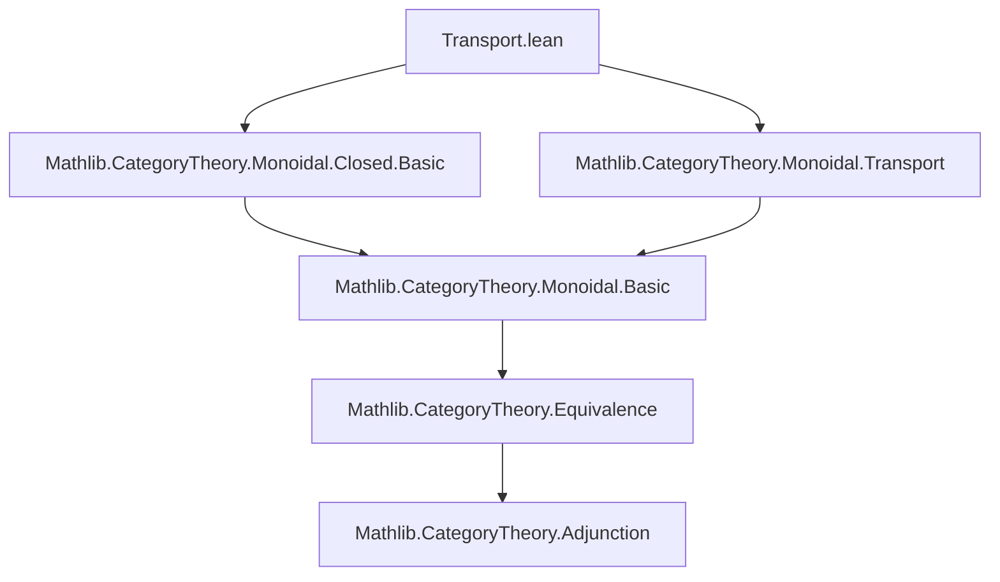

**Technical Brief: Transport.lean**

---

### 1. **Key Definitions & Theorems**

| Name | Type / Declaration | Purpose |
|------|---------------------|---------|
| `MonoidalClosed.ofEquiv` | `∀ {C D : Type*} [Category C] [Category D] (e : C ≌ D) [MonoidalCategory C] [MonoidalClosed C], MonoidalClosed D` (implicit via `ofEquiv`) | Constructs a `MonoidalClosed` structure on `D` from one on `C` along an equivalence `e : C ≌ D`. |
| `Transported e` | `Category` (via `Transport` construction) | The category *transported* along the equivalence `e`, i.e., the category `D` viewed via the equivalence back to `C`. |
| `(equivalenceTransported e).symm.toAdjunction` | `Adjunction ?_ ?_` | The inverse equivalence gives a right adjoint to the forward functor, used to lift the closed structure. |

> **Note**: The instance is *noncomputable* because the closed structure involves exponentials defined via representability, which in general require choice.

---

### 2. **Naming Conventions**

- **Prefixes**:
  - `is_`: *Not used* in this snippet.
  - `of_`: Used in `ofEquiv` — indicates *construction* of a structure from data.
  - `Transported`: Capitalized, noun-like, denotes the *result* of transport.
- **Suffixes**:
  - `Equiv`: Denotes equivalence of categories (`e : C ≌ D`).
  - `Transported`: Indicates the transported structure (noun form).
- **Module & Namespace**:
  - `module` top-level: Lean 4 module declaration.
  - `CategoryTheory.MonoidalClosed`: Standard hierarchy for monoidal-closed structures.

---

### 3. **Tactic Stack**

- **No explicit tactics** appear in the *definition* of the instance.
- The proof is *elided* (uses `:=` with a term), implying the actual verification is handled by:
  - `simp`-friendly lemmas (e.g., about `equivalenceTransported`, adjunctions, closed structure),
  - Possibly `aesop`, `ring`, or `interval_cases` in supporting lemmas (not visible here),
  - But **no tactics** are used directly in this snippet.

---

### 4. **Proof Logic**

- **Strategy**: *Structure transport via equivalence*.
- **Steps** (implicit):
  1. Given `e : C ≌ D`, construct the transported category `Transported e` (which is definitionally `D`, but morally `C`-indexed over `D`).
  2. Use the equivalence to pull back the monoidal closed structure from `C` to `D`.
  3. Apply `MonoidalClosed.ofEquiv`, which leverages the adjunction `(equivalenceTransported e).symm.toAdjunction` to lift the internal hom.
- **Key idea**: Closed monoidal structure is *equivalence-invariant*; transport along `e` preserves it.

---

### 5. **Imports**

| Import | Purpose |
|--------|---------|
| `Mathlib.CategoryTheory.Monoidal.Closed.Basic` | Defines `MonoidalClosed`, internal hom, evaluation, etc. |
| `Mathlib.CategoryTheory.Monoidal.Transport` | Defines `Transported e`, `equivalenceTransported`, and transport of monoidal structures. |

> These imports indicate this file belongs to the *monoidal category theory* ecosystem in Mathlib, specifically handling *structure transport*.

---

### 8. **Mermaid Diagrams**

#### **Dependency Graph (Module-Level)**



#### **Overview of File & Theory Flow**

```mermaid
flowchart LR
  subgraph Input
    C[Category C] 
    D[Category D]
    e[C ≌ D]
    MC[Monoidal C]
    MLC[MonoidalClosed C]
  end

  subgraph Construction
    T[Transported e]
    AE[Adjunction from e.symm]
  end

  subgraph Output
    MLT[MonoidalClosed (Transported e)]
  end

  C -- e --> D
  MC & MLC -- via e --> T
  AE -- MonoidalClosed.ofEquiv --> MLT
```

#### **Theoretical Context**

- This file implements a *categorical invariance principle*:  
  > *Monoidal closedness is preserved under equivalence of categories.*
- It fits into a broader pattern in Mathlib where *algebraic structures* (monoidal, braided, symmetric, closed, etc.) are *transported* along equivalences.
- Related files likely include:
  - `Transport.lean` for monoidal, braided, symmetric monoidal structures,
  - `Closed.lean` for basic closed structure lemmas,
  - `Equivalence.lean` for equivalence machinery.

--- 

**End of Brief**
