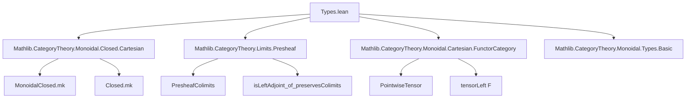

**Technical Brief: `Types.lean` — Cartesian Closure of `Type` and Functor Categories**

---

### 1. Key Definitions & Theorems

| Name | Type / Signature | Purpose |
|------|------------------|---------|
| `Types.tensorProductAdjunction` | `X : Type v₁ → tensorLeft X ⊣ coyoneda.obj (Opposite.op X)` | Constructs the adjunction witnessing that `tensorLeft X` (i.e., `× X`) is left adjoint to exponential `(-)^X`, i.e., `coyoneda (Opposite.op X)`. Explicitly: `unit Z z x = ⟨x, z⟩`, `counit xf = xf.2 xf.1`. |
| `MonoidalClosed (Type v₁)` | `instance` | Proves `Type v₁` is *monoidal closed* under cartesian product (i.e., Cartesian closed). Uses `tensorProductAdjunction`. |
| `MonoidalClosed (C ⥤ Type v₁)` | `instance` (under `SmallCategory C`) | Proves presheaf category `[C, Type v₁]` is monoidal closed. Uses preservation of colimits by `tensorLeft F` and `Presheaf.isLeftAdjoint_of_preservesColimits`. |
| `cartesianClosedFunctorToTypes` | `def` | Constructs `MonoidalClosed (C ⥤ Type (max u₁ v₁ u₂))` via equivalence with `ULift`-adjusted category. Not recommended as a global instance due to universe issues. |
| `cartesianClosedOfEquiv` | (implicit, from `MonoidalClosed` theory) | Transports a `MonoidalClosed` structure along a functor equivalence. Used in both `cartesianClosedFunctorToTypes` and the `EssentiallySmall` instance. |
| `SmallModel C`, `equivSmallModel` | (from `CategoryTheory.Types.EssentiallySmall`) | Provides an equivalence `SmallModel C ⥤ Type v₁ ≌ C ⥤ Type v₁` when `C` is essentially small. |

> **Note**: The main theorem is:  
> **If `C` is a small (or essentially small) category in `Type v₁`, then the functor category `C ⥤ Type v₁` is Cartesian closed.**  
> This implies the category of presheaves `PShv(C) = Cᵒᵖ ⥤ Type v₁` is Cartesian closed.

---

### 2. Naming Conventions

| Pattern | Examples | Meaning |
|--------|----------|---------|
| `isLeftAdjoint` | `tensorLeft X .IsLeftAdjoint` | Predicate for left adjointness. |
| `tensorLeft` | `tensorLeft X`, `tensorLeft F` | Left tensor functor: `Y ↦ X × Y` (cartesian monoidal structure). |
| `coyoneda` | `coyoneda.obj (Opposite.op X)` | Representable contravariant hom-functor: `Y ↦ Y × X` ≅ `Hom(-, X)`. |
| `cartesianClosed*` | `cartesianClosedFunctorToTypes`, `cartesianClosedOfEquiv` | Constructors for `MonoidalClosed` under cartesian monoidal structure. |
| `uliftCategory`, `ULiftHom`, `ULift.equivalence` | Used in `cartesianClosedFunctorToTypes` | Universe-lifting machinery to adjust types across universes. |
| `SmallModel`, `EssentiallySmall` | `EssentiallySmall C`, `SmallModel C` | Constructs a small category equivalent to `C` when `C` is essentially small. |

---

### 3. Tactic Stack

| Tactic | Usage Frequency | Role |
|--------|-----------------|------|
| `infer_instance` | High | Automatically synthesizes instances (e.g., `PreservesColimits`, `IsLeftAdjoint`). |
| `exact` | Medium | Used in `Closed.mk _ (Adjunction.ofIsLeftAdjoint …)` and `cartesianClosedOfEquiv`. |
| `letI`, `haveI`, `have` | Medium | Introduces intermediate instances/proofs (e.g., `haveI : ∀ X, PreservesColimits (tensorLeft X)`). |
| `by` (tactic block elision) | High | Implicit tactic blocks in `instance`/`def` definitions. |
| `Functor.asEquivalence`, `Functor.whiskeringLeft` | Medium | Used in constructing equivalences for universe shifting. |

No heavy automation like `aesop`, `ring`, or `simp_rw` — proofs are mostly *constructive* and rely on categorical universal properties.

---

### 4. Proof Logic

**High-level proof strategy:**

1. **For `Type v₁`:**
   - Define explicit unit and counit for the adjunction `(- × X) ⊣ (-)^X`.
   - Verify triangle identities (implicitly via `MonoidalClosed.mk`).
   - Conclude `MonoidalClosed (Type v₁)`.

2. **For `C ⥤ Type v₁` (small `C`):**
   - Show `tensorLeft F : G ↦ F × G` preserves colimits (since colimits in presheaf categories are computed pointwise, and `×` preserves colimits in `Type`).
   - Use `Presheaf.isLeftAdjoint_of_preservesColimits` to deduce `tensorLeft F` has a right adjoint.
   - Apply `Closed.mk` to get `MonoidalClosed`.

3. **For universe-shifting variants (`Type (max u₁ v₁)`, essentially small `C`):**
   - Construct explicit functor equivalences:
     - `C ⥤ Type (max u₁ v₁ u₂) ≌ (ULift C) ⥤ Type (max u₁ v₁ u₂)`
     - `C ⥤ Type v₁ ≌ (SmallModel C) ⥤ Type v₁`
   - Transport the `MonoidalClosed` structure along the equivalence via `cartesianClosedOfEquiv`.

> **Key categorical principle**: *If `𝒟` is monoidal closed and `𝒟 ≌ 𝒞`, then `𝒞` is monoidal closed.*  
> Also: *Presheaf categories inherit monoidal closed structure from the codomain if colimits are preserved.*

---

### 5. Imports (Primary Dependencies)

| Module | Role |
|--------|------|
| `Mathlib.CategoryTheory.Monoidal.Closed.Cartesian` | Theory of Cartesian closed monoidal categories (`MonoidalClosed`). |
| `Mathlib.CategoryTheory.Limits.Presheaf` | Colimits in presheaf categories, preservation lemmas, `isLeftAdjoint_of_preservesColimits`. |
| `Mathlib.CategoryTheory.Monoidal.Cartesian.FunctorCategory` | Monoidal structure on functor categories (pointwise product). |
| `Mathlib.CategoryTheory.Monoidal.Types.Basic` | Basic facts about `Type` as a monoidal category (cartesian product). |
| `Mathlib.CategoryTheory.Equivalence` (via `Functor.asEquivalence`) | Equivalence of categories machinery. |
| `Mathlib.CategoryTheory.Types.EssentiallySmall` (via `SmallModel`) | For essentially small categories. |

---

### 6. Mermaid Diagrams

#### Dependency Graph (High-Level)



#### Theoretical Flow Overview

```mermaid
flowchart LR
  subgraph Type
    T1[Type v₁] -->|× X ⊣ (-)^X| T2[MonoidalClosed Type]
  end

  subgraph Presheaves
    C[Small C] -->|pointwise ×| CF[C ⥤ Type]
    CF -->|colim preserved| LA[Left Adjoint Exists]
    LA -->|Closed.mk| MC[MonoidalClosed (C ⥤ Type)]
  end

  subgraph Equivalence Transport
    E1[C ≃ D] -->|cartesianClosedOfEquiv| E2[MonoidalClosed D]
    E1 -->|SmallModel| E3[EssentiallySmall C]
  end

  T2 --> MC
  E2 --> MC
```

#### Summary of Implications

- `Type` Cartesian closed ⇒ exponentials exist: `X^Y = Y → X`.
- `C ⥤ Type` Cartesian closed ⇒ **presheaves have exponentials**: for presheaves `F, G`,  
  $$(G^F)(c) = \mathrm{Nat}(y(c) \times F, G)$$  
  where $y$ is Yoneda embedding.
- This is foundational for **topos theory**: presheaf categories are Grothendieck toposes (in particular, Cartesian closed, with subobject classifier).

---

### 7. Notes & TODOs

- The current construction is *explicit* for `Type` and *abstract* for functor categories (via adjoint functor theorem).
- **TODO**: Replace with a *uniform* construction using `MonoidalClosed` for general monoidal closed codomain (as noted in comments).
- Universe management is delicate: global instances like `MonoidalClosed (C ⥤ Type v₁)` are avoided in favor of `Type (max u₁ v₁)` variants.

--- 

**End of Technical Brief**
