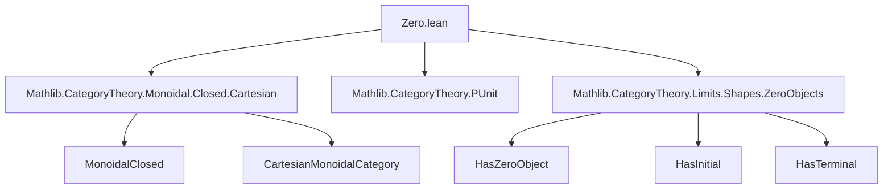

**Technical Brief: `Zero.lean` — Cartesian Closed Categories with Zero Objects**

---

### 1. **Key Definitions & Theorems**

| Name | Type | Purpose |
|------|------|---------|
| `uniqueHomsetOfInitialIsoUnit` | `[HasInitial C] → ⊥_ C ≅ 𝟙_ C → (X Y : C) → Unique (X ⟶ Y)` | Shows that if initial ≅ terminal, then all hom-sets are singletons. Uses hom-isomorphisms via monoidal closed structure and exponential adjunction. |
| `uniqueHomsetOfZero` | `[HasZeroObject C] → (X Y : C) → Unique (X ⟶ Y)` | Specialization of above: zero object ⇒ initial ≅ terminal ⇒ all hom-sets contract. |
| `equivPUnit` | `[HasZeroObject C] → C ≌ Discrete PUnit.{w + 1}` | Constructs equivalence between `C` and the discrete category on one object (i.e., the terminal category). |

**Auxiliary lemmas used (implicit):**
- `Iso.homCongr`: Congruence for homs under isomorphisms.
- `ihom.adjunction`: Exponential adjunction in monoidal closed categories:  
  $$(X \otimes A \to Y) \simeq (A \to Y^X)$$
- `rightUnitor`: Unitors in monoidal categories.
- `Subsingleton.elim`: Elimination principle for subsingletons (used to prove equality of morphisms when hom-sets are unique).

---

### 2. **Naming Conventions**

- **Prefixes:**
  - `uniqueHomsetOf*`: Indicates construction of uniqueness of morphisms under structural assumptions.
  - `is_`, `has_`: Standard in Lean/Mathlib for properties (e.g., `HasZeroObject`, `HasInitial`).
- **Suffixes:**
  - `Of*`: Denotes derivation from a structural assumption (e.g., `OfInitialIsoUnit`, `OfZero`).
- **Constants:**
  - `⊥_ C`: Initial object (zero object in presence of terminal).
  - `𝟙_ C`: Terminal object.
  - `0`: Zero object (when `HasZeroObject` holds).
  - `PUnit`: The singleton type, used to model the terminal category.

---

### 3. **Tactic Stack**

| Tactic | Usage |
|--------|-------|
| `refine` | To construct proofs with holes (e.g., constructing a `Unique` structure). |
| `simp [eq_iff_true_of_subsingleton]` | Simplifies equalities using subsingleton property of hom-sets. |
| `apply`, `intro`, `exact`, `cases` | Standard proof scripting. |
| `equiv.unique` | To prove uniqueness via equivalence to a known unique type. |
| `NatIso.ofComponents` | Constructs natural isomorphism from componentwise isos (used in `equivPUnit`). |
| `Functor.punitExt` | Extensionality for functors out of `PUnit`. |

No heavy automation (`aesop`, `ring`, `linarith`) — relies on structural reasoning and simplification.

---

### 4. **Proof Logic**

The logical flow is:

1. **Assume** `C` is Cartesian closed and has a zero object.
2. **Deduce** `⊥_ C ≅ 𝟙_ C` (since zero object is both initial and terminal).
3. **Show** for any $X, Y$, the hom-set $(X \to Y)$ is in bijection with $(\bot \to Y^X)$ via:
   - $X \to Y \;\simeq\; X \otimes 1 \to Y$ (via `rightUnitor`)
   - $\simeq\; X \otimes \bot \to Y$ (via tensor with iso $\bot \simeq 1$)
   - $\simeq\; \bot \to Y^X$ (via internal hom adjunction)
4. Since $\bot$ is initial, $(\bot \to Y^X)$ is a singleton ⇒ $(X \to Y)$ is a singleton.
5. Conclude all hom-sets are contractible ⇒ category is *discrete* on one object.
6. Construct equivalence `C ≌ Discrete PUnit` using:
   - `Functor.star C`: sends unique object of `PUnit` to terminal object in `C`.
   - `Functor.fromPUnit 0`: sends the unique object to the zero object (same as terminal here).
   - Unit/counit isos follow from uniqueness of morphisms.

---

### 5. **Imports**

| Import | Role |
|--------|------|
| `Mathlib.CategoryTheory.Monoidal.Closed.Cartesian` | Provides Cartesian monoidal structure and closed structure (internal homs, exponentials). |
| `Mathlib.CategoryTheory.PUnit` | Defines `PUnit` and discrete category over it. |
| `Mathlib.CategoryTheory.Limits.Shapes.ZeroObjects` | Defines zero objects, initial/terminal objects, and their interactions. |

---

### 6. **Mermaid Diagrams**

#### **Dependency Graph (Module-Level)**



#### **Conceptual Overview of Proof**

```mermaid
flowchart LR
  A[Zero Object in C] --> B[Initial ≅ Terminal]
  B --> C[Hom(X,Y) ≃ Hom(X⊗1,Y)]
  C --> D[Hom(X⊗⊥,Y)]
  D --> E[Hom(⊥,Y^X)]
  E --> F[Singleton]
  F --> G[All hom-sets contractible]
  G --> H[C ≌ Discrete PUnit]
```

#### **Equivalence Construction**

```mermaid
flowchart LR
  C[Category C] -->|Functor.star C| P[Discrete PUnit]
  P -->|Functor.fromPUnit 0| C
  C -.->|unitIso| C ∘ F ∘ G
  P -.->|counitIso| F ∘ G ∘ F
```

Where:
- `F = Functor.star C`
- `G = Functor.fromPUnit 0`
- `unitIso`, `counitIso` are unique due to contractible homs.

---

### 7. **Theoretical Significance**

This formalization confirms a well-known categorical fact:  
> *A Cartesian closed category with a zero object is trivial — equivalent to the terminal category.*

This is foundational in logic and type theory:  
- In type-theoretic terms, a CCC with a zero object (initial type) and terminal type isomorphic to it collapses all types to a singleton — all terms of any type are equal.

The proof is constructive and leverages:
- Monoidal closed structure (for exponential adjunction),
- Zero object properties (initial = terminal),
- Subsingleton reasoning (uniqueness of morphisms).

---

Let me know if you'd like a formalized summary in Lean syntax or a visualization of the internal hom adjunction step.
