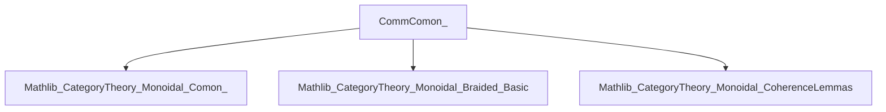
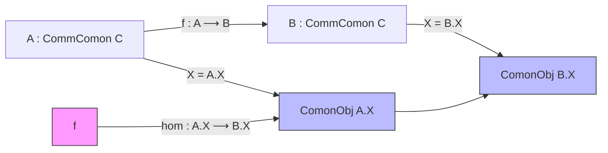

**Technical Brief: `CommComon_.lean`**

---

### 1. **Key Definitions & Theorems**

| Name | Type / Structure | Purpose |
|------|------------------|---------|
| `CommComon C` | `structure` | Bundled commutative comonoid objects in a braided monoidal category `C`. Extends `ComonObj X` with `IsCommComonObj X`. |
| `toComon A` | `def` | Forgets the commutativity proof, yielding a comonoid object. |
| `trivial C` | `def` | The trivial commutative comonoid on the unit object `𝟙_ C`. Later shown to be initial. |
| `instCommComonObjUnit` | `instance` | Proves the unit object `𝟙_ C` carries a canonical commutative comonoid structure. |
| `forget₂Comon C` | `def` | Forgetful functor `CommComon C ⥤ Comon C`. |
| `InducedCategory`-based `Category (CommComon C)` | `instance` | Defines morphisms in `CommComon C` as comonoid homs whose underlying maps preserve commutativity (automatic by definition of `IsCommComonObj`). |
| `hom_ext` | `lemma` | Extensionality: morphisms in `CommComon C` are equal if their underlying comonoid homs are equal. |
| `id_hom`, `comp_hom` | `@[simp] theorem`s | Simplification lemmas for identity and composition in `CommComon C`. |

---

### 2. **Naming Conventions**

- **Prefixes**:
  - `is_` in `IsCommComonObj` — predicate for commutativity of a comonoid.
  - `inst_` in `instCommComonObjUnit` — instance definitions.
  - `forget_` in `forget₂Comon` — standard for forgetful functors.
  - `to_` in `toComon` — projection/forgetful map.

- **Suffixes**:
  - `Comon` — indicates objects/morphisms in the category of comonoids.
  - `Comm` — indicates *commutative* structure.

- **Notable**:
  - `trivial` — canonical initial object.
  - `InducedCategory` — used to define morphisms via underlying structure.

---

### 3. **Tactic Stack**

- `simp` — used in `instCommComonObjUnit` to simplify unitors.
- `by simp [← unitors_equal]` — coherence reasoning in braided monoidal categories.
- `rfl` — for definitional equalities (e.g., `id_hom`, `comp_hom`).
- `InducedCategory.hom_ext`, `Comon.Hom.ext` — extensionality lemmas used in `hom_ext`.
- `inferInstanceAs` — used to derive the `Category` instance via `InducedCategory`.

No heavy automation (e.g., `aesop`, `ring`, `linarith`) appears—proofs are mostly definitional or coherence-based.

---

### 4. **Proof Logic**

- **Structure**: The category `CommComon C` is defined as an *induced category* over `Comon C` via the predicate `IsCommComonObj`.
- **Morphisms**: A morphism `A ⟶ B` in `CommComon C` is a comonoid hom `A.X ⟶ B.X` in `C`; commutativity is preserved automatically because both source and target are commutative.
- **Initiality**: The `trivial` object is defined on `𝟙_ C`, and its commutativity follows from unit coherence (`unitors_equal`).
- **Extensionality**: Morphisms are equal if their underlying maps are equal (`hom_ext`), leveraging `InducedCategory.hom_ext`.

No induction or case analysis is used—proofs rely on definitional equality and coherence.

---

### 5. **Imports**

| Import | Role |
|--------|------|
| `Mathlib.CategoryTheory.Monoidal.Comon_` | Core definitions: `ComonObj`, `Comon`, `Comon.Hom`, etc. |
| `Mathlib.CategoryTheory.Monoidal.Braided.Basic` | Braided monoidal structure: needed for `IsCommComonObj` (symmetry condition). |
| `Mathlib.CategoryTheory.Monoidal.CoherenceLemmas` | Provides `unitors_equal` and related coherence tools. |

> **Note**: The braided structure is essential: commutativity of a comonoid is defined via commutativity of the diagram involving the braiding $c_{X,X} \circ \delta = \delta$, where $\delta$ is the comultiplication.

---

### 6. **Mermaid Diagrams**

#### **Dependency Graph (Module Level)**



#### **Conceptual Overview (Theory Graph)**

```mermaid
graph TD
  BraidedMonoidalCat[C : BraidedMonoidalCategory]
  ComonObj[ComonObj X] --> BraidedMonoidalCat
  IsCommComonObj[IsCommComonObj X] --> ComonObj
  CommComon[CommComon C] --> IsCommComonObj
  CommComon --> ComonObj
  CommComon --> Category[Category (CommComon C)]
  CommComon --> Forget[forget₂Comon : CommComon C ⥤ Comon C]
  trivial[trivial C] --> CommComon
  trivial --> Initial[Initial object in CommComon C]
```

#### **Morphism Structure (Induced Category)**



> Morphisms in `CommComon C` are comonoid homs; the induced category structure ensures composition and identities inherit from `Comon C`.

---

### 7. **Summary**

This module constructs the category `CommComon C` of *commutative* comonoid objects in a braided monoidal category `C`. It leverages the `InducedCategory` pattern to define morphisms and proves basic categorical properties (initial object, forgetful functor). The braided structure is crucial for defining commutativity, and coherence lemmas (e.g., `unitors_equal`) ensure the unit object is commutative. The design is minimal, definitional, and aligned with Lean’s category-theoretic conventions.
