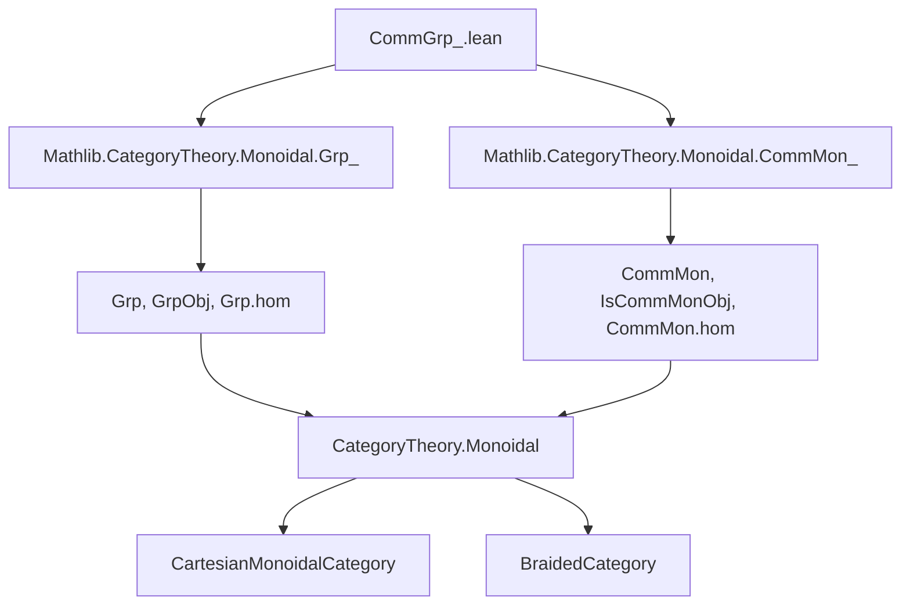

### Technical Brief: `CommGrp_.lean`

---

#### **1. Key Definitions & Theorems**

| Name | Type / Structure | Purpose |
|------|------------------|---------|
| `CommGrp C` | `structure` | Defines a *commutative group object* internal to a Cartesian monoidal category `C`. Combines `GrpObj X` and `IsCommMonObj X` on an object `X : C`. |
| `toGrp A` | `abbrev` | Forgets the commutativity constraint: `CommGrp C → Grp C`. |
| `toCommMon A` | `def` | Forgets the group inverse: `CommGrp C → CommMon C`. |
| `toMon A` | `abbrev` | Further forgets commutativity of monoid: `CommGrp C → Mon C`. |
| `trivial C` | `def` | The trivial commutative group object: underlying object is terminal `𝟙_ C`. |
| `forget₂Grp C` | `def` | Forgetful functor `CommGrp C ⥤ Grp C`. Fully faithful. |
| `forget₂CommMon C` | `def` | Forgetful functor `CommGrp C ⥤ CommMon C`. Fully faithful. |
| `forget C` | `def` | Composite forgetful functor `CommGrp C ⥤ C`. Faithful. |
| `mkIso' e` | `def` | Constructs an isomorphism of commutative group objects from a monoid isomorphism `e : G ≅ H` with compatibility conditions. |
| `mkIso e one_f mul_f` | `abbrev` | Constructs an isomorphism of commutative group objects by verifying unit and multiplication compatibility *only in forward direction*. |
| `mapCommGrp F` | `def` | Functorial action of a finite-product-preserving braided functor `F : C ⥤ D` on commutative group objects: `CommGrp C ⥤ CommGrp D`. |
| `mapCommGrpIdIso` | `def` | Natural isomorphism `(𝟭 C).mapCommGrp ≅ 𝟭 (CommGrp C)`. |
| `mapCommGrpCompIso` | `def` | Natural isomorphism `(F ⋙ G).mapCommGrp ≅ F.mapCommGrp ⋙ G.mapCommGrp`. |
| `mapCommGrpNatTrans f` | `def` | Lifts a natural transformation `f : F ⟶ F'` to `F.mapCommGrp ⟶ F'.mapCommGrp`. |
| `mapCommGrpNatIso e` | `def` | Lifts a natural isomorphism `e : F ≅ F'` to `F.mapCommGrp ≅ F'.mapCommGrp`. |
| `mapCommGrpFunctor` | `def` | 2-functoriality: `(C ⥤ₗ D) ⥤ (CommGrp C ⥤ CommGrp D)`. |
| `mapCommGrp a` (Adjunction) | `def` | Lifts an adjunction `F ⊣ G` of braided functors to `F.mapCommGrp ⊣ G.mapCommGrp`. |
| `mapCommGrp e` (Equivalence) | `def` | Lifts an equivalence `C ≌ D` to `CommGrp C ≌ CommGrp D`. |

---

#### **2. Naming Conventions**

- **Prefixes**:
  - `forget₂_`: Forgetful functors to intermediate structures (`Grp`, `CommMon`).
  - `mapCommGrp`: Functorial action on commutative group objects.
  - `mkIso`, `mkIso'`: Isomorphism constructors.
  - `fullyFaithfulForget₂_`: Proofs of full faithfulness of forgetful functors.

- **Suffixes**:
  - `_hom`, `_mul`, `_one`: Refer to structure maps (multiplication, unit, inverse).
  - `_obj_`, `_map_`: Applied to objects or morphisms in functorial constructions.

- **Aliases**:
  - Deprecated aliases (e.g., `CommGrp_`, `toGrp_`, `forget₂Grp_`) indicate renaming or refactoring over time.

---

#### **3. Tactic Stack**

Frequently used tactics in proofs and definitions:

| Tactic | Usage |
|--------|-------|
| `rfl` | Proving definitional equalities (e.g., `id_hom`, `comp_hom`, simp lemmas). |
| `simp` / `simp_rw` | Simplifying using `@[simp]` lemmas, especially for forgetful functors and structure maps. |
| `cat_disch` | Closing diagrammatic commutativity goals in monoidal/Cartesian settings (used in `mkIso` assumptions). |
| `induction`, `cases` | Not explicitly visible here, but implied by `Grp`, `MonObj`, and `InducedCategory` infrastructure. |
| `ext` | Hom-extension (`hom_ext`) using underlying morphism equality. |
| `apply`, `exact`, `refine` | Used implicitly in `mkIso'`, `mkIso`, and `fullyFaithfulForget₂Grp`. |
| `dsimp`, `rw`, `change` | In `mapCommGrp.obj` to manipulate braided naturality and monoid compatibility. |

---

#### **4. Proof Logic**

- **Structure**: Most proofs rely on:
  - **Induced category machinery**: Morphisms in `CommGrp C` are morphisms in `C` preserving group structure (via `Grp.hom`).
  - **Forgetful functors**: Fully faithful and faithful properties are derived from properties of `InducedCategory`.
  - **Diagram chasing**: Verification of compatibility with unit/multiplication (e.g., in `mapCommGrp.obj`) uses braided monoidal naturality and `IsCommMonObj.mul_comm`.
  - **Isomorphism construction**: `mkIso` and `mkIso'` reduce to checking monoid homomorphism conditions; full faithfulness ensures uniqueness.
  - **Functoriality**: `mapCommGrp` is defined object- and morphism-wise, with naturality and functor laws verified via `simp` and monoidal properties.

- **Common pattern**:
  ```lean
  -- Prove object-level structure compatibility:
  { mul_comm := by
      dsimp
      rw [← Functor.LaxBraided.braided_assoc, ← Functor.map_comp, IsCommMonObj.mul_comm] }
  ```

---

#### **5. Imports**

| Import | Purpose |
|--------|---------|
| `Mathlib.CategoryTheory.Monoidal.Grp_` | Defines `Grp`, `GrpObj`, `Grp.hom`, `Grp.forget`, etc. |
| `Mathlib.CategoryTheory.Monoidal.CommMon_` | Defines `CommMon`, `IsCommMonObj`, `CommMon.hom`, etc. |
| `CategoryTheory`, `Limits`, `MonoidalCategory`, `CartesianMonoidalCategory`, `BraidedCategory` | Core infrastructure for monoidal and Cartesian categories. |
| `Mon`, `Grp`, `CommMon`, `MonObj` | Opened namespaces for structure and morphism constructors. |

---

#### **6. Mermaid Diagrams**

##### **Dependency Graph (Module Level)**



##### **Overview of `CommGrp C` Theory**

```mermaid
graph TD
  CommGrpC[CommGrp C] -->|Forgetful| GrpC[Grp C]
  CommGrpC -->|Forgetful| CommMonC[CommMon C]
  CommGrpC -->|Forgetful| C[C]
  GrpC -->|Forgetful| MonC[Mon C]
  MonC -->|Forgetful| C

  CommGrpC -->|mapCommGrp F| CommGrpD[CommGrp D]
  CommGrpD -->|Forgetful| GrpD[Grp D]

  CommGrpC -->|mapCommGrp F| CommGrpD
  CommGrpD -->|mapCommGrp G| CommGrpE[CommGrp E]
  CommGrpC -.->|mapCommGrpCompIso| CommGrpE

  CommGrpC -->|mapCommGrpFunctor| (C ⥤ₗ D) ⥤ (CommGrp C ⥤ CommGrp D)
```

##### **Functorial Lifting Hierarchy**

```mermaid
graph LR
  C -- F --> D
  CommGrp C -- F.mapCommGrp --> CommGrp D
  C -- G --> E
  CommGrp C -- (G∘F).mapCommGrp --> CommGrp E
  F.mapCommGrp ⋙ G.mapCommGrp -.-> (G∘F).mapCommGrp
```

---

#### **7. Summary**

This file formalizes the category of **internal commutative group objects** in a Cartesian monoidal category `C`. It leverages:
- The `InducedCategory` construction to define morphisms,
- Forgetful functors to intermediate structures (`Grp`, `CommMon`, `C`),
- Functorial lifting of braided finite-product-preserving functors, adjunctions, and equivalences.

The theory is highly structured, with emphasis on:
- **Fully faithfulness** of forgetful functors,
- **Explicit isomorphism constructors** (`mkIso`, `mkIso'`),
- **2-categorical functoriality** (`mapCommGrpFunctor`, `mapCommGrpNatTrans`, etc.).

It serves as a foundational building block for higher categorical and homotopical generalizations (e.g., `E∞`-objects, derived algebraic geometry).
