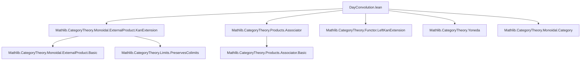

### Technical Brief: `DayConvolution.lean`

---

#### **1. Key Definitions & Theorems**

| Name | Type / Signature | Purpose |
|------|------------------|---------|
| `DayConvolution F G` | `class` | Bundles a functor `F ⊛ G : C ⥤ V` and a unit natural transformation `F ⊠ G ⟶ tensor C ⋙ F ⊛ G` exhibiting it as a *pointwise left Kan extension* along `tensor C : C × C ⥤ C`. |
| `convolution F G` | `C ⥤ V` | The convolution functor (denoted `F ⊛ G`). |
| `unit F G` | `F ⊠ G ⟶ tensor C ⋙ convolution F G` | The universal natural transformation. |
| `isPointwiseLeftKanExtensionUnit F G` | Proof that `unit` exhibits `F ⊛ G` as a pointwise left Kan extension. |
| `map f g` | `F ⊛ G ⟶ F' ⊛ G'` | Induced map on convolutions from `f : F ⟶ F'`, `g : G ⟶ G'`. |
| `associator F G H` | `(F ⊛ G) ⊛ H ≅ F ⊛ G ⊛ H` | Associator isomorphism for Day convolution, constructed via corepresentability and `α_` in `C`. |
| `associator_hom_unit_unit x y z` | Equation characterizing `associator.hom` on components of the unit. |
| `associator_inv_unit_unit x y z` | Equation characterizing `associator.inv` on components of the unit. |
| `associator_naturality` | Naturality of `associator` w.r.t. morphisms of functors. |
| `pentagon` | Verification of the pentagon identity for `associator`. |
| `DayConvolutionUnit U` | `class` | Bundles a unit `U : C ⥤ V` for Day convolution: a canonical map `𝟙_ V ⟶ U.obj (𝟙_ C)` exhibiting `U` as a pointwise left Kan extension of `fromPUnit (𝟙_ V)` along `fromPUnit (𝟙_ C)`. |
| `φ U` | `Functor.fromPUnit (𝟙_ V) ⟶ fromPUnit (𝟙_ C) ⋙ U` | Natural transformation induced by `can`. |
| `leftUnitor U F` / `rightUnitor U F` | `U ⊛ F ≅ F` / `F ⊛ U ≅ F` | Left/right unitors for Day convolution. |
| `leftUnitor_hom_unit_app y` / `rightUnitor_hom_unit_app x` | Equations describing unitors on components of the unit. |
| `triangle` | `DayConvolution.triangle` | Triangle identity for unitors and associator. |

---

#### **2. Naming Conventions**

- **Prefixes**:
  - `isPointwiseLeftKanExtension*`: proofs that something is a pointwise left Kan extension.
  - `corepresentableBy*`: corepresentability data for functors of the form `Y ↦ (F ⊠ G ⊠ … ⟶ tensor^k C ⋙ Y)`.
  - `extensionUnit*`: unit for left Kan extension along `tensor C` or `fromPUnit`.
  - `uniqueUpToIso`: uniqueness up to iso of Kan extensions.
- **Infix**:
  - `⊛` (U+25CB) for `convolution`.
- **Suffixes**:
  - `_app`: component at an object.
  - `_naturality`: naturality of a transformation.
  - `_hom` / `_inv`: forward/inverse direction of an iso.
  - `_unit_*`: interaction with the unit natural transformation.

---

#### **3. Tactic Stack**

- **Core tactics**:
  - `simp`, `simp only`, `simp_rw`, `aesop`, `ext`, `apply_fun`, `congrArg`
  - `rw`, `convert`, `refine'`, `exact`, `assumption`
  - `dsimp`, `change`, `have`, `set`
- **Category-theoretic helpers**:
  - `Functor.hom_ext_of_isLeftKanExtension`, `Functor.leftKanExtensionUnique`
  - `isPointwiseLeftKanExtension*`, `Functor.descOfIsLeftKanExtension_*`
  - `coyoneda`, `coyoneda.mapIso`, `corepresentableBy_*`
  - `whiskerLeft_id`, `whiskerRight_id`, `tensorHom_def`, `tensor_whiskerLeft_symm`, etc.
- **Proof style**:
  - Heavy use of *universal properties* of left Kan extensions.
  - Frequent `hom_ext` arguments using colimit cocones.
  - `pentagon` and `triangle` proofs rely on `hom_ext` + explicit computation on components of units.

---

#### **4. Proof Logic**

- **Induction / Extension Logic**:
  - Most proofs proceed by:
    1. Recognizing a functor as a left Kan extension (via `isPointwiseLeftKanExtension*`).
    2. Using `Functor.hom_ext_of_isLeftKanExtension` or `convolution_hom_ext_at`.
    3. Reducing to verification on *generators* — i.e., morphisms factoring through the unit `F ⊠ G ⟶ F ⊛ G`.
    4. Applying naturality of `unit`, whiskering lemmas (`whiskerLeft_comp_unit_app`, `whiskerRight_comp_unit_app`), and monoidal coherence (e.g., `pentagon_assoc`, `pentagon_inv`).
- **Associator Construction**:
  - Build `associatorCorepresentingIso` using `prod.associativity` and `isoWhisker*`.
  - Use `corepresentableBy₂` / `corepresentableBy₂'` to lift to an iso of functors.
- **Unitors**:
  - Use `prod.leftUnitorEquivalence` / `prod.rightUnitorEquivalence`.
  - Lift via `corepresentableByLeft` / `corepresentableByRight`.
- **Triangle & Pentagon**:
  - Prove by `hom_ext` over multiple layers of Kan extensions.
  - Use `pentagon` lemma (itself proven via `hom_ext` + `aux` lemmas) to reduce to monoidal coherence in `C`.

---

#### **5. Imports & Dependencies**

- **Core imports**:
  ```lean
  Mathlib.CategoryTheory.Monoidal.ExternalProduct.KanExtension
  Mathlib.CategoryTheory.Products.Associator
  ```
- **Key underlying libraries**:
  - `Mathlib.CategoryTheory.Limits.PreservesColimits`
  - `Mathlib.CategoryTheory.Yoneda`
  - `Mathlib.CategoryTheory.Monoidal.ExternalProduct.Basic`
  - `Mathlib.CategoryTheory.Functor.LeftKanExtension`
  - `Mathlib.CategoryTheory.Monoidal.Category`
  - `Mathlib.CategoryTheory.PUnit`

---

#### **6. Mermaid Diagrams**

##### **Dependency Graph (Module-Level)**



##### **Overview of Theory Flow**

```mermaid
graph LR
  subgraph Setup
    C[Monoidal C]
    V[Monoidal V]
    F[F : C ⥤ V]
    G[G : C ⥤ V]
  end

  subgraph DayConvolution
    FC[F ⊛ G]
    unit[F ⊠ G ⟶ tensor C ⋙ F ⊛ G]
    isLKE[isPointwiseLeftKanExtensionUnit]
  end

  subgraph Structure
    map[map f g : F ⊛ G ⟶ F' ⊛ G']
    associator[(F ⊛ G) ⊛ H ≅ F ⊛ G ⊛ H]
    leftUnitor[U ⊛ F ≅ F]
    rightUnitor[F ⊛ U ≅ F]
  end

  subgraph Coherence
    triangle[Triangle identity]
    pentagon[Pentagon identity]
  end

  C --> FC
  V --> FC
  F --> FC
  G --> FC
  unit --> FC
  isLKE --> map
  isLKE --> associator
  isLKE --> leftUnitor
  isLKE --> rightUnitor
  associator --> triangle
  associator --> pentagon
  leftUnitor --> triangle
  rightUnitor --> triangle
```

---

#### **7. Summary**

This file formalizes the **Day convolution monoidal structure** on functor categories `C ⥤ V`, where `C` and `V` are monoidal categories. It defines:

- A *typeclass* `DayConvolution` for constructing convolution functors `F ⊛ G` as pointwise left Kan extensions.
- A *typeclass* `DayConvolutionUnit` for units.
- Constructs the **associator**, **left/right unitors**, and verifies **triangle** and **pentagon** coherence laws.

The formalization is highly *categorical*, relying on:
- Universal properties of left Kan extensions,
- Corepresentability via the Yoneda embedding,
- Explicit manipulation of whiskering, tensor products, and naturality.

It sets the stage for future work on:
- Universal properties of Day convolution (e.g., `V = Type u`),
- Lax monoidal functors out of Day convolution monoidal categories,
- Type-theoretic encodings of monoidal structures arising from Day convolution.

--- 

Let me know if you'd like a formalized dependency graph (e.g., for `leanproject`), or a summary of the `LawfulDayConvolutionMonoidalCategoryStruct` (mentioned in the docstring but not defined in this excerpt).
