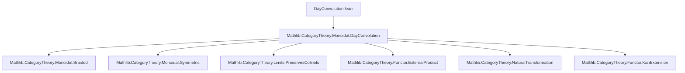

### Technical Brief: Braided Structure on Day Convolution

---

#### **1. Key Definitions & Theorems**

| Name | Type / Signature | Purpose |
|------|------------------|---------|
| `braidingHomCorepresenting` | `F ⊠ G ⟶ tensor C ⋙ G ⊛ F` | Natural transformation corepresenting the braiding morphism `F ⊛ G → G ⊛ F` via the universal property of Day convolution. |
| `braidingInvCorepresenting` | `G ⊠ F ⟶ tensor C ⋙ F ⊛ G` | Corepresenting natural transformation for the inverse of the Day convolution braiding. |
| `braiding` | `F ⊛ G ≅ G ⊛ F` | Explicit braiding isomorphism for Day convolution, constructed using corepresentability. |
| `unit_app_braiding_hom_app` | `(unit F G).app (x, y) ≫ (braiding F G).hom.app (x ⊗ y) = ...` | Describes how the unit of Day convolution interacts with the braiding hom component. |
| `unit_app_braiding_inv_app` | `(unit G F).app (x, y) ≫ (braiding F G).inv.app (x ⊗ y) = ...` | Analogous to above for the inverse. |
| `braiding_naturality_right` | `DayConvolution.map (𝟙 H) η ≫ (braiding H G).hom = (braiding H F).hom ≫ DayConvolution.map η (𝟙 H)` | Naturality of braiding in the second argument. |
| `braiding_naturality_left` | `DayConvolution.map η (𝟙 H) ≫ (braiding G H).hom = (braiding F H).hom ≫ DayConvolution.map (𝟙 H) η` | Naturality of braiding in the first argument. |
| `hexagon_forward` | `(associator F G H).hom ≫ (braiding F (G ⊛ H)).hom ≫ (associator G H F).hom = ...` | Verifies the forward hexagon identity for Day convolution braiding. |
| `hexagon_reverse` | `(associator F G H).inv ≫ (braiding (F ⊛ G) H).hom ≫ (associator H F G).inv = ...` | Verifies the reverse hexagon identity. |
| `symmetry` | `(braiding F G).hom ≫ (braiding G F).hom = 𝟙 _` | Shows that if `C` and `V` are symmetric, then Day convolution is symmetric. |

---

#### **2. Naming Conventions**

- **Prefixes**:
  - `braiding*`: All definitions/lemmas related to the braiding structure.
  - `unit_app_*`: Lemmas describing interaction of unitors with other natural transformations.
  - `hexagon_*`: Lemmas verifying hexagon identities.
- **Suffixes**:
  - `_hom`, `_inv`: For hom and inverse components of isomorphisms.
  - `_corepresenting`: For morphisms used to define the braiding via corepresentability.
  - `_naturality_*`: Naturality squares involving Day convolution maps.
- **Pattern**: `braidingHomCorepresenting`, `unit_app_braiding_hom_app`, `hexagon_forward`, `symmetry`.

---

#### **3. Tactic Stack**

- **Core tactics**:
  - `simp` (with `-tensor_obj`, `assoc`, etc.)
  - `apply Functor.hom_ext_of_isLeftKanExtension`
  - `ext` (often with `⟨_, _⟩` or `⟨x, y, z⟩`)
  - `rw`, `congr`, `dsimp`
  - `haveI := ...` + `dsimp at this` + `rw [...] at this`
- **Specialized lemmas used**:
  - `BraidedCategory.braiding_tensor_left_hom`, `braiding_naturality_right_assoc`, etc.
  - `associator_hom_unit_unit_assoc`, `unit_app_braiding_hom_app_assoc`
  - `Iso.map_hom_inv_id`, `Iso.inv_hom_id_assoc`, `Iso.hom_inv_id_assoc`
- **Pattern**: Heavy use of `hom_ext_of_isLeftKanExtension` + `ext` + `simp` with many specialized lemmas to reduce to braided category axioms in `C` and `V`.

---

#### **4. Proof Logic**

- **Construction of braiding**:
  - Define corepresenting morphisms `braidingHomCorepresenting`, `braidingInvCorepresenting`.
  - Use corepresentability of Day convolution (`corepresentableBy`) to get `braiding : F ⊛ G ≅ G ⊛ F`.
  - Prove `hom_inv_id` and `inv_hom_id` using `Functor.hom_ext_of_isLeftKanExtension`.

- **Hexagon identities**:
  - Reduce to component-wise verification at `⟨⟨x, y⟩, z⟩` or `⟨x, y⟩`.
  - Use naturality and coherence of braiding in `C` and `V`.
  - Apply `hexagon_forward`/`hexagon_reverse` in `C` or `V` (via `BraidedCategory.hexagon_*`).
  - Use associator/unit naturality and tensor functor properties.

- **Symmetry**:
  - Use `hom_ext_of_isLeftKanExtension` again.
  - Simplify using `symmetry` in `C` and `V`, and `Functor.map_comp`.

---

#### **5. Imports**

- `Mathlib.CategoryTheory.Monoidal.DayConvolution`: Core definitions and properties of Day convolution.
- Implicit dependencies:
  - `Mathlib.CategoryTheory.Monoidal.Braided`
  - `Mathlib.CategoryTheory.Monoidal.Symmetric`
  - `Mathlib.CategoryTheory.Limits.PreservesColimits`
  - `Mathlib.CategoryTheory.Functor.ExternalProduct`
  - `Mathlib.CategoryTheory.NaturalTransformation`

---

#### **6. Mermaid Diagrams**

##### **Dependency Graph (Module-Level)**

##### **Overview of Theory Flow**

##### **Component-wise Verification Strategy**

--- 

This file formalizes a foundational result in higher category theory: the Day convolution monoidal structure inherits braided (and symmetric) structure from its inputs. The proofs rely heavily on the universal property of Day convolution and coherence in braided monoidal categories.
