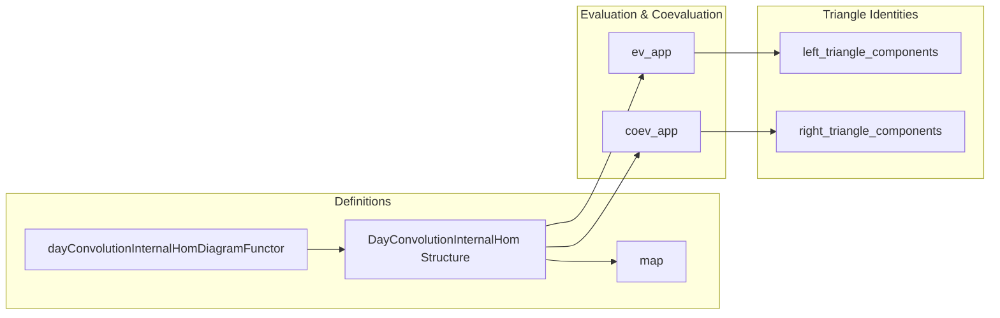

### Technical Brief: Internal Hom for Day Convolution (Lean 4)

---

#### **1. Key Definitions & Theorems**

| Name | Type / Structure | Purpose |
|------|------------------|---------|
| `dayConvolutionInternalHomDiagramFunctor F` | `(C ⥤ V) ⥤ C ⥤ Cᵒᵖ ⥤ C ⥤ V` | Constructs the diagram whose limit (end) represents the internal hom for Day convolution: $c \mapsto \int^{c_1,c_2} \hom(F c_1, G(c_2 \otimes c))$ |
| `DayConvolutionInternalHom F G H` | `Structure` | Asserts that $H$ is the internal hom $[F, G]$ for Day convolution: i.e., $H c \cong \int^{c_1,c_2} \hom(F c_1, G(c_2 \otimes c))$, with compatibility conditions for functoriality and wedge universality |
| `DayConvolutionInternalHom.map` | `H ⟶ H'` | Induced map between internal homs from a map $G \to G'$, via functoriality of ends |
| `ev_app` | `F ⊛ H ⟶ G` | Evaluation map corresponding to curried universal property: $F \otimes [F, G] \to G$ |
| `coev_app` | `G ⟶ H` | Coevaluation map: $G \to [F, F \otimes G]$, induced by unit of Day convolution |
| `left_triangle_components` | `DayConvolution.map (𝟙 F) ℌ.coev_app ≫ ℌ.ev_app = 𝟙 (F ⊛ G)` | Left triangle identity for the closed structure (unit-counit coherence) |
| `right_triangle_components` | `ℌ'.coev_app ≫ ℌ'.map ℌ.ev_app ℌ = 𝟙 H` | Right triangle identity for the closed structure |

---

#### **2. Naming Conventions**

- **Prefixes**:
  - `dayConvolutionInternalHomDiagramFunctor`: composite naming for diagram construction.
  - `ev_app`, `coev_app`: evaluation/coevaluation components.
  - `map_app_comp_π`, `coev_app_π`: lemmas linking `map`/`coev_app` with projections `π`.
- **Suffixes**:
  - `_app`: component at an object (e.g., `ev_app`, `coev_app`).
  - `_π`: projection-related properties (e.g., `map_app_comp_π`, `coev_app_π`).
  - `_naturality_app`: naturality lemmas for transformations.
- **Structure fields**:
  - `π`, `hπ`, `isLimitWedge`, `map_comp_π`: standard wedge/end data.

---

#### **3. Tactic Stack**

Frequent tactics used:
- `ext`: extensionality for natural transformations / morphisms.
- `simp` / `dsimp`: simplification using `simps!`, `reassoc`, `ihom.ev_naturality`, etc.
- `rw`: rewriting using naturality, associativity, and definitions.
- `apply Wedge.IsLimit.hom_ext`: key for uniqueness of maps into ends.
- `apply MonoidalClosed.curry_injective` / `uncurry_injective`: injectivity of currying/uncurrying.
- `simp only [...]`: fine-grained simplification with explicit lemmas.
- `have := ...; replace this := ...`: intermediate reasoning steps.
- `reassoc_of%`: custom reassociation using `reassoc` attribute.

---

#### **4. Proof Logic**

- **Structure**: Proofs rely heavily on:
  - **Universal property of ends** (`IsLimit`/`Wedge.IsLimit.lift`, `hom_ext`).
  - **Monoidal closed structure of `V`**: currying/uncurrying, evaluation, naturality.
  - **Day convolution representability**: via `DayConvolution.corepresentableBy`.
- **Typical flow**:
  1. Define candidate morphism via `Wedge.IsLimit.lift` (for ends).
  2. Prove wedge condition (`hπ`-like) using naturality of `F`, `G`, and `η`.
  3. Prove naturality of the resulting transformation using `hom_ext`.
  4. Verify triangle identities by evaluating at components and using `homEquiv.injective` + `curry_injective`.
- **Induction**: Not used — all arguments are categorical/universal.

---

#### **5. Imports & Dependencies**

```lean
import Mathlib.CategoryTheory.Monoidal.DayConvolution
import Mathlib.CategoryTheory.Monoidal.Closed.Basic
import Mathlib.CategoryTheory.Limits.Shapes.End
```

- **Core dependencies**:
  - `DayConvolution`: defines the Day convolution monoidal structure on $[C, V]$.
  - `MonoidalClosed`: internal homs, evaluation, currying in $V$.
  - `End`: ends as limits of profunctors.

---

#### **6. Mermaid Diagrams**

##### **Dependency Graph**

```mermaid
graph TD
  A[Closed Monoidal Category V] --> B[DayConvolution]
  C[Monoidal Category C] --> B
  D[Ends (Limits)] --> B
  B --> E[InternalHom for DayConvolution]
  E --> F[MonoidalClosed Structure on [C,V]]
```

##### **Overview of File Structure**



##### **Universal Property Diagram (End)**

```mermaid
graph LR
  subgraph Diagram
    D["c₁, c₂ ↦ ihom (F c₁) (G (c₂ ⊗ c))"]
    L["∫^{c₁,c₂} ihom (F c₁) (G (c₂ ⊗ c))"]
  end

  D -->|π_{c,c₁}| L
  D -->|π_{c,c₂}| L
  L -.->|isLimitWedge| H["H c"]
```

---

#### **7. TODO & Future Work**

- **Transport to `MonoidalClosed` instance**:
  - Once `LawfulDayConvolutionMonoidalStruct` is merged (see [issue #26820](https://github.com/leanprover-community/mathlib4/issues/26820)), this file’s constructions should yield a full `MonoidalClosed (C ⥤ V)` instance.
- **Coherence laws**: Not yet formalized (e.g., pentagon, triangle identities for closed structure).
- **Naturality in `F`**: Not yet explored.

---

#### **8. Summary**

This file constructs the internal hom for Day convolution in the functor category $[C, V]$, assuming $V$ is monoidal closed and $C$ is monoidal. It leverages ends to represent the internal hom object-wise, and verifies the closed structure axioms (evaluation, coevaluation, triangle identities) using categorical universal properties. The formalization is highly structured, with careful attention to naturality and uniqueness via `hom_ext` and `curry_injective`.
